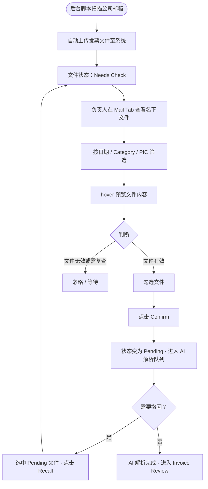

| 项目名称 | **Mail Invoice Collection — Mail Tab** |
|------|-------------|
| 文档版本 | v1.0        |
| 创建日期 | 2026-06-04  |
| 最后更新 | 2026-06-04  |
| 所属模块 | F Expert · Invoice Collection（F-PAP-PAYMENT-REQUEST.html）|

---

# 背景

F Expert 现有的 Invoice Collection 流程依赖员工手动上传发票文件（Uploaded Tab）。随着业务规模扩大，部分供应商会直接将发票发送至公司邮箱（如 `billing@ctw.inc`），这些邮件附件无法自动进入现有审核流程，需要员工人工转发或重复上传，效率低下且容易遗漏。

为解决这一问题，系统引入 **邮件自动采集机制**：通过后台脚本定期扫描公司邮箱，自动抓取发票类附件并上传至系统。由于脚本采集的准确性存在一定误差，这批文件在正式进入 AI 解析流程前，需由对应负责人（PIC）进行人工确认（Check），确认无误后才触发解析。

Mail Tab 即为该功能的操作入口。

---

# 目标

* 将邮件自动采集的发票文件与手动上传的发票文件在 UI 上区分管理，避免操作混乱。
* 提供以 PIC 为核心的任务分配视角，让每位负责人只处理自己名下的文件，降低认知负担。
* 通过 Confirm / Recall 两个操作，精确控制文件进入和退出解析流程的时机。

---

# 用户使用流程

---

# 状态流转

| 状态 | 说明 | 可执行操作 |
|------|------|-----------|
| **Needs Check** | 脚本采集后的初始状态，等待负责人确认 | Confirm（→ Pending） |
| **Pending** | 已确认，等待 AI 解析中 | Recall（→ Needs Check） |

> **规则约束：**
> * `Approved` 状态的文件不支持 Recall（已完成解析，不可回退）。
> * `Confirm` 按钮：当前选中文件中有 Pending 状态时禁用（不可对已在解析中的文件重复确认）。
> * `Recall` 按钮：当前选中文件中有 Needs Check 状态时禁用（只能撤回 Pending 状态文件）。
> * 混合选中（同时包含 Needs Check 和 Pending）时，两个按钮均可用，分别作用于对应状态的文件。

---

# 功能说明

## 一、筛选工具栏（Mail Tab 专属）

Mail Tab 激活时，工具栏显示以下三个筛选组件；切换回 Uploaded Tab 时自动隐藏。

### 1.1 日期筛选

* 月份选择器，选定月份后仅展示该月内 `receivedAt` 的文件。
* 未选择时显示全部月份的文件。

### 1.2 Category 筛选

* 点击展开多选下拉列表，枚举值：`Tech` / `Ads` / `Finance`。
* 支持多选，选中后按钮变蓝色激活态，标签文字变为已选分类名（如 `Tech, Ads`）。
* 点击「Show all」清除筛选条件。

### 1.3 PIC 筛选

* **默认选中当前登录用户（@me）**，仅展示分配给自己的文件，降低无关干扰。
* 点击展开单选下拉列表，当前用户条目附带 `@me` 标注。
* 第一项为「All」，选中后展示全部 PIC 的文件。
* 选中某人后按钮显示对应彩色头像 + 姓名。

---

## 二、文件列表

### 表头列说明

| 列名 | 说明 |
|------|------|
| （复选框） | 支持多选，含全选；只有 `Needs Check` 和 `Pending` 状态可勾选，`Approved` 不可选 |
| Type | 文件类型图标（PDF / 图片） |
| File Name | 文件名 |
| Source Mailbox | 采集来源邮箱地址（固定为 `billing@ctw.inc`） |
| Category | 文件所属业务分类 |
| PIC | 负责人头像 + 姓名 |
| State | 当前状态标签 |
| Received At | 邮件接收时间 |

### Hover 预览

鼠标悬停在行上约 350ms 后，自动弹出气泡，内嵌等比缩放的 Invoice PDF / 图片预览，方便负责人在不打开详情页的情况下快速核验文件内容。鼠标移入气泡后预览保持，移出后延迟 80ms 消失。

> Hover 预览功能**仅在 Mail Tab 存在**，Uploaded Tab 不提供此功能。

---

## 三、操作按钮

两个操作按钮仅在 Mail Tab 显示，Uploaded Tab 不展示。

### Confirm

* 样式：深色实心主按钮。
* 作用：将选中的 `Needs Check` 文件状态变更为 `Pending`，进入 AI 解析队列。
* **禁用条件**：选中文件中包含 `Pending` 状态时禁用（避免重复确认）。

### Recall

* 样式：黑边白底次要按钮。
* 作用：将选中的 `Pending` 文件状态回退至 `Needs Check`，可重新由负责人决定是否确认。
* **禁用条件**：选中文件中包含 `Needs Check` 状态时禁用（无需撤回尚未确认的文件）。

---

# 数据字段

## 文件对象字段

| 字段 | 类型 | 说明 |
|------|------|------|
| `id` | string | 文件唯一标识，前缀 `m` |
| `name` | string | 文件名 |
| `type` | `'pdf'` \| `'img'` | 文件类型 |
| `source` | string | 来源邮箱地址 |
| `state` | `'needs-check'` \| `'parsing'` \| `'approved'` \| `'denied'` | 当前状态 |
| `receivedAt` | string | 邮件接收时间，格式 `YYYY-MM-DD HH:mm` |
| `selected` | boolean | 当前是否被勾选（前端状态） |
| `category` | `'Tech'` \| `'Ads'` \| `'Finance'` | 业务分类 |
| `pic` | string | 负责人 ID，对应 `PIC_LIST` |

## 状态标签映射

| state 值 | 显示文本 |
|----------|---------|
| `needs-check` | Needs Check |
| `parsing` | Pending |
| `approved` | Approved |
| `denied` | Denied |

---

# 与 Uploaded Tab 的差异对比

| 维度 | Uploaded Tab | Mail Tab |
|------|-------------|----------|
| 文件来源 | 员工手动上传 | 后台脚本从邮箱自动采集 |
| 初始状态 | Parsing（上传即解析） | Needs Check（需人工确认后才解析） |
| 操作按钮 | Upload Invoice | Confirm / Recall |
| 筛选项 | 日期 | 日期 + Category + PIC |
| Hover 预览 | 无 | 有（气泡式 PDF 预览） |
| 多选功能 | 无 | 有（支持全选） |
| PIC 列 | 无 | 有 |

