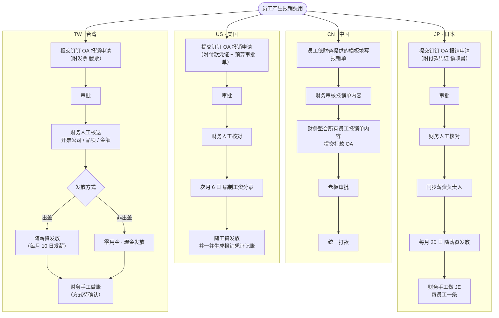
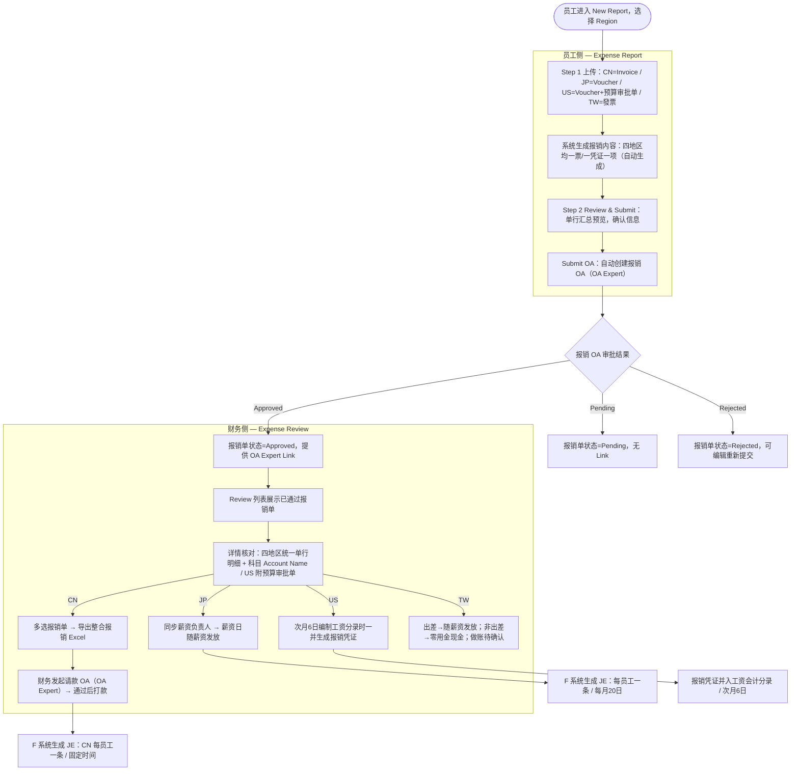
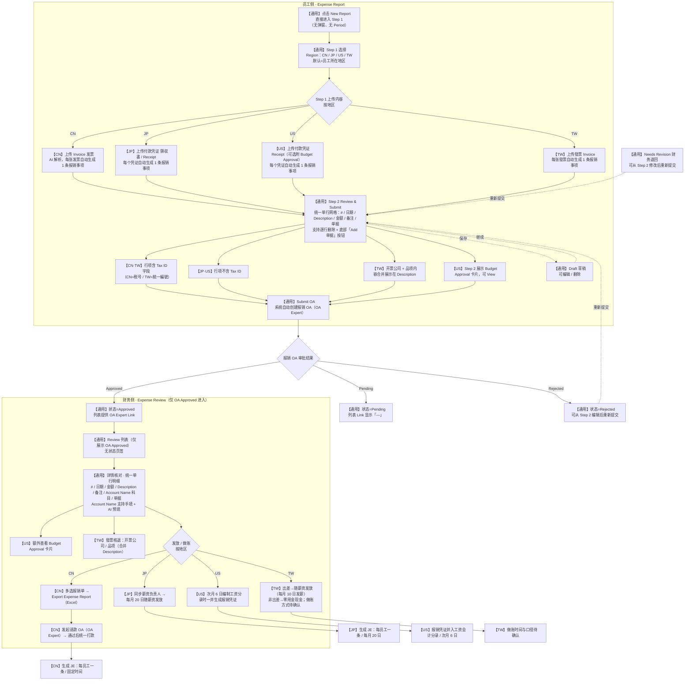

| 项目名称 | **员工报销单 — F Expert Expense Report** |
|------|-------------|
| 文档版本 | v3.0        |
| 创建日期 | 2026-06-11  |
| 最后更新 | 2026-06-23  |
| 所属模块 | F Expert · Expense Report（员工侧）& Expense Review（财务侧） |
| 原型文件 | F-PAP-EXPENSE-REPORT_副本.html（员工侧）、F-PAP-EXPENSE-REVIEW_副本.html（财务侧）、F-OA-EXPERT-APPROVAL.html（OA Expert 审批流页面） |

---

> ## ✅ 字段对齐说明（四地区统一）
>
> 经对齐，**CN / JP / US / TW 四地区的录入与审核字段已统一**：
>
> - **员工侧 Step 2 / 详情页**：四地区均采用同一套**单行网格**（行号 / 日期 / Description / 金额 / 备注 / 单据 + 删除 + 新增单据按钮）。其中 **CN 与 TW 额外含 `Tax ID`（CN 税号 / TW 統一編號）字段**。
> - **财务侧审核详情页**：四地区报销事项表均含 **`Account Name 科目名称`** 列与 **AI 预填**逻辑（原为 CN 专属，现已对齐 JP / US / TW），便于自动生成 JE（AI 记账）。

---

# 一、背景

员工每月产生的报销费用（停车费、餐费、打车、住宿、出差等）目前需要手工填写报销单、提交 OA 审批，再由财务人工做 JE 记账。整个链路存在填写耗时、人工核对量大、记账无法自动化等问题。

## 1.1 当前线下报销流程（现状 · 各地区）

> 下图为引入 F Expert **之前**各地区的**线下 / 人工**报销流程。可见各地区均依赖**手工填单、人工核对、人工记账**，且发放与做账规则因地区而异，正是 v3.0 要解决的痛点。



**v3.0 升级要点：**

1. **多地区支持**：同一套功能覆盖 **CN（中国）/ JP（日本）/ US（美国）/ TW（台湾）** 四个地区，流程、上传内容、做账时间各不相同，由报销单的 `Region` 字段驱动。
2. **简化录入**：取消「挂载点」概念，**每张发票/凭证自动生成一条报销事项**；上传与整理合并，录入流程由 3 步压缩为 **2 步**。
3. **双 OA 模型**：
   - **报销 OA**：员工提交后由系统**自动创建**（调用 D 系统 OA Expert 功能），用于审批该笔报销内容；报销单状态直接同步 OA 审批结果。
   - **请款 OA**：财务对已通过的报销单进行整合，导出报销 Excel 作为附件，**手动发起**请款 OA（同样使用 D 系统 OA Expert），通过后打款。
4. **OA Expert 跳转**：列表页提供 `Link` 字段，可直接跳转到该报销单对应的 OA Expert 审批流会话。
5. **地区差异化做账**：CN / JP / US / TW 的 JE 生成时间与方式不同（见第三章）。

---

# 二、名词说明

| 名词 | 英文 | 说明 |
|------|------|------|
| **地区** | Region | 报销单所属地区，枚举 CN / JP / US / TW。新建报销单时默认选中员工所在地区，可下拉切换。不同地区的上传内容、录入字段、审批与做账规则不同。 |
| **发票** | Invoice | CN 地区的正式财务凭证（PDF / 图片）。员工上传后 AI 解析开票日期、金额、开票方、发票号等。**每张发票自动生成一条报销事项**。 |
| **付款凭证 / 收据** | Payment Voucher / Receipt | JP / US 地区上传的支付证明或收据（領収書）。**每个凭证自动生成一条报销事项**。 |
| **报销事项** | Expense Item | 一条具体报销行。**四地区一致：一张单据（发票 / 凭证 / 收据 / 發票）自动生成一条报销事项**，员工再 Review / 编辑。**Step 2 与详情页统一采用单行网格**展示（行号 / 日期 / Description / 金额 / 备注 / 单据），字段与交互一致。 |
| **税号 / 統一編號** | Tax ID | 报销事项开票主体的税务登记号。**仅 CN（税号）与 TW（統一編號）**含该字段，录入于 Step 2 与详情页；JP / US 不含。 |
| **预算审批单** | Budget Approval | **仅 US 地区**，员工在上传时可选附加的预算审批单截图，财务在审核详情页可查看。 |
| **报销 OA** | Reimbursement OA | 员工提交报销单后由系统自动创建的审批流（D 系统 OA Expert），用于审批本笔报销内容。 |
| **请款 OA** | Payment-Request OA | 财务将一批已通过的报销单整合导出 Excel 后，手动发起的付款审批流（D 系统 OA Expert），通过后打款。**主要用于 CN 地区集中打款场景。** |
| **OA Expert** | OA Expert | D 系统中的审批 Agent，承载报销 OA 与请款 OA 的会话与审批内容。 |
| **项目类型** | Category / Account Name 科目名称 | 财务做账时使用的会计科目分类，仅财务在审核/做账阶段使用，员工不可见。 |
| **JE** | Journal Entry | 会计分录。不同地区生成时间与口径不同（见第三章）。 |

> **历史变更**：v2.0 中的「挂载点 Mount Point」「替票一票多项」「多票一单」「发票冲突」等模型在 v3.0 中已移除，改为「一票一项 / 一凭证一项」的简化结构。若后续仍需兼容替票场景，作为待确认事项另行评估。

---

# 三、地区流程与做账规则

## 3.1 CN 报销流程（中国）

```
员工上传报销 Invoice
  → 系统生成报销内容（每张发票一条报销事项）
  → 提交后自动创建「报销 OA」（D 系统 OA Expert）
  → 财务审批通过
  → 财务下载整合后的报销 Excel（含所有员工）
  → 财务发起「请款 OA」（D 系统 OA Expert）
  → 通过后打款
```

- **做账时间**：固定时间统一做账，**每个员工一条 JE**。

## 3.2 JP 报销流程（日本）

```
员工上传报销凭证（领収書 / Payment Voucher）
  → 系统生成报销内容（每个凭证自动生成一条报销事项）
  → 提交后自动创建「报销 OA」（D 系统 OA Expert）
  → 审批通过
  → 财务将信息同步给薪资负责人
  → 在薪资日同薪资一起发放
```

- **做账时间**：**每月 20 日**，**每个员工一条 JE**。
- 与 CN 区别：**无集中请款 OA、无 Finance Check**；通过后由财务把信息交给薪资负责人，随工资发放。

## 3.3 US 报销流程（美国）

```
员工上传报销凭证（Payment Voucher，可选附预算审批单截图）
  → 系统生成报销内容（每个凭证自动生成一条报销事项）
  → 提交后自动创建「报销 OA」（D 系统 OA Expert）
  → 审批通过
  → 在薪资日同薪资一起发放
```

- **做账时间**：**次月 6 日**，在编制工资会计分录时**一并生成相应的报销财务凭证**。
- 与 JP 区别：审批通过后直接随薪资发放（无需单独同步薪资负责人这一动作）；上传环节支持**预算审批单截图**。

## 3.4 TW 报销流程（台湾 / 台北）

> 台湾员工基本上很少报销；**如有报销，流程与 JP（日本）一致**：提交后自动创建报销 OA、审批通过后按发放情形发放，**无集中请款 OA、无 Finance Check**。

```
员工上传报销发票（發票）
  → 系统生成报销内容（每张發票自动生成一条报销事项；需核退开票公司名称、品项内容与金额）
  → 提交后自动创建「报销 OA」（D 系统 OA Expert）
  → 审批通过
  → 按发放情形发放（出差→随薪资 / 非出差→零用金现金）
```

- **上传内容**：报销申请**需提供发票（發票）**；需**核退开票公司名称、品项内容、金额**三项信息。
- **发放方式**（两种情形）：
  - **出差相关**：基本上**随薪资一起发放**（同 JP）。
  - **出差以外**：基本上走**零用金**，申请通过后**直接发放现金**。
- **做账时间 / 方式**：**待确认**（见第九章）。
- **币种**：新台币 **NT$**。

## 3.5 四地区对比

| 维度 | CN | JP | US | TW |
|------|----|----|----|----|
| 上传内容 | Invoice（必传） | Payment Voucher / Receipt | Payment Voucher + 预算审批单（可选） | 發票（必传，核退公司名/品项/金额） |
| 报销事项生成 | 每张发票自动生成一条 | 每个凭证自动生成一条 | 每个凭证自动生成一条 | 每张發票自动生成一条 |
| 报销 OA | 提交后自动创建 | 提交后自动创建 | 提交后自动创建 | 提交后自动创建 |
| 请款 OA | ✅ 财务整合后发起 | ❌（随薪资发放） | ❌（随薪资发放） | ❌ |
| 发放方式 | 请款 OA 通过后打款 | 薪资日同薪资发放 | 薪资日同薪资发放 | 出差→随薪资；非出差→零用金现金 |
| 做账时间 | 固定时间 | 每月 20 日 | 次月 6 日（随工资分录一并生成） | 待确认 |
| JE 粒度 | 每员工一条 | 每员工一条 | 工资分录中合并生成报销凭证 | 待确认 |

## 3.6 整体流程图



## 3.7 F Expert 原型实现流程图（现状）

> 下图按**当前原型实际实现**绘制（`F-PAP-EXPENSE-REPORT_副本.html` 员工侧 + `F-PAP-EXPENSE-REVIEW_副本.html` 财务侧）。
> 节点前缀标明地区特殊性：**【通用】**=四地区一致；**【CN】/【JP】/【US】/【TW】**=该地区特有步骤或字段。



---

# 四、员工侧 — Expense Report（New Report）

## 4.1 地区选择

- 点击「New Report」**直接进入 Step 1**（已取消新建弹窗与 Period 字段）；Step 1 顶部提供 **Region 下拉**（CN / JP / US / TW），默认选中员工所在地区。
- 选择地区后，上传内容、录入字段与单据类型随之切换。

## 4.2 录入步骤（2 步）

| 步骤 | CN | JP / US / TW |
|------|----|---------|
| **Step 1** | Upload Invoices：上传发票 | Upload Files：上传付款凭证 / 收据（US 可附预算审批单截图；**TW 上传發票**） |
| **Step 2** | Review & Submit：单行汇总预览，确认后提交 | Review & Submit：单行汇总预览，确认后提交 |

- 上传成功后立即触发 AI 解析；**四地区均按「一张单据自动生成一条报销事项」**进入 Step 2，员工在 Step 2 Review / 编辑。
- 所有地区在 Step 2 顶部展示**上传人信息**（姓名、邮箱、所属部门）。
- 文件可点击「View」弹窗预览：CN 发票、JP/US 凭证、US 预算审批单。

## 4.3 Step 2 字段

> **四地区统一**：CN / JP / US / TW 均为**一张单据（发票 / 凭证 / 收据 / 發票）自动生成一条报销事项**；Step 2 与详情页采用同一套单行表格，列结构对齐（行号 / 日期 / Description / 金额 / 备注 / 单据），均支持**逐行删除**与底部**「Add 单据」**按钮（上传单据自动生成一行）。员工在 Step 2 对自动生成的内容进行 Review / 编辑。

### CN（发票驱动）

| 列 | 说明 |
|----|------|
| # 行号 | 自动序号 |
| 发票日期 Invoice Date | AI 解析，可修改 |
| Description | **解析发票上的内容**预填，可修改 |
| **Tax ID 税号** | 发票开票主体税号，AI 解析预填，可修改 |
| 发票金额 Invoice Amount (¥) | AI 解析金额，可修改 |
| Remarks 备注 | 选填 |
| Invoice 发票 | 弹窗查看 |

> CN 每条 Expense 的所有字段整合到**同一行**展示，提升屏效；不再有「实际内容支出说明」「挂载点」「Payment Voucher 列」等。

### JP / US / TW（凭证驱动，列结构对齐 CN）

> 与 CN 一致：**每个凭证 / 收据 / 發票自动生成一条报销事项**，AI 解析预填后由员工 Review / 编辑。

| 列 | 说明 |
|----|------|
| # 行号 | 自动序号 |
| 日期 Date | 解析单据预填，可修改 |
| Description | 解析单据预填，可修改；**TW** 将「开票公司 + 品项内容」合并在 Description 展示 |
| **Tax ID 統一編號** | **仅 TW**：發票开票公司統一編號（JP / US 无此列） |
| 金额 Amount | JP 为 ¥、US 为 $、**TW 为 NT$** |
| Remarks 备注 | 选填 |
| 单据 Voucher / Invoice | 弹窗查看（JP / US 为付款凭证 Voucher、**TW 为發票 Invoice**） |

- **US 专属**：Step 1 可选上传预算审批单截图，Step 2 以卡片形式展示并提供「View」。
- **TW 专属**：报销申请**需提供发票（發票）**，含**统一编号、开票公司名称、品项内容、金额**核退信息（开票公司与品项内容合并展示在 Description）。发放区分**出差（随薪资）/ 非出差（零用金现金）**两种情形，在备注标注。

## 4.4 提交与状态机

- Step 2 底部按钮为 **「Submit OA」**：点击后报销单直接进入 D 系统 OA 工作流，**报销单状态即为 OA 审批状态**（不再有独立的「OA Status」字段）。
- 列表页状态列名为 **OA Status**；标签文案不含「OA」字样。

| 状态 | 含义 | 可编辑 | 可删除 |
|------|------|:----:|:----:|
| Draft | 草稿，未提交 | ✅ | ✅ |
| Pending | 报销 OA 审批中 | ❌ | ❌ |
| Approved | 报销 OA 已通过 | ❌ | ❌ |
| Rejected | 报销 OA 已驳回 | ✅（可编辑后重新提交） | ❌ |
| Needs Revision | 财务退回待修改 | ✅ | ❌ |

- 编辑被驳回 / 退回的报销单时，**从 Step 2 开始编辑**。

## 4.5 列表页字段

员工侧列表列：Employee、Region、Period、Submitted、Amount、OA Status、**Link**、Comments。

- **Link**：跳转该报销单对应的 OA Expert 审批流会话；仅 **Approved / Rejected** 状态有链接，**Pending 无值（显示「—」）**，Draft / Needs Revision 亦无值。
- Comments 列宽度受限，过长内容自动换行。
- （已移除 v2.0 的 Invoices 数量列。）

---

# 五、财务侧 — Expense Review

## 5.1 列表页

- Review 列表**仅展示已通过（OA Approved）的报销单**；当前只有这一种状态，**不显示状态页签**。
- 列：☑ 多选框、Employee、Region、Period、Submitted、Amount、OA Status、**Link**。
- 币种按地区展示：CN / JP 为 ¥，US 为 $，TW 为 NT$。
- **Link**：跳转 OA Expert 对应审批流会话（见第七章）。

## 5.2 审核详情页

> **四地区列结构对齐**：报销事项表均含 `# / 日期 / 金额 / Description / 备注 / Account Name 科目 / 单据`；其中 **Account Name 科目名称**支持**手动填写 + AI 预填**（原 CN 专属，现已对齐 JP / US / TW）。

| 区域 | 详情内容 |
|------|---------|
| CN | 报销明细表格：`# / 发票日期 / 发票金额(¥) / Description / 备注 / Account Name / 发票`，发票弹窗可查看 |
| JP / US / TW | 报销明细表格，**列结构与 CN 一致**：`# / 日期 / 金额 / Description / 备注 / Account Name / 单据`（JP·US 凭证 Voucher、**TW 為發票 Invoice**）。**JP / TW 不含 Finance Check** |
| US 专属 | 额外展示**预算审批单**卡片，可「View」查看预算审批详情 |
| TW 专属 | 報銷發票（發票）核退信息：开票公司名称 / 品项内容合并在 Description 展示；区分出差（随薪资）与非出差（零用金现金）发放 |

- 详情页表格金额列与表头对齐（右对齐）。
- 操作按钮按状态条件展示（详见状态可操作项约定）；操作项只放在详情页，不放列表页。

## 5.3 多选与导出（请款 OA 附件）

1. 列表支持**逐行多选**与**表头全选**；选中行高亮。
2. 选中后底部出现操作栏，显示选中数量与**按币种分组的合计**（混选 CN/JP 的 ¥ 与 US 的 $ 时分别合计，如 `¥4,210.50 + $3,240.00`）。
3. 点击 **「导出报销单」** 下载整合后的报销 Excel（见第六章）。
4. 该 Excel 作为财务**发起请款 OA**（D 系统 OA Expert）的附件，通过后打款。

---

# 六、导出报销 Excel 规格

导出文件为多 Sheet 工作簿，文件名格式 `YYYYMMDD员工日常报销.xlsx`。

## 6.1 Total 汇总表（第 1 个 Sheet）

| 列 | 说明 |
|----|------|
| 姓名 | 报销人 |
| 金额 | 该报销单金额 |

- 末行为「合计」行，汇总所选全部报销单金额。

## 6.2 每位报销人明细表（每人一个 Sheet）

Sheet 以报销人命名，结构如下：

- 第 1 行标题：`{月份}费用报销单`（如 `5月费用报销单`，按 Period 自动转中文月份）
- `报销人：` + 姓名 ｜ `申报日期：` + 提交日期
- 表头（10 列）：开票日期、消费日期、项目类型、费用内容支出说明、金额(人民币元)、发票金额、备注、实际内容支出说明、发票开具主体、发票编号索引（例）
- 明细行：
  - CN：以报销事项关联发票生成，发票金额仅在该发票首行显示
  - JP / US / TW：以报销事项行映射（日期 / Description / 金额 / 备注），每个凭证一行
- 表尾：`合计` 行；CN 额外输出 `人民币大写`；`负责人：` 行

> 文件采用 UTF-8 BOM，确保 Excel 直接打开中文 / 日文不乱码。

---

# 七、OA Expert 集成

## 7.1 报销 OA（自动创建）

员工点击「Submit OA」后，系统自动调用 D 系统 OA Expert 创建报销 OA 会话；报销单状态实时同步 OA 审批结果（Pending / Approved / Rejected）。

## 7.2 请款 OA（财务手动发起）

财务在 Review 选择已通过报销单 → 导出报销 Excel → 以附件形式发起请款 OA（OA Expert）→ 通过后打款。**仅 CN 集中打款场景使用。**

## 7.3 Link 跳转

- 员工侧与财务侧列表的 `Link` 均跳转到 OA Expert 审批流页面（`F-OA-EXPERT-APPROVAL.html`），并通过参数（报销单号、姓名、邮箱、部门、期间、金额、地区、状态）渲染对应审批内容。
- 页面还原 OA Expert 界面：左侧 Doraemon 导航 + Expert Agent 列表、中部「OA Expert」会话列表、右侧审批卡片（审批对象、申请内容、审批进度时间线、审批结果）。
- 仅 Approved / Rejected 有链接，Pending 无链接。

---

# 八、下游 F 系统集成与做账

OA 审批通过后，系统向下游 F 系统推送数据并生成 JE，按地区差异化处理：

| 地区 | 触发 | JE 生成口径 | 时间 |
|------|------|-------------|------|
| CN | 请款 OA 通过 | 每个员工一条 JE | 固定时间 |
| JP | 报销 OA 通过 + 同步薪资负责人 | 每个员工一条 JE | 每月 20 日 |
| US | 报销 OA 通过 | 报销财务凭证并入工资会计分录一并生成 | 次月 6 日 |

**JE 映射（通用）**

| 报销事项字段 | JE 映射 |
|-------------|---------|
| 项目类型 / 科目名称 | 借方会计科目 |
| 金额 | 借方金额 |
| 员工 / 部门 | 成本中心 |
| 贷方 | 应付账款 / 员工借款（CN/JP）；US 并入工资应付 |
| Accounting Date | 对应地区做账时间 |

> 若 JE 置信度低，自动创建 JE Review 会话，财务通过 Chat 确认（复用现有 JE Review 流程）。

---

# 九、待确认事项

| 问题 | 当前结论 | 待确认 |
|------|---------|--------|
| OA Expert 对接方式 | 报销 OA 自动创建、请款 OA 手动发起 | 创建/查询/回调的具体 API 与字段契约 |
| 请款 OA 适用范围 | 目前仅 CN | JP / US 是否也需要集中请款而非随薪资发放 |
| 替票 / 多票一单 | v3.0 已简化为一票一项 | 是否需要重新支持替票（一票多项）与多票一单 |
| 项目类型枚举 | 沿用既有枚举 | 各地区科目映射是否一致，US/JP 是否需要本地化科目 |
| US 预算审批单 | 上传为可选、详情可查看 | 是否需要校验预算金额与报销金额一致性 |
| JP 薪资同步 | 财务手工同步薪资负责人 | 是否需要系统化接口对接薪资系统 |
| TW 做账与发放 | 流程同 JP；出差随薪资、非出差走零用金现金 | **台湾报销的做账时间与口径待确认**；零用金现金发放与随薪资发放两种情形的会计处理细节 |
| US 工资分录合并 | 次月 6 日随工资分录生成报销凭证 | 报销凭证与工资分录的合并规则与科目细节 |
| 提交后状态流转 | 状态即 OA 状态 | 打款完成后是否新增 Paid / Completed 状态 |
