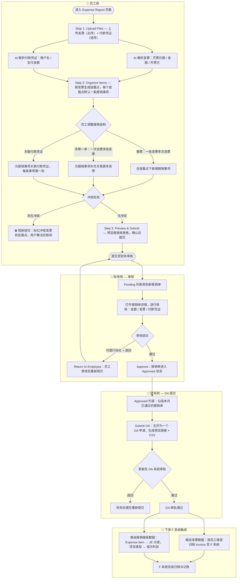

| 项目名称 | **员工报销单 — F Expert Expense Report** |
|------|-------------|
| 文档版本 | v2.0        |
| 创建日期 | 2026-06-11  |
| 最后更新 | 2026-06-14  |
| 所属模块 | F Expert · Expense Report & Expense Review |
| 原型文件 | F-PAP-EXPENSE-REPORT.html（员工侧）、F-PAP-EXPENSE-REVIEW.html（财务侧）|

---

# 一、背景

员工每月产生的报销费用（停车费、餐费、打车、住宿等）目前需要手工填写报销单后提交 OA 审批，再由财务人工做 JE 记账。整个链路存在以下问题：

- 员工填写报销单耗时，字段多、替票关系复杂
- 财务需要逐行核对发票与消费记录的对应关系，人工工作量大
- JE 记账依赖财务手工操作，无法自动化
- 财务汇总多人报销单提交 OA 的操作分散，缺少统一入口

**本功能目标**：员工上传发票（必传）和付款凭证（选传），系统 AI 自动解析并生成报销单草稿；财务 Review 后批量提交 OA；OA 审批通过后由 F-agent 自动完成 JE 记账。

---

# 二、名词说明

| 名词 | 英文 | 说明 |
|------|------|------|
| **发票** | Invoice | 商户开具的正式财务凭证，PDF 或图片格式。员工在报销时必须上传，AI 解析提取开票日期、金额、开票方、发票号等信息。 |
| **付款凭证** | Payment Voucher | 支付行为的证明材料，如支付宝/微信支付截图、银行卡流水截图等，**非必传**。AI 解析可识别商户名称和支付金额（不一定能完整识别）。 |
| **挂载点** | Mount Point | 以单张发票为基础生成的报销单元。每张发票对应一个挂载点，系统自动命名为「报销1」「报销2」等。一个挂载点可包含一条或多条报销事项。 |
| **报销事项** | Expense Item | 挂载点下的具体报销行，描述一次实际消费行为。包含：消费日期、费用内容支出说明、报销金额、关联发票、关联付款凭证、实际内容支出说明、备注等字段。 |
| **替票** | Surrogate Invoice | 一张发票对应多条报销事项，且发票的正式开票内容与实际报销事项不符的情况（发票金额通常大于各报销事项的实际金额）。典型场景：员工用一张停车费汇总发票来报销多笔不同类型的零散消费，发票描述与具体消费内容并不一一对应。此时一个挂载点下需建立多条报销事项，并在「实际内容支出说明」字段中补充真实消费内容。 |
| **一票一单** | One-to-One | 一张发票对应一条报销事项的标准情况，系统默认生成此结构。 |
| **多票一单** | Multi-Invoice Item | 一条报销事项关联多张发票的情况。典型场景：一次大额商务宴请，餐厅单张开票上限不足，分拆开两张发票，但对应同一次消费事项。 |
| **冲突** | Invoice Conflict | 同一张发票被多个不同挂载点下的报销事项同时引用时产生冲突。冲突发票和涉及的挂载点均会标红提示，且阻断提交。 |
| **项目类型** | Category / Account Code | 财务做账时使用的会计科目分类，仅财务在审核阶段填写，员工不可见此字段。 |
| **OA** | OA Approval | 老板审批流程。财务将当月所有已 Approved 的员工报销单批量提交为一个 OA，由老板统一审批。 |
| **JE** | Journal Entry | 会计分录，OA 审批通过后由 F-agent 自动生成，用于下游 F 系统记账。 |

---

# 三、整体流程



---

# 四、报销单生成逻辑（交互说明）

## 4.1 整体结构模型

```
报销单
 ├── 挂载点「报销1」（对应 Invoice A）
 │     ├── 报销事项 1：洗车费 ¥88  [关联: Invoice A]  [付款凭证: VC-01]
 │     ├── 报销事项 2：停车费 ¥56  [关联: Invoice A]
 │     └── 报销事项 3：停车费 ¥40  [关联: Invoice A]
 │         → 替票场景：三条事项共用一张发票
 │         → 校验：¥88+¥56+¥40 = ¥184 ≤ Invoice A 金额 ✅
 │
 ├── 挂载点「报销2」（对应 Invoice B）
 │     └── 报销事项 4：商务宴请 ¥3500  [关联: Invoice B + Invoice C]
 │         → 多票一单场景：一次消费，两张发票
 │
 └── 挂载点「报销3」（对应 Invoice C）
       └── 报销事项 5：打车 ¥89  [关联: Invoice C]  [付款凭证: VC-02]
           ⚠️ Invoice C 同时被「报销2」的事项4引用 → 冲突！
```

## 4.2 Step 1 — 文件上传

| 规则 | 说明 |
|------|------|
| 发票为必传 | 员工必须上传至少一张发票才能继续 |
| 付款凭证为选传 | 不上传付款凭证也可提交，不影响流程 |
| 上传方式 | 点击上传区域 / 拖拽文件，支持 PDF 及图片格式 |
| AI 解析 | 上传后立即触发 AI 解析，提取字段（见第五章字段说明） |
| 预览 | 点击任意已上传文件的「View」按钮，以弹窗形式预览文件内容 |

## 4.3 Step 2 — Organize Items（挂载点与报销事项）

### 挂载点生成规则

- 每张发票自动生成一个挂载点，顺序命名为「报销1」「报销2」...
- 挂载点卡片显示：编号名称、当前状态（OK / Conflict）、合计金额（该挂载点下所有报销事项金额之和）
- 挂载点卡片不显示具体的发票 ID 或文件名

### 报销事项默认生成规则

| 场景 | 默认行为 |
|------|----------|
| 仅上传发票 | 每张发票生成一个挂载点，默认包含一条报销事项；事项的「实际内容支出说明」由 AI 使用发票内容预填 |
| 同时上传发票 + 付款凭证 | 同上，额外尝试将付款凭证与报销事项自动关联（按金额 + 日期 ±N 天 + 商户名模糊匹配，满足 ≥2 条才自动关联，否则留空由用户手动关联） |

### 用户可执行的操作

| 操作 | 说明 |
|------|------|
| 新增报销事项 | 在挂载点内点击「+ New Expense Item」，在**同一张卡片内**追加新的报销事项行（适用于替票场景） |
| 编辑报销事项字段 | 直接在卡片内编辑消费日期、费用内容支出说明、金额、备注、实际内容支出说明 |
| 补充关联发票 | 为某条报销事项点击「+ Associate Invoice」，打开**文件上传对话框**上传新发票并关联至该事项（适用于多票一单场景） |
| 关联付款凭证 | 为某条报销事项点击「+ Add Voucher」，打开**文件上传对话框**上传付款凭证 |
| 替换付款凭证 | 若该报销事项已关联一张付款凭证，按钮变为「↺ Replace」，上传新凭证后旧凭证被替换 |
| 查看文件 | 点击任意发票或付款凭证 Pill 上的「View」，以弹窗预览文件 |
| 删除关联 | 点击 Pill 上的「×」按钮移除关联关系 |

### 付款凭证关联规则

- 每条报销事项**最多关联一张**付款凭证
- 若上传了付款凭证但未与任何报销事项关联，页面顶部显示橙色警告 Banner，列出未关联的凭证，提示用户处理（可忽略，不阻断提交）

### 发票冲突检测规则

> **触发条件**：同一张发票出现在多个不同挂载点的报销事项关联列表中。  
> **注意**：同一挂载点下多条事项引用同一张发票（替票场景）不视为冲突。

| 表现 | 说明 |
|------|------|
| 视觉标记 | 冲突发票 Pill 标红；涉及冲突的**所有挂载点卡片**标红并显示文字提示「Invoice conflict — remove duplicate association」 |
| 提交阻断 | 存在任何未解决冲突时，提交按钮不可用，显示提示：「发票被多处引用 — 同一张发票不可同时挂在多个报销下。请移除重复关联后才能提交。(N 张冲突)」 |
| 解决方式 | 用户在冲突的挂载点中移除多余的发票关联（点击 Pill 上的「×」）后，冲突自动解除 |

### 金额校验规则

- 每个挂载点下所有报销事项的金额之和 **≤ 该挂载点对应的发票金额**
- 超出时显示红色提示（不阻断提交，财务审核时可核查）

## 4.4 Step 3 — Preview & Submit

预览表格包含以下列（按顺序）：

| 列名 | 说明 |
|------|------|
| Invoice Date 开票日期 | AI 解析值，可修改 |
| Expense Date 消费日期 | 员工填写，可修改 |
| Description 费用内容支出说明 | 员工填写，可修改 |
| Amount 金额 | 报销事项金额 |
| Invoice Amount 发票金额 | 若多张发票，显示加和形式（如 `¥188 + ¥88`） |
| Invoice Date 发票日期 | 若多张发票，显示多个日期（如 `2026/6/12 + 2026/6/15`） |
| Actual Description 实际内容支出说明 | AI 预填或员工填写 |
| Remarks 备注 | 员工填写 |
| Invoice 发票 | 可点击查看发票详情（弹窗） |
| Payment Voucher 付款凭证 | 可点击查看付款凭证（弹窗），无则显示「—」 |

---

# 五、字段说明

## 5.1 字段来源与编辑权限

| 字段 | 来源 | 员工（提交阶段） | 财务（审核阶段） |
|------|------|-----------------|-----------------|
| 开票日期 Invoice Date | 发票 AI 解析 | ✅ 可查看 / 修改 | ✅ 可查看 / 修改 |
| 消费日期 Expense Date | 员工填写 | ✅ 必填 | ✅ 可修改 |
| 费用内容支出说明 Description | 员工填写 | ✅ 必填 | ✅ 可修改 |
| 金额 Amount | 员工填写（默认填入发票金额） | ✅ 可修改 | ✅ 可修改 |
| 发票金额 Invoice Amount | 发票 AI 解析 | 👁 只读 | 👁 只读 |
| 实际内容支出说明 Actual Description | AI 预填（可选） | ✅ 可补充/修改 | ✅ 可修改 |
| 备注 Remarks | — | ✅ 选填 | ✅ 选填 |
| 项目类型 Category | AI 预填 + 财务可修改 | ❌ 不可见 | ✅ 必填（下拉选择，AI 预填） |

## 5.2 项目类型枚举

| 枚举值 | 典型消费场景 |
|--------|-------------|
| 员工福利 | 员工关怀支出、住房补贴 |
| 办公用品 | 日常办公耗材、文具、打印耗材 |
| 业务招待 | 客户接待、商务宴请 |
| 差旅费 | 出差综合费用、高铁/机票 |
| 交通费 | 打车、公共交通、滴滴 |
| 住宿费 | 出差住宿 |
| 车辆费 | 停车、洗车、新能源充电 |
| 餐饮费 | 工作餐、团队餐 |
| 团建费 | 团队活动 |

## 5.3 项目类型 AI 预填逻辑

财务审核阶段，系统在展示每行报销事项时，基于「**费用内容支出说明（Description）**」对项目类型进行关键词匹配预填：

**匹配规则（关键词 → 科目）**

| 关键词（含任意一个即匹配） | 预填值 |
|---|---|
| 停车、洗车、充电、车辆 | 车辆费 |
| 住房补贴、员工关怀、福利 | 员工福利 |
| 住宿、酒店、旅馆 | 住宿费 |
| 出差、差旅、机票、高铁、火车、航班 | 差旅费 |
| 打车、交通、地铁、滴滴、出行、公交 | 交通费 |
| 餐、饮食、工作餐、团队餐 | 餐饮费 |
| 办公、打印、文具、耗材、纸张 | 办公用品 |
| 招待、宴、接待、客户 | 业务招待 |
| 团建、活动 | 团建费 |

**交互行为**

- AI 预填的字段以**紫色边框 + "AI" 角标**区分，提示财务注意确认
- 财务手动修改下拉选项后，紫色标识消失，记录为已人工确认
- 若无关键词匹配，下拉框留空，财务必须手动填写
- 提交 OA 前系统不强制校验项目类型是否填写完整（建议但不阻断）

---

# 六、财务审核功能说明（Expense Review）

## 6.1 列表页

财务进入 Expense Review 后，默认展示报销单列表，包含三个状态页签：

| 页签 | 内容 |
|------|------|
| **Pending** | 员工已提交、待财务审核的报销单 |
| **Approved** | 财务已 Approve 的报销单，可勾选提交 OA |
| **All** | 全部报销单 |

每张报销单卡片显示：员工姓名、月份、部门、发票数量、提交日期、金额、状态标签。

## 6.2 审核详情页

财务点击卡片进入详情页后可执行以下操作：

| 操作 | 说明 |
|------|------|
| 查看报销明细表格 | 与员工预览表格结构一致，含发票 / 付款凭证查看功能（弹窗） |
| 填写项目类型 | 下拉选择每行的会计科目 |
| Flag 问题行 | 点击行内 ⚑ 按钮标记有问题的行 |
| Return（退回） | 填写退回原因，报销单退回员工修改；被 Flag 的行会同步展示 |
| Approve（通过） | 报销单状态变为 Approved，进入 Approved 列表 |

## 6.3 批量提交 OA

在 Approved 页签中：

1. 财务勾选本月需要提交的报销单（可多选）
2. 底部出现操作栏，显示勾选数量和合计金额
3. 点击「Submit OA」，弹出确认弹窗，列出所有选中报销单及总金额，支持填写备注
4. 点击「Confirm & Submit」后执行提交，同时自动生成 **OA Package**（见 6.4）
5. 所有勾选的报销单取消选中状态

## 6.4 OA Package — 提交成功包

提交成功后，系统弹出「OA Package Ready」面板，内容包含：

### OA Reference Number

系统自动生成唯一 OA 编号，格式为 `OA-YYYYMMDD-XXXX`（如 `OA-20260614-A3F2`），用于追溯和归档。

### 汇总数据（Overview Stats）

| 指标 | 说明 |
|------|------|
| Reports | 本次提交的报销单数量 |
| Invoices | 涉及的发票总张数 |
| Total Amount | 所有报销单金额之和 |
| OA Reference | 本次 OA 的唯一编号 |

### 报销单明细表格

按员工维度列出每张报销单的汇总行：

| 列 | 说明 |
|----|------|
| Employee | 员工姓名 |
| Dept | 所属部门 |
| Period | 报销月份 |
| Amount | 报销金额 |
| Invoices | 发票张数 |
| Expense Items | 报销事项条数 |

最后一行显示所有报销单的合计值。

### 可分享预览链接

系统生成一条可分享的预览链接，格式为：

```
https://f-expert.io/oa/preview/{OA-Reference}
```

- 财务可将链接发送给老板（OA 审批人），老板通过链接无需登录即可查阅本次 OA 内容
- 链接页面展示：OA 汇总数据 + 每位员工的报销明细
- 链接内提供「Copy Link」按钮，点击后文字变为「Copied!」，2 秒后恢复

> **实现说明**：实际系统需要后端生成带鉴权 Token 的短链（建议有效期 30 天）。

### CSV 下载

点击「Download CSV」按钮，浏览器直接下载报销明细数据文件，文件名格式为 `{OA-Reference}_expense-reports.csv`。

**CSV 字段（列顺序）：**

| 列名 | 来源 |
|------|------|
| OA Ref | 本次 OA 编号 |
| Employee | 员工姓名 |
| Department | 部门 |
| Period | 报销月份 |
| Expense Date | 消费日期 |
| Description 费用内容支出说明 | 员工填写 |
| Amount (CNY) | 报销金额 |
| Invoice Amount (CNY) | 发票金额（多张时为加和，如 `188+88`） |
| Invoice Date | 发票开票日期（多张时为拼接，如 `2026/6/12+2026/6/15`） |
| Actual Description 实际内容支出说明 | AI 预填或员工填写 |
| Remarks | 备注 |
| Invoice ID(s) | 关联发票编号（多张时用 `+` 连接） |

> CSV 文件使用 UTF-8 BOM 编码，确保 Excel 直接打开中文字段不乱码。

---

# 七、下游 F 系统集成

OA 审批通过后，系统向下游 F 系统推送两类数据：

## 7.1 发票归档数据

按员工维度，推送每张发票的基本信息：

| 字段 | 说明 |
|------|------|
| 员工 ID | |
| 发票编号 | |
| 开票日期 | |
| 发票金额 | |
| 开票方 | |
| 发票文件路径 | |

## 7.2 报销做账数据（JE 生成依据）

按员工报销单维度，推送每条报销事项，用于生成 JE 分录：

| 报销事项字段 | JE 映射 |
|-------------|---------|
| 项目类型 | 借方会计科目 |
| 金额（人民币元） | 借方金额 |
| 员工 / 部门 | 成本中心 |
| 贷方 | 应付账款 / 员工借款科目 |
| Accounting Date | OA 审批通过日期 |

若 JE 置信度低，自动创建 JE Review 会话，财务通过 Chat 确认（复用现有 JE Review 流程）。

---

# 八、待确认事项

| 问题 | 当前结论 | 待确认 |
|------|---------|--------|
| OA 对接方式 | 系统内批量选中后提交 OA | OA 是否有可用 API，或需要生成 PDF 手动上传 |
| 项目类型枚举 | 初步枚举已定 | 需财务确认枚举值与 OA / JE 科目一一对应关系 |
| 替票审计要求 | 员工填写实际说明即可 | 是否需要上传原始小票照片作为附件 |
| 付款凭证 AI 识别能力 | 尽力识别，不强制 | 对于无法识别的凭证，是否需要员工手动标注金额 |
| 员工可见范围 | 员工只看自己的报销单 | 主管是否需要在 F Expert 内看到下属的报销单 |
| 多票一单场景下的金额校验 | 报销事项金额 ≤ 所关联所有发票金额之和 | 是否还需要每张发票的独立金额校验 |
| OA 提交后状态流转 | 当前原型不改变报销单状态 | OA 通过后报销单是否变为新的 Completed 状态 |
