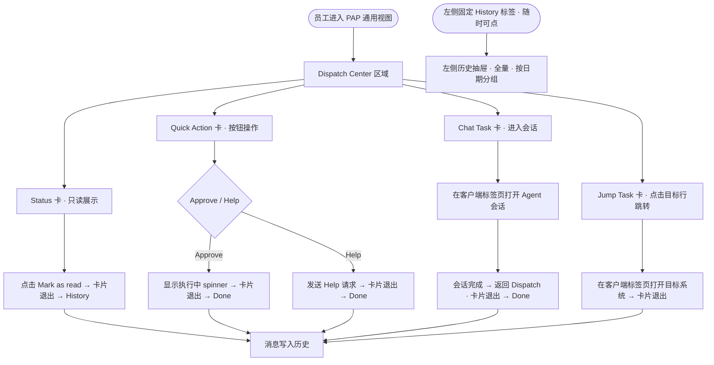
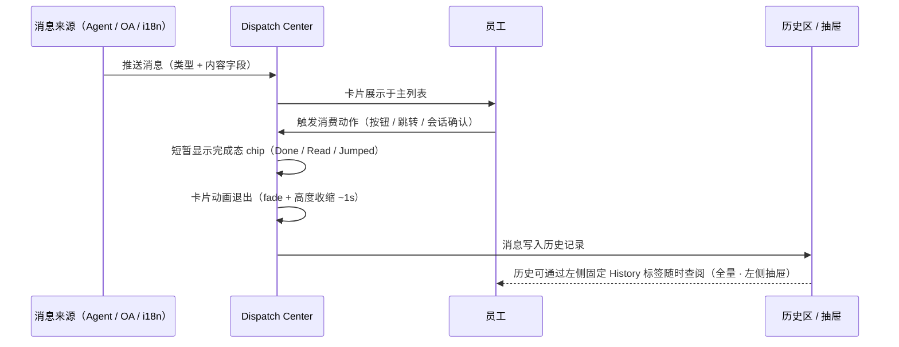

n变更记录：


| 时间         | 内容                                             | 负责人 |     |
| ---------- | ---------------------------------------------- | --- | --- |
| 2026-06-07 | 初版，Dispatch Center 设计                          | —   |     |
| 2026-06-07 | 精简卡片字段：移除所有 tags 和 statusPill；调整各类型消费交互        | —   |     |
| 2026-06-16 | Chat Task 类型编号由 B-Chat 改为 C，Jump Task 由 C 改为 D | —   |     |


# 背景

## PAP 消息触达的现有问题

D 系统 2.0 时代有独立的消息中心，员工可以在其中查看系统通知、任务提醒、审批结果等各类消息。当产品迁移至纯 PAP 架构后，这一入口不复存在——PAP 专注于任务执行与 Agent 协作，缺乏一个统一的消息触达通道。

这带来了一个实际问题：**新功能上线、流程变更、审批结果、Agent 产出的操作请求，都无法有效触达用户。** 员工只能依赖主动进入各子系统查看，容易遗漏。

因此需要在 PAP 中新增一个轻量的消息与任务触达模块，满足以下场景：

- 系统状态变更通知（如 OA 审批完成）
- Agent 生成的快捷操作请求（如补偿审批）
- 需要用户多轮输入的会话任务（如内容发布确认）
- 需要跳转至外部系统处理的导航任务

## 目标

- 为通用员工角色提供统一的任务触达中心，覆盖 Agent 推送、系统状态通知、跳转导航三类场景
- 清晰定义四种消息类型的字段规范、生成来源和消费方式
- 设计历史消息的展示与归档策略，兼顾即时可见和长期可查

---

# Dispatch Center 设计思路

Dispatch Center 是 PAP 通用员工视图的消息触达模块，以内联卡片列表的形式嵌入页面主内容区，替代原有的 AI Task 区域。

## 核心设计原则

1. **按类型分发，不按系统分发**：消息来源可能是 Agent、OA 系统、i18n 系统等多个系统，但对员工呈现时统一按交互类型（Status / Quick Action / Chat Task / Jump Task）分类展示，降低系统感知负担。
2. **消费即归档**：每条消息只有一次主动消费机会，消费后卡片退出主列表、进入历史，保持主区域始终是"需要我处理的任务"。
3. **类型即操作**：卡片本身即交互入口，操作方式由类型决定——无需额外说明：Status 卡点"Mark as read"、Quick Action 卡点按钮、Chat Task 卡进入会话、Jump Task 卡点标题行右侧箭头跳转。
4. **历史可追溯**：左侧固定 History 标签始终可见，点击后从左侧滑入历史抽屉，按时间分组展示全量记录，并记录每条历史的操作动作（Approved / Help sent / Chat done / Jumped / Read）。

## 用户使用流程




## 消息生命周期




---

# 消息类型详解

Dispatch Center 定义四种消息类型，按触发动作和消费路径区分。

## 类型总览

Dispatch Center 定义四种消息类型，按触发动作和消费路径区分。

**Status**（`a-status`）：系统状态通知，点击 Mark as read 消费，历史记录 Read。

**Quick Action**（`b-quick`）：快捷操作任务，点击 Approve 或 Help 消费，历史记录 Approved / Help sent。

**Chat Task**（`c-chat`）：会话任务，进入会话完成确认后消费，历史记录 Chat done。

**Jump Task**（`d`）：跳转任务，点击标题行右侧 › 箭头消费，历史记录 Jumped。

---

## Type A · Status（状态通知）

### 定义

只读的系统状态变更通知，不需要员工做任何操作决策，仅用于告知。

### 字段规范

每条 Status 消息包含以下字段：`id`（消息唯一 ID）、`type`（固定为 `a-status`）、`typeLabel`（卡片头部标签，固定为 `Status`）、`source`（来源系统名称，如 `OA System`）、`time`（推送时间，`HH:mm` 格式）、`title`（通知标题，≤ 20 字）、`summary`（通知详情，一句话，包含关键数字或结果）。

### 生成来源

由后端系统在状态变更节点（OA 审批通过、付款完成、出行申请批准等）主动推送，无需用户触发。

### 消费方式

卡片底部展示 **Mark as read** 按钮。员工点击后：

- 卡片显示"Read"chip → 动画退出 → 进入历史，记录 `Read`

### 案例 — A1：财务请款 OA 已完成

> 来源：OA System · 今天 14:52
>
> **财务请款 OA 已完成**
> 你提交的请款申请（申请号 OA-2026-05-1183，金额 ¥ 32,000）已完成全部审批流程，款项将于 3 个工作日内到账。
>
> 操作：`Mark as read`

---

## Type B-Quick · Quick Action（快捷任务）

### 定义

需要员工做一次决策的任务，创建方（Agent 或系统）已完成分析并给出推荐，员工通过按钮点击完成授权。适用于审批、发布确认、转人工介入等场景。

适用判断：**创建方已得出结论，员工只需授权**。若选项本身需要解释或背景说明，应使用 Chat Task。

### 字段规范

每条 Quick Action 消息包含以下字段：`id`（消息唯一 ID）、`type`（固定为 `b-quick`）、`typeLabel`（固定为 `Quick Action`）、`source`（创建方名称，可为 Agent 或系统）、`time`（推送时间）、`title`（任务标题）、`summary`（背景说明，创建方应提供足够上下文，员工无需跳转即可决策）、`actions`（操作按钮列表，每项含 `semantic / label / callback`）。

### 生成来源

创建方可以是 **Agent** 或**后端系统**，两者均遵循统一推送协议：

- **Agent 创建**：Agent 完成信息收集与分析后，判断需要员工一次性决策时推送，callback 由 Agent 运行时处理。
- **系统直接创建**：系统在状态变更节点（如流水线完成、审批就绪）主动推送，callback 为系统暴露的 Webhook 端点。
- **不可改造的系统**：由 Admin Agent 作为适配层，将系统事件转换为 Quick Action 卡并持有 callback 逻辑，系统侧无需改造。

### Action 按钮规范

按钮样式和排列顺序由 `semantic` 语义类型决定，`label` 允许自定义，最多展示 3 个按钮：


| Semantic   | 语义             | 视觉    | 排列位置 |
| ---------- | -------------- | ----- | ---- |
| `execute`  | 主操作，立即执行，通常不可逆 | 实心强调色 | 最左   |
| `defer`    | 推迟处理，稍后执行      | 描边中性色 | 中间   |
| `escalate` | 上报，转交决策者介入     | 文本低调色 | 最右   |


常见组合：

- 审批类：`execute: Approve` + `escalate: Help`
- 发布类：`execute: Publish Now` + `defer: Schedule` + `escalate: Help`
- 确认类：`execute: Confirm` + `escalate: Help`

### 执行流程

用户点击按钮后，PAP 将用户决策作为回调信号发回给创建方，由创建方执行实际业务操作，再将执行结果返回 PAP：

```
用户点击按钮
  ↓
PAP → callback → 创建方（Agent 或系统 Webhook）
  { msg_id, semantic, label, actor, timestamp }
  ↓
创建方执行业务操作（调用目标系统接口）
  ↓
创建方 → PAP：done / failed
  ↓
PAP 更新卡片状态
```

PAP 不直接调用业务接口，只负责传递人的决策信号，业务逻辑由创建方自行承担。

`escalate` 按钮是特殊路径：不回调创建方，而是通知 Decision Maker 在 PAP Manager 视图创建介入任务，原卡片挂起等待处理。

### 消费方式

1. 点击 **execute 类按钮**（如 Publish Now / Approve）：卡片显示执行中 spinner，等待创建方执行回包 → 收到 `done` 后卡片动画退出 → 进入历史，记录对应 label
2. 点击 **defer 类按钮**（如 Schedule）：PAP 回调创建方注册推迟逻辑 → 卡片退出 → 进入历史
3. 点击 **escalate 类按钮**（如 Help）：通知 Decision Maker 介入 → 卡片退出 → 进入历史，记录 `Help sent`
4. 创建方返回 `failed`：卡片保留在主列表并显示错误态，等待人工处理或重试

### 案例 — B1：v1.2.4 热修包发布确认

> 来源：Release Agent · 10:23
>
> **「逃离校园」v1.2.4 热修包待发布**
> 自动化测试全部通过（通过率 100%）。修复内容：成就 Lv.7 / Lv.11 解锁 bug、iOS 低内存崩溃。包体积 2.3 MB，回滚方案已就绪。发布窗口：今日 22:00 前（低峰期）。
>
> 操作：`🚀 Publish Now`（execute）· `Schedule`（defer）

---

## Type C · Chat Task（会话任务）

### 定义

需要员工通过多轮对话提供输入或确认的任务，Agent 已完成可自动执行的部分，但存在 2-3 个需要员工判断的关键节点（如内容文案、时间设定），通过会话逐步收集。

### 字段规范

每条 Chat Task 消息包含以下字段：`id`（消息唯一 ID）、`type`（固定为 `c-chat`）、`typeLabel`（固定为 `Chat Task`）、`source`（发起 Agent 名称，如 `Minion Agent`）、`time`（推送时间）、`title`（任务标题）、`summary`（任务背景说明，包含 Agent 已完成的步骤与等待输入的项目）、`actions`（仅含进入会话按钮，`label: '💬 Start Chat'`）。

### 生成来源

由 Minion Agent 在执行复杂任务流程中，遇到需要人工输入的节点时推送。`summary` 应明确说明：哪些步骤已自动完成、哪些步骤等待员工输入。

### 消费方式

1. 点击 **💬 Start Chat**：在客户端新标签页打开 Agent 会话，进入预设的对话流程
2. 在会话中完成输入并点击"确认执行" → 会话完成 → 返回 Dispatch Center → 卡片动画退出 → 进入历史，记录 `Chat done`
3. 历史记录中，点击该条历史 → 重新打开对应会话页查看完整对话

### 案例 — C1：X 官号上线发布任务

> 来源：Minion Agent · 14:37
>
> **X 官号上线发布任务 · 需要你的输入**
> 「逃离校园」上线前发布流程已就绪，Minion 需要你提供发布文案和发送时间，其余步骤将自动执行。
>
> 操作：`💬 Start Chat`
>
> **会话流程：**
>
> 1. Agent 展示任务进度（Upload follower ✅ · SNS Banner ✅ · Text ⏳ · Sending Time ⏳）
> 2. 员工提供发布文案
> 3. Agent 检查文案，建议加 hashtag，在 Adnext 创建草稿
> 4. 员工确认发送时间（今日 20:00）
> 5. Agent 汇总确认卡 → 员工确认执行 → 自动排队发布

---

## Type D · Jump Task（跳转任务）

### 定义

需要员工前往另一个系统或会话完成的任务，Dispatch Center 仅作为导航入口，不承载具体操作内容。适用于需要在专属系统中处理的任务（如 i18n 监修、工单处理）。

### 字段规范

每条 Jump Task 消息包含以下字段：`id`（消息唯一 ID）、`type`（固定为 `d`）、`typeLabel`（固定为 `Jump Task`）、`source`（来源系统名称）、`time`（推送时间）、`title`（任务标题，标题行右侧内联显示 `›` 箭头作为跳转触发区）、`summary`（任务背景，说明跳转后需要完成的工作）。

### 生成来源

由需要员工在目标系统中操作的 Agent 或系统推送。`summary` 应清晰说明跳转后需要完成的动作，而非仅描述目标系统名称。

### 消费方式

**无操作按钮**。标题行右侧内联显示 `›` 箭头，**点击标题行**即触发跳转：

- 在客户端新标签页打开目标系统
- 卡片动画退出 → 进入历史，记录 `Jumped`

历史记录中，点击该条历史 → 重新在客户端标签页打开目标系统。

### 案例 — D1：i18n 翻译监修

> 来源：i18n System · 11:45
>
> **翻译监修任务待处理 ›**
> 「逃离校园」本地化文本已完成机器翻译，等待监修确认。本周五提交本地化审核，请尽快完成监修并标记 Reviewed。

---

# 历史消息处理

## 设计策略

历史消息的核心问题是：**随时间积累，条目会无限增长**，且 Dispatch Center 主区域在无待处理消息时本身不存在，不适合作为历史入口的宿主。因此将历史入口单独抽离为左侧固定标签。


| 层级      | 存储方式                      | 容量        | 展示形式         |
| ------- | ------------------------- | --------- | ------------ |
| 历史抽屉    | Mock 历史 + 当前 session 消费记录 | 全量（12+ 条） | 左侧抽屉 · 按日期分组 |
| 归档（规划中） | 持久化数据库                    | 无上限       | 消息中心归档页      |


## 左侧固定 History 标签

- 始终贴在客户端内容区左边缘，**无论主区域是否有消息均可见**
- 外观：小型半透明胶囊，仅含时钟图标，悬浮时加深
- 点击后从左侧滑入历史抽屉

## 左侧历史抽屉

点击左侧固定 History 标签从左侧滑入：

- 遮罩 + 背景模糊
- 顶部显示标题"历史消息" + 总条数徽章
- 按日期分组（Today / Yesterday / Jun 5 / …）
- 每行展示：类型色点 · 标题 · 来源 · 操作动作（斜体）· 时间 · Done/Read 标签
- **Chat Task 行可点击**：在客户端标签页打开对应会话
- **Jump Task 行可点击**：在客户端标签页打开目标系统
- 点击背景遮罩或关闭按钮收起

## 历史记录中操作动作的展示规则

Quick Action 记录用户实际点击的按钮（Approved 或 Help sent），展示在内联历史的来源后（斜体）以及抽屉的独立字段中。Chat Task 记录 Chat done，内联历史和抽屉均展示。Jump Task 记录 Jumped，内联历史和抽屉均展示。Status 仅展示 Read 状态，无操作动作字段。

## 长期归档策略（规划）

未来规划的消息中心归档页将在历史抽屉基础上提供更强的查询能力：

- 按时间范围筛选
- 按类型筛选（Status / Quick Action / Chat Task / Jump Task）
- 按来源 Agent / 系统筛选
- 关键词搜索
- 对 Chat Task 类型，可点击跳转至原始会话

---

# 权限

通用员工（General Employee）拥有以下权限：查看 Dispatch Center 消息列表、点击 Quick Action 卡的 Approve / Help 按钮、点击 Chat Task 卡的 Start Chat 在客户端标签页打开 Agent 会话、点击 Jump Task 卡标题行在客户端标签页打开目标系统、通过左侧固定 History 标签打开历史抽屉查看全量记录。

系统 / Agent 端拥有推送消息至 Dispatch Center 的权限。