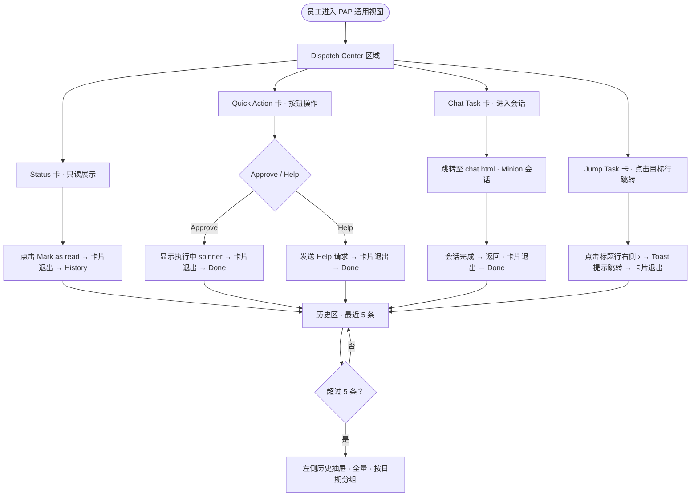
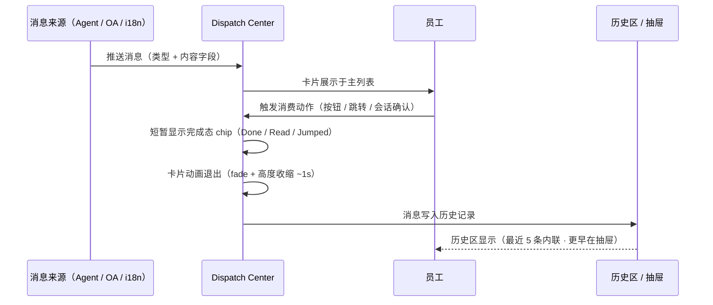

变更记录：

| 时间       | 内容                        | 负责人 |     |
|------------|----------------------------|--------|-----|
| 2026-06-07 | 初版，Dispatch Center 设计  | —      |     |
| 2026-06-07 | 精简卡片字段：移除所有 tags 和 statusPill；调整各类型消费交互 | — |  |

# 背景

##  PAP 消息触达的现有问题

D 系统 2.0 时代有独立的消息中心，员工可以在其中查看系统通知、任务提醒、审批结果等各类消息。当产品迁移至纯 PAP 架构后，这一入口不复存在——PAP 专注于任务执行与 Agent 协作，缺乏一个统一的消息触达通道。

这带来了一个实际问题：**新功能上线、流程变更、审批结果、Agent 产出的操作请求，都无法有效触达用户。** 员工只能依赖主动进入各子系统查看，容易遗漏。

因此需要在 PAP 中新增一个轻量的消息与任务触达模块，满足以下场景：
- 系统状态变更通知（如 OA 审批完成）
- Agent 生成的快捷操作请求（如补偿审批）
- 需要用户多轮输入的会话任务（如内容发布确认）
- 需要跳转至外部系统处理的导航任务

## 目标

- 为通用员工角色提供统一的任务触达中心，覆盖 Agent 推送、系统状态通知、跳转导航三类场景
- 清晰定义四种消息类型的字段规范、生成来源和消费方式
- 设计历史消息的展示与归档策略，兼顾即时可见和长期可查

---

# Dispatch Center 设计思路

Dispatch Center 是 PAP 通用员工视图的消息触达模块，以内联卡片列表的形式嵌入页面主内容区，替代原有的 AI Task 区域。

## 核心设计原则

1. **按类型分发，不按系统分发**：消息来源可能是 Agent、OA 系统、i18n 系统等多个系统，但对员工呈现时统一按交互类型（Status / Quick Action / Chat Task / Jump Task）分类展示，降低系统感知负担。
2. **消费即归档**：每条消息只有一次主动消费机会，消费后卡片退出主列表、进入历史，保持主区域始终是"需要我处理的任务"。
3. **类型即操作**：卡片本身即交互入口，操作方式由类型决定——无需额外说明：Status 卡点"Mark as read"、Quick Action 卡点按钮、Chat Task 卡进入会话、Jump Task 卡点标题行右侧箭头跳转。
4. **历史可追溯**：历史区显示最近 5 条，超出的在左侧抽屉中按时间分组展示，并记录每条历史的操作动作（Approved / Help sent / Chat done / Jumped / Read）。

## 用户使用流程

## 消息生命周期

---

# 消息类型详解

Dispatch Center 定义四种消息类型，按触发动作和消费路径区分。

## 类型总览

Dispatch Center 定义四种消息类型，按触发动作和消费路径区分。

**Status**（`a-status`）：系统状态通知，点击 Mark as read 消费，历史记录 Read。

**Quick Action**（`b-quick`）：快捷操作任务，点击 Approve 或 Help 消费，历史记录 Approved / Help sent。

**Chat Task**（`b-chat`）：会话任务，进入会话完成确认后消费，历史记录 Chat done。

**Jump Task**（`c`）：跳转任务，点击标题行右侧 › 箭头消费，历史记录 Jumped。

---

## Type A · Status（状态通知）

### 定义

只读的系统状态变更通知，不需要员工做任何操作决策，仅用于告知。

### 字段规范

每条 Status 消息包含以下字段：`id`（消息唯一 ID）、`type`（固定为 `a-status`）、`typeLabel`（卡片头部标签，固定为 `Status`）、`source`（来源系统名称，如 `OA System`）、`time`（推送时间，`HH:mm` 格式）、`title`（通知标题，≤ 20 字）、`summary`（通知详情，一句话，包含关键数字或结果）。

### 生成来源

由后端系统在状态变更节点（OA 审批通过、付款完成、出行申请批准等）主动推送，无需用户触发。

### 消费方式

卡片底部展示 **Mark as read** 按钮。员工点击后：
- 卡片显示"Read"chip → 动画退出 → 进入历史，记录 `Read`

### 案例 — A1：财务请款 OA 已完成

> 来源：OA System · 今天 14:52
>
> **财务请款 OA 已完成**
> 你提交的请款申请（申请号 OA-2026-05-1183，金额 ¥ 32,000）已完成全部审批流程，款项将于 3 个工作日内到账。
>
> 操作：`Mark as read`

---

## Type B-Quick · Quick Action（快捷任务）

### 定义

需要员工做一次二选一决策的任务，Agent 已完成分析并给出推荐，员工通过按钮点击完成。适用于审批、确认、转人工介入等场景。

### 字段规范

每条 Quick Action 消息包含以下字段：`id`（消息唯一 ID）、`type`（固定为 `b-quick`）、`typeLabel`（固定为 `Quick Action`）、`source`（发起 Agent 名称，如 `小秘 Agent`）、`time`（推送时间）、`title`（任务标题）、`summary`（Agent 分析摘要，说明背景和建议行动）、`actions`（操作按钮列表，每项含 `label / cls / action`）。

### 生成来源

由 Agent（如小秘 Agent）在完成信息收集和分析后，判断需要员工一次性决策时推送。Agent 应在 `summary` 中提供足够的上下文，员工无需跳转至其他系统即可决策。

### 消费方式

1. 点击 **Approve**：卡片显示"Agent 正在执行…"spinner → 1.6s 后卡片动画退出 → 进入历史，记录 `Approved`
2. 点击 **Help**：立即发送求助请求，Toast 提示"Help 请求已发送，等待决策者介入" → 卡片动画退出 → 进入历史，记录 `Help sent`

### 案例 — B1：CP 道具补偿审批

> 来源：小秘 Agent · 10:23
>
> **CP「逃离校园」道具补偿**
> 「校园合成」Lv.7 / Lv.11 成就 bug 影响约 153 名玩家，待补 70 张合成卡。活动今日 23:59 截止，需先补偿再排查。
>
> 操作：`Approve` · `Help`

---

## Type B-Chat · Chat Task（会话任务）

### 定义

需要员工通过多轮对话提供输入或确认的任务，Agent 已完成可自动执行的部分，但存在 2-3 个需要员工判断的关键节点（如内容文案、时间设定），通过会话逐步收集。

### 字段规范

每条 Chat Task 消息包含以下字段：`id`（消息唯一 ID）、`type`（固定为 `b-chat`）、`typeLabel`（固定为 `Chat Task`）、`source`（发起 Agent 名称，如 `Minion Agent`）、`time`（推送时间）、`title`（任务标题）、`summary`（任务背景说明，包含 Agent 已完成的步骤与等待输入的项目）、`actions`（仅含进入会话按钮，`label: '💬 Start Chat'`）。

### 生成来源

由 Minion Agent 在执行复杂任务流程中，遇到需要人工输入的节点时推送。`summary` 应明确说明：哪些步骤已自动完成、哪些步骤等待员工输入。

### 消费方式

1. 点击 **💬 Start Chat**：卡片显示"Chat opened"chip → 动画退出 → 跳转至 `chat.html?scene=xxx`，进入预加载的 Minion 会话
2. 在会话中完成输入并点击"确认执行" → 会话完成 → 进入历史，记录 `Chat done`
3. 历史记录中，点击该条历史 → 跳转至对应会话页查看完整对话

### 案例 — B2：X 官号上线发布任务

> 来源：Minion Agent · 14:37
>
> **X 官号上线发布任务 · 需要你的输入**
> 「逃离校园」上线前发布流程已就绪，Minion 需要你提供发布文案和发送时间，其余步骤将自动执行。
>
> 操作：`💬 Start Chat`
>
> **会话流程（chat.html?scene=x-release）：**
> 1. Agent 展示任务进度（Upload follower ✅ · SNS Banner ✅ · Text ⏳ · Sending Time ⏳）
> 2. 员工提供发布文案
> 3. Agent 检查文案，建议加 hashtag，在 Adnext 创建草稿
> 4. 员工确认发送时间（今日 20:00）
> 5. Agent 汇总确认卡 → 员工确认执行 → 自动排队发布

---

## Type C · Jump Task（跳转任务）

### 定义

需要员工前往另一个系统或会话完成的任务，Dispatch Center 仅作为导航入口，不承载具体操作内容。适用于需要在专属系统中处理的任务（如 i18n 监修、工单处理）。

### 字段规范

每条 Jump Task 消息包含以下字段：`id`（消息唯一 ID）、`type`（固定为 `c`）、`typeLabel`（固定为 `Jump Task`）、`source`（来源系统名称）、`time`（推送时间）、`title`（任务标题，标题行右侧内联显示 `›` 箭头作为跳转触发区）、`summary`（任务背景，说明跳转后需要完成的工作）。

### 生成来源

由需要员工在目标系统中操作的 Agent 或系统推送。`summary` 应清晰说明跳转后需要完成的动作，而非仅描述目标系统名称。

### 消费方式

**无操作按钮**。标题行右侧内联显示 `›` 箭头，**点击标题行**即触发跳转：
- Toast 提示跳转目标
- 卡片动画退出 → 进入历史，记录 `Jumped`

历史记录中，点击该条历史 → Toast 提示跳转目标（模拟）。

### 案例 — C1：i18n 翻译监修

> 来源：i18n System · 11:45
>
> **翻译监修任务待处理 ›**
> 「逃离校园」本地化文本已完成机器翻译，等待监修确认。本周五提交本地化审核，请尽快完成监修并标记 Reviewed。

---

# 历史消息处理

## 设计策略

历史消息的核心问题是：**随时间积累，条目会无限增长**。Dispatch Center 采用分层展示策略解决这一问题：

| 层级 | 存储方式 | 容量 | 展示形式 |
|------|---------|------|---------|
| 内联历史 | 当前 session 消费记录 | 最近 5 条 | 历史区折叠列表（默认展开） |
| 历史抽屉 | Mock 历史 + 当前消费 | 全量（12+ 条） | 左侧抽屉 · 按日期分组 |
| 归档（规划中） | 持久化数据库 | 无上限 | 消息中心归档页 |

## 内联 History 区

- 位于 Dispatch Center 消息列表下方，标题显示为 **History**
- 默认展开，切换 Case 时自动展开
- 最多展示 5 条，超出显示"另有 N 条更早记录 → 全部历史"
- 每行展示：类型色点 · 标题 · 来源 · 操作记录（Quick Action 显示 Approved / Help sent）· Done/Read 标签

## 左侧历史抽屉

点击"另有 N 条更早记录 → 全部历史"从左侧滑入：

- 遮罩 + 背景模糊
- 顶部显示标题"历史消息" + 总条数徽章
- 按日期分组（Today / Yesterday / Jun 5 / …）
- 每行展示：类型色点 · 标题 · 来源 · 操作动作（斜体）· 时间 · Done/Read 标签
- **Chat Task 行可点击**：跳转至对应会话页
- **Jump Task 行可点击**：Toast 提示跳转目标
- 点击背景遮罩或关闭按钮收起

## 历史记录中操作动作的展示规则

Quick Action 记录用户实际点击的按钮（Approved 或 Help sent），展示在内联历史的来源后（斜体）以及抽屉的独立字段中。Chat Task 记录 Chat done，内联历史和抽屉均展示。Jump Task 记录 Jumped，内联历史和抽屉均展示。Status 仅展示 Read 状态，无操作动作字段。

## 长期归档策略（规划）

当历史条目超出内联上限（5 条）时，抽屉入口提示"另有 N 条更早记录"。未来规划的消息中心归档页将提供：

- 按时间范围筛选
- 按类型筛选（Status / Quick Action / Chat Task / Jump Task）
- 按来源 Agent / 系统筛选
- 关键词搜索
- 对 Chat Task 类型，可点击跳转至原始会话

---

# 权限

通用员工（General Employee）拥有以下权限：查看 Dispatch Center 消息列表、点击 Quick Action 卡的 Approve / Help 按钮、点击 Chat Task 卡的 Start Chat 进入会话、点击 Jump Task 卡标题行右侧箭头跳转目标系统、查看内联历史区（最近 5 条）、打开历史抽屉查看全量记录。

系统 / Agent 端拥有推送消息至 Dispatch Center 的权限。
