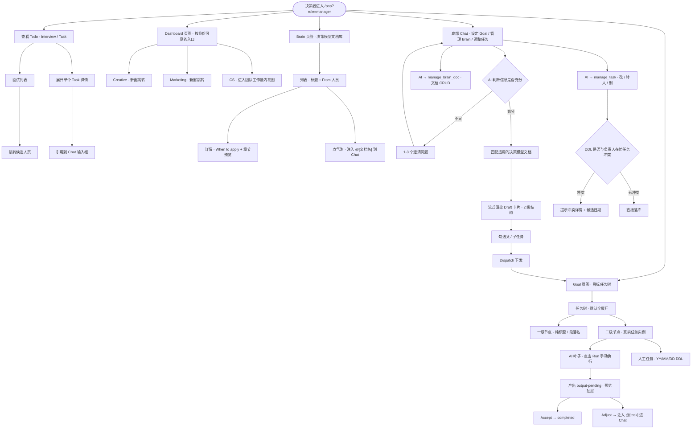
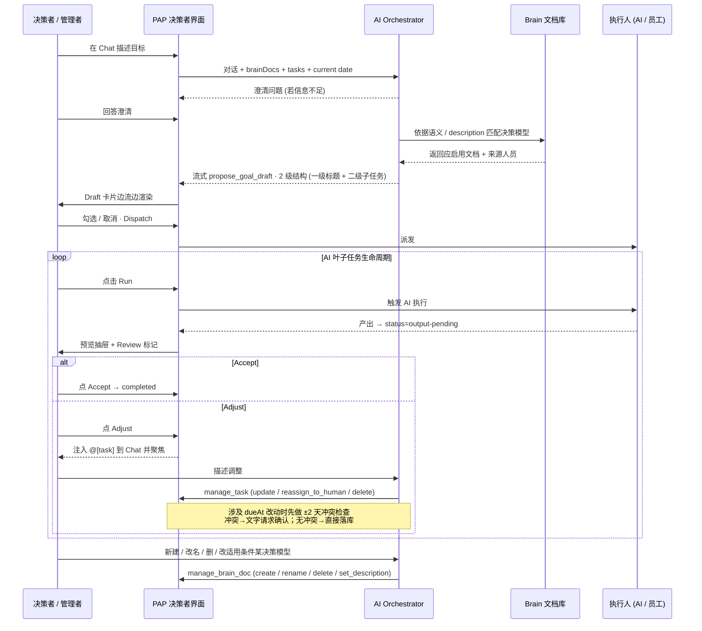

变更记录：

| 时间  | 内容  | 负责人 |     |
|-----|-----|-----|-----|
|     |     |     |     |

# 背景

PAP 的第一个 P 是决策者，负责指定目标，分配任务，管理资源

希望通过 Agent 辅助决策，拆解任务，整理资源，达成更高效的决策落地

业务管理者通过团队看板，了解资源运转情况，及时进行干预和管理

# 目标

* 提取任务制定方式（本期萃取 CEO 的 Memory），把任何目标拆解成可落地的任务，并分发给其它人
* CS Team 的看板

# 需求

## 原型

<https://prototype-henna-kappa.vercel.app/pap?role=manager&user=u2>

## 用户使用流程

多角色协作时序：

## 角色定义

在进入各模块之前先对齐页面涉及的两类人：

1. **决策者 / 公司管理者（Manager）**：PAP 决策者视图的主使用人。负责制定目标、审定任务草案并下发、手动触发 AI 叶子任务的执行与审核、通过 Chat 管理 Brain 文档和已派发任务。Todo / Goal / Chat / Brain 能力全量可见。
2. **决策者账号的次级身份**：用于控制 Dashboard 页签内部**入口的可见集合**。
   * **决策层成员（Executive）**：公司 executive 部门成员。Dashboard 内可见 Creative / Marketing 等跨所有业务 Dashboard 入口。
   * **CS 业务管理者（AI Trainer Lead）**：Dashboard 内可见 CS 入口，进入后查看 AI Trainer 团队的当日工作量指标。
   * 同一账号可同时具备多个次级身份，对应入口同时显示。

> Brain 页签对所有 Executive 部门成员 开放。Dashboard 页签对所有 Manager 可见；内部入口按次级身份过滤，全部为空时展示空态。

## 页面顶部 · Todo 区

Todo 区展示决策者本期内最紧迫的个人事项，按"面试 / 任务"两类并列。

1. Todo 区标题：
   * 状态：
     * 默认显示 Todo 总数（Interview 条数 + Task 条数）
   * 文案：
     * 区域标签："Todo"
     * 计数格式：纯数字，右对齐等宽对齐
2. Interview 卡片：展示最近一条待办面试的摘要。
   * 交互：
     * 点击卡片主体：新窗口打开候选人页
     * 点击右上角计数数字：弹出 Interview 全量列表抽屉
     * 列表项再点击：新窗口打开候选人页
   * 状态：
     * 有面试：显示下一场面试的标题、剩余时间、面试官
     * 无面试：显示"暂无面试"
     * 剩余时间已过：显示 "overdue"
   * 规则：
     * 以应用内"当前时间"为基准计算剩余时间
     * 剩余时间单位：< 60min 用 `Xmin`；< 24h 用 `XhYmin` 或 `Xh`；≥ 24h 用 `XdYh` 或 `Xd`
     * 面试列表按 `dueAt` 升序排序
   * 文案：
     * 区域标签："Interview"
     * 空态："暂无面试"
3. Task 卡片：展示当前最相关的 Task 摘要。
   * 交互：
     * 点击卡片主体：弹出 Task 全量列表抽屉，并自动展开当前进行中的任务
     * 点击右上角计数数字：弹出 Task 全量列表抽屉（不自动展开）
     * 在列表项点击标题：展开 / 收起详情
     * 在列表项详情中点击 Chat 气泡按钮：将 `@[任务标题(截取 5 字)] ` 追加到 Chat 输入框并关闭抽屉
   * 状态：
     * 任务状态：in-progress（进行中）/ pending（未开始）/ completed（已完成）
     * 三种状态在列表中的展示文案：doing / todo / done
     * 展开状态：显示需求详情（优先使用结构化 requirementBlocks；没有则展示纯文本 requirement）
     * 过期状态：DDL 已过时在 DDL 后追加 "overdue" 标记
   * 规则：
     * 列表排序：状态优先级 doing → todo → done；同状态内按 DDL 升序
     * 标题引用到 Chat 时，超过 5 字截取并追加 "…"
     * 展开的详情区支持独立滚动，不影响页面其余滚动
     * 详情区内部的点击不会触发列表项的折叠
   * 文案：
     * 区域标签："Task"
     * 状态标签：doing / todo / done
     * DDL 前缀："DDL · "
     * 空态："暂无任务"
   * 边界：
     * 面试、任务抽屉支持 Esc 键关闭
     * 抽屉背景点击任意空白处关闭

## 主内容区 · 页签切换

Goal / Dashboard / Brain 三个页签水平并列，页签顺序固定。

1. 页签栏：横向切换三个页签。
   * 交互：
     * 点击页签：切换主内容区；若此前在 Dashboard / Brain 进入过某个入口或文档详情，切回该页签时自动回到列表
     * 当 Chat 正在规划某目标（`planningGoalId` 非空）时，自动切到 Goal 页签
   * 状态：
     * 选中态：文字加粗并在下方显示 1px 主色下划线
     * 非选中态：文字灰化
   * 规则：
     * 页签顺序固定为 Goal → Dashboard → Brain
   * 文案：
     * 三个页签标签："Goal" / "Dashboard" / "Brain"
   * 边界：
     * 三个页签对所有 Manager 始终可见；Dashboard 内部入口根据次级身份过滤
     * 任一身份都缺失时 Dashboard 列表显示空态提示，页签本身不隐藏

## Goal 页签

Goal 页签是决策者的主工作区，展示所有正在推进的目标以及每个目标下的任务树。任务树是一棵 **2 级语义** 的树：

* **一级 = 组织性标题 / 段落名（Grouper）**
* **二级 = 真正要落地的任务实例（Task Instance）**

这层约定同时由 UI、`propose_goal_draft` 工具的生成规则、以及 `manage_task` 工具的操作语义共同保障。

1. 目标列表容器：按创建顺序垂直排列 Goal 卡片。
   * 规则：
     * 显示所有状态为非 `draft` 的 Goal（草稿态仍在 Chat 对话历史内渲染，见"Chat 与流式草案"章节）
     * 动态 Goal（来自 Chat 下发）与静态 Goal（mock）在同一列表中融合展示，动态优先级高于同 ID 的静态版本
2. Goal 卡片：单个目标卡片（头部 + 任务树）。
   * 交互：
     * 点击卡片头部：选中该 Goal
     * 点击任务节点：选中节点并弹出详情
   * 状态：
     * 当该 Goal 正处于 Chat "分析并分配任务" 阶段时，卡片底部显示脉动提示
     * 所有子任务完成时，卡片整体显示已完成样式
3. 任务节点 · 两级语义：
   * **一级节点（Grouper）**：scope / workstream / phase 的名字；UI **只渲染标题**，不渲染执行人徽标、负责人、DDL、状态、进度条；标题字重比二级略重、`letter-spacing` 略大，视觉上是"段落小标题"。
   * **二级节点（Task Instance）**：渲染完整元数据——执行人徽标（AI / HU）、负责人、DDL（`YY/MM/DD`）、状态标签（待开始 / 进行中 / 待审 / 已完成 / 失败 / 等待中 / 已过期）、可操作按钮（Run / Accept / Adjust）。
   * **单任务一级节点的叶子合成**：若一级节点没有任何真实子任务，UI 自动在其下**合成一个同 id 的叶子行**，承载该任务的全部实例元数据。由此"一级 = 纯标题"的视觉契约对所有一级节点都成立；合成叶子复用同一个 node id，所有 store 动作（runAiTask / acceptAiTaskOutput / …）依然命中原节点。
   * **默认全展开**：不提供 `+/−` 折叠控件；左侧留出固定占位以维持层级缩进的视觉节奏。
4. AI 叶子任务执行生命周期（仅 `executor === 'ai'` 的二级节点，`confirmed === true`）：

| 状态  | UI 呈现 | 可操作 |
|-----|-------|-----|
| `pending` | 行尾显示 `▷ Run` | 点击 Run → `doing` |
| `doing` | 显示 doing（hairline，无强对比） | 不可再次 Run |
| `review` | 可点击   |     |
| `done` | 标题中划线 |     |
| `tohuman` | 任务被转给了人工 |     |
5. 人工任务 ：
   * 展示名字、DDL、状态
   * 状态
     * `todo`
     * `doing`
     * `done`

## Chat 与流式草案

Chat 位于页面底部，是决策者下发目标、管理 Brain、调整已派发任务的统一入口。AI 通过三个结构化工具（`propose_goal_draft` / `manage_brain_doc` / `manage_task`）把意图落地。

1. Chat 输入框：多轮对话入口。
   * 交互：
     * 文本输入 + 回车 / 点"发送"按钮：提交消息
     * 发送后自动清空输入；提交瞬间输入框保持焦点
     * AI 流式输出期间输入框禁用；流式结束后焦点自动回到输入框
     * Todo 的 Task 点"引用到 Chat" / Brain 的气泡 / Goal 的 Adjust 按钮：均以 `@[xxx]` 形式追加到输入框，并自动定位到末尾
   * 状态：Idle / Typing / Submitted / Streaming / Disabled（AI 正在输出时）
   * 文案：
     * 空闲占位符：根据场景显示 "Set a goal, or ask anything — e.g. …" 或 "Refine the draft, or ask anything — e.g. …"
   * 规则：
     * 仅决策者（manager）角色可见 Chat
     * 存在待确认草案时占位符切换为 "Refine the draft..."
2. 消息历史面板：展示近期多轮对话，支持手动收起 / 展开。
   * 交互：
     * 新消息到来或 AI 开始流式输出时自动展开
     * 点击右上角 Hide 按钮 / 面板外空白处：收起
     * 收起 + 存在待确认草案：输入框上方显示 Draft 横幅；点击横幅重新展开
   * 文案：
     * 收起按钮："Hide"
     * Draft 横幅："DRAFT · {Goal 标题} · {N} pending · REVIEW"
   * 规则：
     * 新一轮消息提交后自动滚动到底部
     * AI 消息区展示文本回复；若该条消息中包含 `propose_goal_draft` 工具调用，则紧随文本下方锚定草案卡片
3. 动态上下文注入（服务端装配）： 除对话外，以下上下文在调用模型前由 `app/api/pap/chat/route.ts` 装配进 system prompt，保证 AI 使用最新数据做判断：
   * `brainDocs[]`：Brain 文档全量（`id` / `name` / `domain` / `description` / `sources[]` / `matchKeywords[]`）。用于：① `manage_brain_doc` 的 `docId` 绑定；② `propose_goal_draft` 在生成草案前选择最适用的决策模型；③ 判断是否出现红线冲突。
   * `tasks[]`：当前已派发任务清单（`id` / `goalTitle` / `title` / `executor` / `status` / `assignee` / `dueAt` / `deliverable` / `hasOutput`）。用于：① `manage_task` 的 `taskId` 绑定；② DDL 冲突检查（见 "工具 · manage_task"）。
   * `Current date: YYYY-MM-DD (Weekday)`：锚定相对时间词（"下周五 / 月底 / 两周内"）解析基准。
   * 上述上下文对前端透明（由 `BottomInput` 的 `useChat.body` 逐请求注入最新快照）。
4. AI 澄清与下草案的决策规则（system prompt 约束）：
   * 信息不足（时限、基线、执行方向任一缺失）：以 1–3 个问题反问，**不** 调用工具。
   * 信息充分：调用一次 `propose_goal_draft`，用结构化 JSON 吐出目标 + 3–6 个一级标题 + 每个一级 2–4 个二级子任务（单任务场景 1 个也允许）。
   * 已有草案：不重复调用工具，通过文字给出修改建议；仅当用户明确说"重新规划 / re-plan / 重新设计"才再次调用。
   * 非目标类问题（闲聊、状态查询等）：正常文字回复，不调用工具。
5. Draft 流式预览卡片：AI 正在吐 `propose_goal_draft` 的 JSON 时实时渲染。
   * 只读预览；流式结束瞬间自动升级为"可下发的 Draft 面板"。
   * 渲染数据源是同一条 `message.parts[]` 上 `tool-propose_goal_draft` part 的 `input` 字段；partial JSON 持续更新，组件每次 render 直接读取最新快照。
   * 顶部标签："Drafting"。
   * 当 AI 命中了某份 Brain 决策模型时，草案顶部以标签形式展示该模型名 + 来源人员（"对齐 CEO 心智：XX 决策模型 · From 佐佐木 / …"）。
6. Draft 可下发面板：草案落地后在 Chat 内联渲染，用于勾选并下发。
   * 交互：
     * 父任务复选框：全选 / 全取消该父及其所有未下发子任务
     * 子任务复选框：独立勾选 / 取消
     * 父任务 "…" 展开按钮：折叠 / 展开子任务
     * 父任务 "×" 删除按钮：从草案中移除（已下发的不可删）
     * 点击 "Dispatch" 按钮：勾选任务 + 对应父任务写回 store 并标记 `confirmed: true`
   * 规则：
     * 新 AI 流入的任务默认勾选态（seed 机制）；用户主动取消后不再被系统重新勾上
     * 勾选子任务在 dispatch 时自动带上父任务以维持结构
     * 所有父任务全部 `confirmed` 后：Goal 从草稿态升级为 active，Chat 草案区消失；对话历史保留
     * Dispatched 完成后 `setMessages([])` + 清空输入，返回干净的"设定新 Goal"起始态
   * 文案：
     * 顶部左上角标签："Draft"
     * 顶部右侧计数："{N} 个任务待确认 · 已下发 M"
     * 主 CTA："Dispatch · {N}"
     * 空骨架："· AI 正在草拟任务与子任务"

## 工具 · propose_goal_draft

`propose_goal_draft` 是 Chat → Goal 草案的**唯一**落地工具，AI 与管理者沟通收敛后，通过一次调用把目标拆解为结构化 JSON。

### 层级契约（硬约束 · 与 UI 共享同一套语义）

* **一级（父任务）= 组织性标题 / 段落名 / workstream 名**：UI 只渲染标题，**不渲染** 执行人、负责人、DDL、状态、进度条。一级节点不是"可执行的任务实例"。其 `executor` / `assignee` 仅作内部骨架字段，不参与决策。
* **二级（子任务）= 真实任务实例**：所有可执行工作、deliverable、DDL、执行人与负责人都住在二级。
* **每个父任务必须至少 1 个子任务**。AI 不得生成裸父任务；若一个工作确实原子，仍以"一级 scope 名 + 一个二级实际工作"表达，UI 会在渲染期自动合成叶子。
* 一级标题用名词 / 主题短语；二级标题用动作 / 动词短语；两者必须用词清晰区分，二级不得复述一级。

上述契约同时写入 `propose_goal_draft` 的 `description` 字段和 system prompt 的 "Hierarchy discipline" 段，确保 AI 在决定是否调用工具和生成结构时都会看到同一份规则。

### 触发时机

同时满足以下**全部**条件，本轮对话才允许调用一次：

1. 有明确可衡量的结果（outcome）。
2. 有大致时限（timeframe）。
3. 至少有一个执行方向（baseline / 现状或切入点）。
4. 本轮对话尚未调用过本工具；且不处于"继续修改已有草案"的 refinement 阶段。

不满足时 AI 以 1–3 个问题反问；refinement 阶段以文字给出改动建议；仅当管理者明确说"重新规划 / re-plan / 重新设计"才允许再次调用。

### Brain 文档匹配

在调用 `propose_goal_draft` 前，AI 依据 Chat 中表达的目标语义，从上下文 `brainDocs[]` 中挑选最贴近的决策模型文档：

* 判定依据：优先使用 `description`（"当目标涉及 X / 当用户在做 Y 时启用…"）作为语义匹配条件；`matchKeywords[]` 作为辅助。
* 若命中：在草案预览顶部标签展示该模型名 + 来源人员（前端消费 `brainDocs` 自行拼装），同时让草案内容在优先级、executor 分工、时限判断上对齐该文档的"战略优先级 / 决策风格 / 风险偏好 / 红线与禁区"。
* 若无明显匹配：不展示匹配标签；AI 不得编造文档。
* 若与命中文档的"红线"冲突：AI 不得生成该类任务，在正文中向决策者提示冲突点并给替代方案。

### 输入变量

| 变量  | 类型  | 来源  | 用途  |
|-----|-----|-----|-----|
| `conversation` | `UIMessage[]` | 当前 Chat 多轮对话 | 识别目标、时限、基线、已指派人 |
| `manager` | `{ id, name, department, role }` | 登录态 / `userProfiles` | 默认 `owner`；组织上下文过滤 |
| `brainDocs` | `BrainDocContext[]` | store · 决策模型文档库 | Brain 匹配 + 红线判定 + `manage_brain_doc` 的 id 绑定 |
| `tasks` | `TaskContext[]` | store · 已派发任务 | DDL 冲突检查 + `manage_task` 的 id 绑定 |
| `active_goals` | `Goal[]`（running） | store 中的 Goal 列表 | 避免重复立项 |
| `Current date` | `YYYY-MM-DD (Weekday)` | 服务端时间 | 相对时间词解析 |

> 除 `conversation` 外均由服务端 `app/api/pap/chat/route.ts` 组装进 system prompt。

### 输出结构（模型写入的工具 input）

| 字段  | 类型  | 规则  |
|-----|-----|-----|
| `goalTitle` | string | 目标名，≤ 28 字 |
| `goalDescription` | string | 一句话，覆盖"范围 + 时限" |
| `owner` | string? | 建议 goal owner；缺省为当前管理者 |
| `tasks[]` | Task\[\] | 3–6 个一级父任务（硬上限 7） |
| `tasks[].title` | string | **一级标题** · 名词 / scope 名 · 中文 8–14 字或等效英文 |
| `tasks[].description` | string | 一句话说明这个 scope 为何存在 |
| `tasks[].executor` | `'ai' \| 'human'` | 骨架字段，UI 不展示；写子任务的主导执行者即可 |
| `tasks[].assignee` | string? | 同上，骨架字段 |
| `tasks[].tools` | string\[\]? | 推荐工具 |
| `tasks[].dependsOn` | number\[\]? | 同数组内上游父任务的 0-based 下标，仅当真有依赖时填 |
| `tasks[].subtasks[]` | Subtask\[\] | **至少 1 个**，常规 2–4 个 |
| `tasks[].subtasks[].title` | string | **二级标题** · 动作 / 动词 · 与一级用词清晰区分 |
| `tasks[].subtasks[].deliverable` | string | 本子任务的具体产出物 |
| `tasks[].subtasks[].executor` | `'ai' \| 'human'` | AI：数据拉取 / 监控 / 稿件初版 / 配置 / A/B / 仪表盘；Human：设计判断 / 对外协调 / 创意拍板 / 最终审批 |
| `tasks[].subtasks[].assignee` | string? | 仅当 Chat 显式指派或决策文档暗示默认负责人时填 |
| `tasks[].subtasks[].tools` | string\[\]? | 推荐工具 |
| `tasks[].subtasks[].dueAt` | `YYYY-MM-DD`? | `**executor === 'human'**` **的子任务必填**；AI 子任务可省。基于当前日期与目标时限选择合理值，避免同一负责人在 48h 内多个 DDL |

### 错误与边界

1. AI 误调工具产出半截草案：前端检测 `tasks.length === 0` 或 `goalTitle` 为空，继续显示骨架；若流式结束仍为空，回滚为纯文本消息。
2. 草案违反命中的 Brain 文档红线：AI 必须拒绝生成该类任务，在文字回复中说明冲突并给替代方案；草案面板不出现违规任务。
3. Anthropic 结构化输出失败 / 超时：服务端捕获后返回 500，客户端显示一次性报错；对话历史不被破坏，管理者可重试。
4. `brainDocs` 为空（无任何文档）：AI 不展示匹配标签，直接按通用规则生成草案。
5. 同一目标重复立项：服务端装配时发现 `active_goals` 中高相似度条目，在 system prompt 提示"已存在类似 Goal"，让 AI 优先追加任务到已有 Goal 而非新建。

## 工具 · manage_brain_doc

Brain 文档的 CRUD 全部由 Chat 驱动。决策者以自然语言表达意图（"新建一个 XX 决策模型 / 把 XX 改名为 YY / 删掉 XX / 改下 XX 的适用条件"），AI 用结构化的 `manage_brain_doc` 调用落库。Brain 页签不提供本地增删改按钮。

### 行为（`action` 枚举）

| action | 必填  | 用途  |
|--------|-----|-----|
| `create` | `name` | 新建文档。强烈建议同时给 `description`（"当目标涉及 X / 当用户在做 Y 时启用…"，1–3 句）和可选的 `domain`。若用户未给足够信号写出有意义的 `description`，AI 先问一个短澄清问题再调用。 |
| `rename` | `docId` + `name` | 把 `docId` 指向的文档改名为 `name` |
| `delete` | `docId` | 删除 `docId` 指向的文档 |
| `set_description` | `docId` + `description` | 更新该文档的"何时启用"描述。匹配器直接基于这段文字决定是否在草案时启用该文档。 |

### 规则

* `docId` 必须来自上下文 `BRAIN DOCS` 区块；AI 不得编造 id。若用户用部分名称引用且存在歧义，AI 先用文字询问哪一份，再调用工具。
* `description` 语气固定为"当目标涉及 X / 当用户在做 Y 时启用…"；1–3 句；匹配器依据它决定启用该文档，必须具体、有范围。
* 调用后 AI 只追加一句简短确认文案（例如"已新建：XX"），不重复列出文档内容——UI 会自更新。
* 调用约束上同一轮对话允许多次 `manage_brain_doc` 调用（区别于 `propose_goal_draft` 的单次约束）。

### 永久禁用路径（来源人员增删）

Brain 文档的 `From` 人员列表由**后台萃取管线**拥有，不向 Chat 开放增删。

* AI 被要求"给 XX 加个来源 / 删掉某人" 时：**不** 调用 `manage_brain_doc`，以礼貌的文字说明该列表由自动化抽取流程维护，无法从 Chat 编辑。
* 对应的 store action / UI 控件一并下线，避免任何手动路径。

## 工具 · manage_task

已派发任务的修改也由 Chat 驱动。触发点：Goal 页签上 AI 叶子任务的 `Adjust` 按钮（自动注入 `@[任务标题]` 到输入框），或决策者直接在 Chat 写"把 XX 交给 Sarah / 把 DDL 改到下周五 / 删掉这个任务 / 改下标题"。

### 行为（`action` 枚举）

| action | 必填  | 用途  |
|--------|-----|-----|
| `update` | `taskId` | 更新 `title` / `description` / `deliverable` / `dueAt` 中的任意若干字段；AI 仅写入要变更的字段 |
| `reassign_to_human` | `taskId` | 把该任务指派给某个人。强烈建议带 `assignee`（人名）。状态回落为 `pending`，重新计入 Human 维度。可同时带 `dueAt` 作为新负责人的 DDL |
| `delete` | `taskId` | 移除该任务（一级或二级皆可）；影响 Goal 的进度统计 |

### 规则

* `taskId` 必须来自上下文 `TASKS` 区块；AI 不得编造 id。
* AI 被要求"重跑 / redo / rerun"某任务时：**不** 调用本工具，以文字提示决策者直接在任务行点 `Run` 自行发起。
* `delete` 在请求轻微模糊时 AI 先用文字确认。
* 调用后追加一句简短确认（例："已把这条交给 Sarah，DDL 定到 5/18"）；任务列表自更新。

### DDL 冲突检查（核心）

当本次调用会改动 `dueAt`（`update` 改 DDL 或 `reassign_to_human` 带新 DDL），AI 在发起工具调用**之前**必须完成冲突校验：

1. 扫描上下文 `TASKS` 中"拟定负责人"的全部 `running / output-pending / pending / waiting-input` 任务。
2. 若存在其 `due=` 与拟定 `dueAt` 相差 **±2 日（含）** 的任务，视为冲突。
3. 冲突分支：
   * **暂不调用工具**。
   * 以文字回复：逐字引用冲突任务名称与 DDL（`due=` 字段）；简述为什么看起来紧；给 1–2 个备选日期（宽松一档 / "仍然按 5/18 走"）并请决策者确认。
   * 决策者明确"就按 YYYY-MM-DD / override / confirm" 后，AI 用**原定** `dueAt` 调用工具；若决策者改了日期，按**新日期**重新做一次冲突检查。
4. 无冲突时直接调用工具，不做额外确认。

相对时间词按 `Current date` 解析：如 "下周五" → 以当前日期为基准的下周五；"月底" → 当月最后一天；"两周内" → 当前日期 + 14 天。

## 执行人匹配工作流

下发时决定每个二级任务由谁（AI 还是某个员工）执行。Dispatch 按钮触发。

1. 显式指派：决策者已在 Chat 或草案中给某个任务指定 `assignee`。
   * 规则：
     * 直接采用草案 `assignee` 字段的值，不再走技能匹配
     * Chat 中通过 `@某某` 视为显式指派
     * AI 在草案中也可主动推荐人选写入 `assignee`
2. 技能匹配：草案中 `assignee` 为空时的默认路径。
   * 规则：
     * 以任务的 `title + description + tools` 为匹配条件
     * 从员工技能目录召回匹配度最高的候选人
     * 策略由独立 workflow 负责（本期黑盒：输入任务 → 输出推荐人 / 推荐 AI 工具）
   * 状态：匹配中 / 匹配完成 / 无合适候选
   * 边界：置信度不足时保持 `assignee` 为空，在任务树以"待指派"占位展示，由管理者手动补齐
3. AI 执行任务：`executor === 'ai'` 时的处理路径。
   * 规则：
     * 不需要指派人；但**不自动执行**——由决策者在对应二级叶子点 `▷ Run` 后进入 `running` → `output-pending` → `completed/adjust` 生命周期
     * 推进过程由 `useDispatchedPipeline` 按 `dependsOn` 排序调度 Run 的可用性
4. 重派人类（后置）：下发后若决策者认为某 AI 任务更适合人工承接，可在 Chat 让 AI 调用 `manage_task` 的 `reassign_to_human`（见上一节）。

## Dashboard 页签

Dashboard 页签按行呈现若干入口。入口可见集合由当前登录人的次级身份决定，点击入口后执行其 `action`（内部路由 / 新窗口打开 URL）。

1. 入口列表：每行一个入口。
   * 交互：
     * 点击行：执行入口定义的 `action`
     * 悬停态：行背景轻微加深
   * 文案：
     * 入口标签直接使用名称（不再展示副标题或 "Dashboard" 小字）
     * 行尾操作提示：外链入口显示 "Open →"；内视图入口显示 "→"
2. 本期内置入口：
   * **Creative**（Executive 可见）：外链跳转已建好的 Creative Dashboard（新窗口打开）。
   * **Marketing**（Executive 可见）：外链跳转已建好的 Marketing Dashboard（新窗口打开）。
   * **CS**（CS 业务管理者可见）：进入"CS · AI Trainer 团队工作量" 内视图（不新开窗口）。
3. CS 入口的内视图（承接原 Team 页签的全部内容）：
   * 头部：左上角 "← Dashboard" 返回入口列表。
   * 团队汇总条 TeamSummaryBar：
     * 状态：成员数 / 在岗数 / 各指标汇总。
     * 文案：左上小标题 "AI Trainer"；副文案 "{N} members · {M} on shift"；指标标签 Expert / CS / Eval / KB。
   * 团队成员列表 TeamMemberRow：每位成员一行。
     * 状态：成员名、头像首字母、职位、所属部门、在岗标记（空闲 / 忙 / Off today）。
     * 规则：按数据给定顺序展示；每行展示 Expert / CS / Eval / KB 四项当日指标。
4. 边界：
   * 同时具备 Executive + CS 业务管理者身份：三类入口全部显示。
   * 纯 Manager（既非 Executive 也非 CS 业务管理者）：Dashboard 页签仍可见，但列表显示空态 "暂无可见的 Dashboard 入口"。

## Brain 页签

Brain 页签是决策模型文档（Decision Model Docs）的库。每份文档都是一段被萃取并结构化的决策逻辑，承载若干 "何时启用 / 为什么这样决策 / 具体章节"，用于在设定 Goal 时给 AI 提供 CEO 心智对齐。

1. 文档列表 BrainDocList：按文档创建顺序垂直排列，一份文档一个卡面。
   * 卡面内容（最小化）：
     * 标题：文档名，其右侧附一个 Chat 气泡 icon
     * From：来源人员列表（BrainDocSourceChip 并排展示）
   * 卡面**不展示** summary / 摘要 / 时间戳 / 段落数 / 采集次数等次要信息（原研哉风）
   * 交互：
     * 点击卡面主体：进入详情
     * 点击 Chat 气泡：向 Chat 输入框注入 `@[文档名]` 并聚焦（驱动 `manage_brain_doc`）
2. 文档详情 BrainDocDetail：
   * 布局（自上而下）：
     * 左上角 "← Brain" 返回列表
     * 标题 + Chat 气泡 icon
     * From：来源人员列表（与列表卡面同一种 Chip，**只读**）
     * When to apply：展示文档 `description` 字段，为 AI 启用该文档的依据
     * 章节预览：按文档既有 `sections` 顺序渲染小节标题与正文摘录
   * 交互：
     * 点击气泡：同列表行为
   * 规则：
     * 详情页不提供创建 / 重命名 / 删除 / 修改描述 / 来源增删等本地按钮
     * 所有修改通过 Chat 调用 `manage_brain_doc`；来源增删永久禁用
3. 来源人员卡 BrainDocSourceChip：
   * 显示：头像首字母 + 姓名 + 身份小字（职位 · 部门）
   * 样式：hairline 细边框、透明背景、字重 400、留白充足；**不展示** 采集次数 / 片段数等数字
   * 状态：只读；不提供删除 / 编辑按钮
4. 空态：无文档时展示"暂无决策模型文档 — 让 AI 帮你新建一份（例如『新建一个客服质量决策模型』）"。

### 决策模型文档结构（`DecisionModel`）

| 字段  | 类型  | 说明  |
|-----|-----|-----|
| `id` | string | 稳定唯一 id |
| `name` | string | 文档名 |
| `domain` | string | 业务域轻量标签 |
| `summary` | string | 一句话说明（后台 / 调试可见，UI 不展示） |
| `description` | string | **何时启用**；"当目标涉及 X / 当用户在做 Y 时启用…"；1–3 句；AI 匹配的主要依据 |
| `version` / `updatedAt` | string | 版本与时间 |
| `totalExcerpts` | number | 累计采集片段数（内部统计，UI 不展示） |
| `sources[]` | `DecisionModelSource[]` | 来源人员（姓名 / 职位 / 部门 / excerpts 数量）；UI 只展示姓名 + 职位 · 部门 |
| `matchKeywords[]` | string\[\] | 辅助匹配关键词 |
| `sections[]` | `DecisionModelSection[]` | 章节标题 + 内容（详情页按此渲染） |

### 文档来源与萃取管线（后台）

1. 来源：CEO 与核心高管的日常沟通记录，覆盖多通道。
   * 即时通讯：钉钉中的消息、决策贴、评论。
2. 萃取管线：
   * 定时增量采集上述通道新增内容。
   * LLM 抽取器做去噪、脱敏、主语识别；
   * 聚合器按语义归并进文档的固定章节。
   * 每次产出一个带 `version` + `updatedAt` 的文档；历史版本保留差异可回溯。
3. 数据边界：仅服务于 PAP 的 AI 决策辅助，不用于员工考核，不对外透出。

## 权限

| 角色  | 功能  |
|-----|-----|
| executive 成员，部门 leader | Todo 区 · Interview 卡 / 列表 |
| executive 成员，部门 leader | Todo 区 · Task 卡 / 列表 / Chat 引用 |
| executive 成员，部门 leader | Goal 页签 · 目标列表与任务树 |
| executive 成员，部门 leader | 底部 Chat 输入 · 多轮对话 |
| executive 成员，部门 leader | 流式 Draft 卡片的读取权限 |
| executive 成员，部门 leader | Draft 面板勾选 / 删除 / Dispatch |
| executive 成员，部门 leader | Chat 中显式指派执行人（`@某某`） |
| executive 成员，部门 leader | 技能匹配工作流触发权限 |
| 部门 leader（本期仅仅 CS） | Team 页签 · 查看 AI Trainer 团队成员当日指标 |
| 部门 leader（本期仅仅 CS） | Team 页签的可见性（仅 CS 业务管理者） |
| executive 成员 | Dashboard 页签的可见性（仅 executive 成员） |
| executive 成员 | Dashboard 入口的跳转 |
| executive 成员 | 跨角色 demo 切换（URL role/user 参数） |

