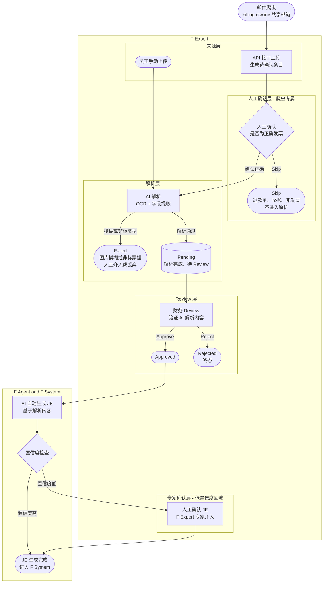

# Invoice 全流程图

**状态**: Draft  
**创建日期**: 2026-06-15  
**关联系统**: F Expert · F Agent · F System

---

## 全流程图

虚线框内为 **F Expert** 负责的功能范围。

---

## 各层说明

### 来源层

| 来源 | 操作方 | 说明 |
|------|--------|------|
| 员工手动上传 | 员工（F Expert 内） | 在 F Expert 中直接上传发票文件（JPG / PNG / PDF） |
| 邮件爬虫 | Bot（F Expert 外部） | 定时抓取共享邮箱附件，通过 API 接口自动上传至 F Expert，无需人工触发 |

---

### 人工确认层（爬虫专属）

仅爬虫上传的文件需要经过此步骤，员工手动上传直接进入解析。

| 操作 | 触发条件 | 结果 |
|------|---------|------|
| 确认正确 | 文件确为应付发票 | 进入 AI 解析 |
| Skip | 退款单、收据、非发票类文件 | 终止，不进入解析流程 |

---

### 解析层（AI 门禁）

| 状态 | 触发条件 | 后续处理 |
|------|---------|---------|
| 解析通过 → `pending` | 图像清晰、票据类型合法（正式发票） | 进入 Review 队列 |
| 解析失败 → `failed` | 图像模糊、扫描不清晰；或为收据、非正式票据等不支持的类型 | 阻断流程，需人工介入处理或丢弃 |

---

### Review 层（F Expert · 财务）

| 操作 | 结果 | 说明 |
|------|------|------|
| Approve | `checked` | 财务确认 AI 解析内容正确，票据进入下游处理 |
| Reject | `denied`（终态） | 财务驳回，流程终止 |

---

### 下游层（F Agent & F System）

| 节点 | 说明 |
|------|------|
| AI 自动生成 JE | F Agent 基于发票解析内容自动生成会计分录（Journal Entry） |
| 置信度高 | JE 直接写入 F System，流程完成 |
| 置信度低 → 回流 F Expert | 转人工专家在 F Expert 中确认 JE 内容，确认后写入 F System |

---

## F Expert 功能边界

| 功能 | 是否在 F Expert |
|------|----------------|
| 员工手动上传入口 | ✅ |
| 邮件爬虫（共享邮箱抓取） | ❌（F Expert 外部） |
| 爬虫 API 接收 & 展示 | ✅ |
| 人工确认爬虫文件（Confirm / Skip） | ✅ |
| AI 解析 & 门禁（failed 处理） | ✅ |
| 财务 Review（Approve / Reject） | ✅ |
| AI 自动生成 JE | ❌（F Agent） |
| JE 写入系统 | ❌（F System） |
| 低置信度专家人工确认 JE | ✅（回流） |
