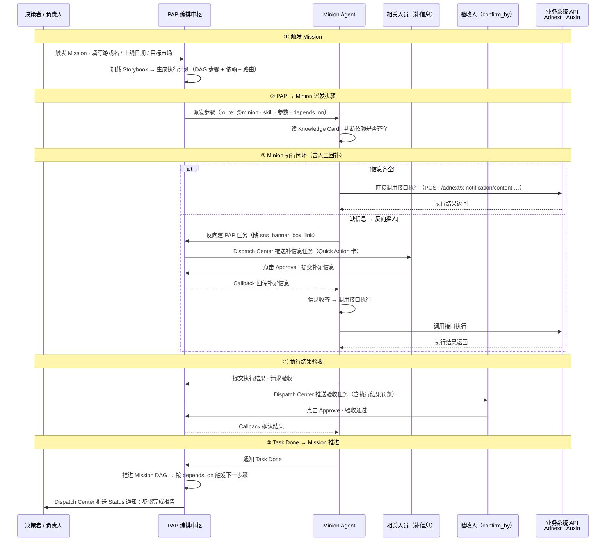

# PAP × Minion Agent 交互设计

**状态**: Draft  
**创建日期**: 2026-06-14  
**关联文档**: [PAP 编排式 Agent 系统](../其他系统需求/自动执行性Minon.md) · [Dispatch Center](D员工任务管理-Dispatch Center.md)

---

## 概述

PAP 作为编排中枢（Brain），Minion Agent 作为执行层 subagent，两者构成**双向指挥模型**：

- **PAP → Minion**：按 Storybook 派发结构化步骤指令
- **Minion → PAP → 人**：Minion 做不到时反向摇人，信息再回流给自己
- **人 → PAP → Minion**：人提交结果，驱动 Minion 继续执行

---

## 核心概念说明

在阅读交互流程之前，先理解以下几个关键概念。

---

### Storybook

Storybook 是一份结构化的任务编排脚本，由产品或流程设计者预先定义，PAP 在 Mission 触发时加载它、生成执行计划。

可以把 Storybook 理解为「这个 Mission 应该怎么做」的说明书：它列出了所有步骤、每一步由谁执行、需要哪些输入、步骤之间的依赖顺序、完成后是否需要人工验收。PAP 按照 Storybook 来决定先做什么、后做什么、什么时候摇人。

子 Agent 只负责执行，不会读取或修改 Storybook。

---

### Route（路由）

Route 是每个步骤的「执行目标声明」，告诉 PAP 这个步骤应该派给谁。

常见取值：`@minion`（派给 Minion Agent）、`@admin`（派给 Admin Agent）、`@human`（派给人工角色）。PAP 的 DAG 调度器在触发某个步骤时，根据 route 字段决定把指令投递到哪里。

---

### Skill（技能）

Skill 是子 Agent 执行某类任务时使用的「能力模块」，对应一份 Knowledge Card。

Knowledge Card 里写清楚了：这个 skill 具体调用哪个 API、入参格式是什么、遇到什么情况需要暂停并摇人、执行完成后输出什么内容。子 Agent 收到 PAP 的指令后，先读取对应 skill 的 Knowledge Card，再按照里面的规则执行。

同一个子 Agent 可以拥有多个 skill（如 Minion 同时具备 Adnext、Auxin、Sendgrid 等不同系统的操作能力），每次只使用本次任务指定的那一个。

---

### 参数（inputs）

参数是执行某个步骤所需的具体数据，由 PAP 在派发指令时一并打包发给子 Agent。

参数有两个来源：一是 Mission 触发时由决策者填写（如游戏名称、上线日期）；二是前置步骤执行完成后产出的结果（如步骤 1 产出的 Follower 文件路径）。Storybook 中声明了每个参数的来源，PAP 负责在派发前把所有可用参数组装好。

如果某个必要参数的来源为空（即既没有触发时提供，也没有前置步骤产出），PAP 会标记该步骤为缺参，子 Agent 执行时触发 Need Input 流程。

---

### depends_on（前置依赖）

depends_on 是步骤之间的顺序约束，声明「当前步骤必须等哪些步骤完成之后才能开始」。

依赖关系由 Storybook 统一定义，PAP 的 DAG 调度器负责检查——只有当某步骤的所有前置依赖都已收到 Task Done 通知，PAP 才会向对应的 Agent 或人工角色派发这个步骤。

没有 depends_on（或依赖已全部满足）的步骤可以并发执行，PAP 会同时派发给多个 Agent，互不等待。子 Agent 自身不感知依赖关系，它只管收到指令后执行。

---


以「游戏上线 Mission」为例，展示完整双向协作链路。



---

## 交互节点说明

| 步骤 | 发起方 | 目标方 | 载体 | 说明 |
|---|---|---|---|---|
| 1 | 决策者 | PAP | PAP UI | 触发 Mission，填写游戏名、上线日期、目标市场等参数 |
| 2 | PAP | PAP 自身 | 内部编排 | 加载对应 Storybook，生成含 depends_on 依赖的 DAG 执行计划 |
| 3 | PAP | Minion | Dispatch API | 派发结构化步骤指令（route + skill + 参数 + depends_on 上下文） |
| 4 | Minion | Minion 自身 | Knowledge Card | 读取对应 skill 的 Knowledge Card，判断所需信息是否齐全 |
| 5a | Minion | 业务系统 API | HTTP 调用 | 信息齐全时直接调用 Adnext / Auxin 接口执行操作 |
| 5b | Minion | PAP | 程序化建任务 API | 缺信息时反向在 PAP 创建人工任务，声明所需信息及对应角色 |
| 6 | PAP | 相关人员 | Dispatch Center | 以 Quick Action 卡推送补信息任务 |
| 7 | 相关人员 | PAP | PAP 任务提交 | 点击 Approve，在任务中填写并提交补足信息 |
| 8 | PAP | Minion | Callback / Webhook | 将人员提交的信息回调给 Minion |
| 9 | Minion | Minion 自身 | — | 信息收齐后执行接口调用（可循环直至收齐） |
| 10 | Minion | PAP | 结果上报接口 | 提交执行结果，请求进入验收环节 |
| 11 | PAP | 验收人 | Dispatch Center | 以 Quick Action 卡推送验收任务（含执行结果预览） |
| 12 | 验收人 | PAP | PAP 任务提交 | 点击 Approve 或 Reject，返回验收结论 |
| 13 | PAP | Minion | Callback / Webhook | 将验收结果回调给 Minion；如 Reject 则重新进入执行 |
| 14 | Minion | PAP | Task Done 通知 | 确认通过后通知 PAP 该步骤已完成 |
| 15 | PAP | PAP 自身 | 内部 DAG 调度 | 按 depends_on 判断哪些后续步骤可并发推进 |
| 16 | PAP | 决策者 | Dispatch Center | 推送 Status 通知：步骤完成报告 / Mission 全部完成报告 |

---

## 关键设计要点

**双向指挥**：PAP 指挥 Minion 执行，Minion 也能反向通过 PAP 指挥人提供信息，人的输入再回流给 Minion，形成闭环。

**收敛式执行**：Minion 缺信息时不直接失败，而是拆分出人工子任务，待信息收齐后继续执行。同一步骤可多次摇人（循环），直到所有依赖满足。

**Dispatch Center 作为统一入口**：所有需要人工介入的节点（补信息、验收）都通过 Dispatch Center 卡片触达，人无需主动进入其他系统查看。

**验收不通过的回退**：步骤 13 若验收人点击 Reject，PAP 回调 Minion 并附带反馈，Minion 重新进入执行阶段（返回步骤 5）。

**DAG 并发调度**：单个步骤完成后，PAP 自动判断所有 depends_on 已满足的后续步骤，可并发派发给不同 subagent 或人工角色。

---

## 当前 PAP 能力缺口

Minion 接入依赖以下能力，目前尚未建设：

| 层级 | 缺失能力 | 优先级 |
|---|---|---|
| 编排层 | Storybook 加载 · DAG 调度器 · Mission 状态机 | P0 |
| 接口契约层 | PAP→Minion 派发接口 · Minion→PAP 程序化建任务 API · 双向 Callback Webhook · Task Done 上报接口 | P0 |
| 界面层 | Dispatch Center 程序化推送 · Mission 进度视图 · 验收任务附带结果预览 | P1 |

---

## 子 Agent 在各阶段需要提供的数据

子 Agent（以 Minion 为例）在与 PAP 协作的过程中，会经历四种典型状态。每种状态下，子 Agent 需要向 PAP 提交不同的数据，PAP 再据此驱动后续流程。

---

### 阶段一：开始执行前（Storybook 定义阶段）

在正式执行之前，每项任务的执行规则由 **Storybook** 预先定义。Storybook 是 PAP 加载 Mission 编排逻辑的来源，包含以下信息：

- **执行路由**：这个任务由谁来执行（Minion、Admin Agent 还是人工角色）
- **所需输入参数**：任务执行需要哪些字段，以及这些字段的来源（来自 Mission 触发参数，还是需要人工提供）
- **前置依赖（depends_on）**：这个任务必须等哪些其他任务完成后才能开始
- **缺信息时找谁**：当必要字段缺失时，应该向哪个角色发起人工补充请求
- **完成后由谁验收**：任务执行完毕后，应该将结果推送给哪个角色进行确认，以及采用哪种验收方式

Storybook 由产品/流程设计者定义，子 Agent 执行时只读，不自行判断依赖关系。

---

### 阶段二：任务自动完成后（Task Done 状态）

当子 Agent 完全自主完成一个任务后，需向 PAP 提交以下数据：

- **执行结果摘要**：用人类可读的语言描述做了什么、完成了什么，用于 PAP 向决策者推送 Status 通知
- **执行产出物**：任务产出的具体内容，例如创建的 Campaign ID、生成的文件、发送的请求链接等，PAP 会将这些内容存入 Mission 执行记录，并在需要时展示给验收人
- **当前状态**：Done（任务完成）

PAP 收到 Task Done 后，会按照 Storybook 中的 depends_on 关系，判断是否可以推进后续步骤。

---

### 阶段三：执行受阻、需要人工提供信息时（Need Input 状态）

当子 Agent 在执行过程中发现必要信息缺失，无法继续时，需向 PAP 提交以下数据：

- **受阻原因**：用简短语言说明是什么信息缺失导致无法继续，PAP 会将这段描述展示在 Dispatch Center 的卡片上
- **需要补充的信息**：具体需要人工提供哪些内容，每个字段的名称、含义，以及必要时的选项或格式说明
- **应该由谁来提供**：对应的人工角色或具体人员，PAP 据此决定向谁推送 Dispatch Center 任务卡
- **当前状态**：Blocked / Need Input（执行暂停，等待人工回填）

PAP 收到后，在 Dispatch Center 向对应人员推送 Need Input 卡片。人员点击卡片后跳转到对应 Chat 会话，Minion 在会话中引导人员逐步提供所需信息，人员填写完毕后在 Chat 中进行二次确认。确认后 PAP 将信息回传给子 Agent，子 Agent 继续执行。

---

### 阶段四：执行完成、需要人工验收时（Need Review 状态）

当子 Agent 完成执行，但根据 Storybook 的设定该步骤需要人工确认结果时，需向 PAP 提交以下数据：

- **验收内容**：执行完成的产出物，以及可供人工查看的内容（如 AI 生成的多版草稿、执行链接等），PAP 会将这些内容带入 Chat 会话中展示
- **验收类型**：说明这次验收需要以哪种方式进行——是从多个版本中选择其一，还是对内容进行编辑修改后确认
- **应该由谁来验收**：对应的人工角色或具体人员，以及截止时间（如有）
- **当前状态**：Pending Review（执行完成，等待人工验收）

PAP 收到后，在 Dispatch Center 向对应人员推送 Review 卡片。人员点击卡片后跳转到对应 Chat 会话，Minion 在会话中展示产出内容，人员在 Chat 中完成审阅并进行二次确认。确认通过后 PAP 通知子 Agent 继续推进；若需要重新生成，子 Agent 重新执行并再次提交。

### 步骤总览

| # | Phase | Category | 步骤 | Agent Flow | 覆盖情况 |
|---|---|---|---|---|---|
| 1 | release | Adnext | ADNext X通知管理登録 | 摇人取 json 文件 + auto 生成文案 + Marketer Review/Edit + 摇人取 banner link + auto set 发送时间 + auto test | ⚠️ 部分覆盖 |
| 2 | release | Auxin Marketing | Auxin IM通知予約 | auto 生成内容 + 摇人取 banner link + auto 建 Campaign | ✅ 覆盖 |
| 3 | release | Auxin Marketing | Auxin ポップアップ予約 | 摇人取 spine box link + auto 建 Campaign | ✅ 覆盖 |
| 4 | release | G123Web | G123 ゲーム一覧登録 | Use Admin Agent | ✅ 覆盖 |
| 5 | release | G123Web | G123 ゲーム公開管理更新 | Use Admin Agent | ✅ 覆盖 |
| 6 | release | Newsletter | Sendgrid/AD用 エンジニアへユーザーメアドリスト反映依頼 | Agent auto update | ✅ 覆盖 |
| 7 | release | Newsletter | Sendgrid ユーザー連路 | （流程待明确） | ❓ 待补充 |
| 8 | release | PressRelease | Sendgrid DesignLibrary 下书き登録・Sender 更新 | Agent auto create content using Sendgrid API | ✅ 覆盖 |
| 9 | release | PressRelease | プレス予約 | 纯人工（无 Agent Flow） | ✅ 人工任务覆盖 |
| 10 | release | PressRelease | プレス予約・メディア登録・メール配信 | 纯人工 | ✅ 人工任务覆盖 |
| 11 | release | SNS | X フォロワーデータ取得・エンジニア反映依頼 | Agent create A ticket（为步骤 1 提供前置数据） | ✅ 覆盖 |
| 12 | release | SNS | YouTubeチャンネルの動画 10時 | Agent create A ticket | ✅ 覆盖 |
| 13 | after-release | Auxin | Auxin 表示と遷移確認 10時 | 确认任务（标注 No need） | ✅ 验收流程覆盖 |

**结论：13 个步骤中，11 个完全覆盖，1 个部分覆盖，1 个待补充。**

---

### 各步骤详细说明

#### ✅ 步骤 2 · 3：Auxin IM 通知 / ポップアップ予約

两个步骤结构相同，均走「反向摇人 → 信息回流 → auto 执行」标准闭环：

1. Minion auto 生成 Auxin 内容（文案 + banner）
2. 缺 banner link / spine box link → 反向建 PAP 任务摇 Marketer → Dispatch Center 推 Quick Action 卡
3. Marketer 提交链接 → PAP Callback → Minion 收齐 → auto 建 Campaign

**路由**：`route: @minion`（Auxin skill）

---

#### ✅ 步骤 4 · 5：G123 ゲーム一覧登録 / 公開管理更新

纯 Admin Agent 执行，无需人工介入：

**路由**：`route: @admin`（G123 Web skill），PAP 直接派发，Admin Agent auto 完成后 Task Done 通知 PAP。

---

#### ✅ 步骤 6：Sendgrid/AD 用エンジニアへユーザーメアドリスト反映依頼

Agent 自动向 Sendgrid 更新邮件地址列表，仅通知工程团队确认。

**路由**：`route: @minion`（Sendgrid skill）→ auto 执行 → 同时建 PAP 通知任务给工程师（Status 类卡片，只读知悉）。

---

#### ✅ 步骤 8：Sendgrid DesignLibrary 下書き登録

Agent 读取 Sendgrid Design Library 模板，自动生成邮件内容并注册草稿、更新 Sender。

**路由**：`route: @minion`（Sendgrid API skill）→ 内容生成完成后推验收任务给 PressRelease 负责人确认。

---

#### ✅ 步骤 9 · 10：プレス予約 / メディア登録・メール配信

纯人工步骤，没有 Agent Flow。Storybook 中声明 `route: @pr_owner`，PAP 直接建人工任务派发给 PR 负责人，在 PAP 提交完成后推进 Mission。

---

#### ✅ 步骤 11：X フォロワーデータ取得

Agent 在 A 系统创建工单，由工程师取得 X 官号 follower JSON 文件。这一步是步骤 1（ADNext X通知）的**前置依赖**，Storybook 中需声明：

```yaml
### Step: adnext_x_setup
- depends_on: [sns_x_follower_data]   # 步骤 11 完成后才可派发
```

**路由**：`route: @minion`（A ticket creation skill）→ Agent 建 A ticket → 工程师处理 → 完成后 Minion Task Done。

---

#### ✅ 步骤 12：YouTube チャンネルの動画 10時

Agent 建 A ticket，视频准备由人工完成。实际视频制作属于创意人工任务，Agent 仅做调度通知。

**路由**：`route: @minion`（A ticket creation）→ 建 ticket 后同时以 `route: @video_owner` 建 PAP 人工任务提醒视频负责人。

---

#### ✅ 步骤 13：Auxin 表示と遷移確認（after-release）

表中标注"确认用 task No need"，表示 Agent 不需要专门处理，视情况由 after-release Storybook 包含一条验收任务：

**路由**：`route: @qa_owner`（PAP 人工验收）→ 验收人确认 Auxin 展示和跳转无误后标记完成。

---

#### ⚠️ 步骤 1（关键缺口）：ADNext X通知管理登録

这是覆盖度最复杂的一步，包含 5 个子流程：

| 子流程 | Agent Flow | 当前交互流程覆盖 |
|---|---|---|
| 1. Upload follower JSON | Agent 摇 engineer 提供 json 文件 | ✅ 反向摇人 → Quick Action 卡 |
| 2.1 prepare text | Agent auto 生成 → **Marketer Review/Edit** | ⚠️ **有缺口** |
| 2.2 prepare SNS banner | Agent 摇 Marketer 提供 banner box link | ✅ 反向摇人 → Quick Action 卡 |
| 2.3 Setup Sending Time | Agent auto set（依赖 Mission 输入的 release_time_jst） | ✅ 自动 |
| 3. Test with own X account | Agent auto test | ✅ 自动 |

**缺口说明 — 2.1 prepare text 的 Review/Edit**：

当前验收流程（confirm_by）只支持 **Approve / Reject** 二选一。但 Marketer 对 AI 生成的文案可能需要**直接编辑修改**后再确认，而不仅仅是拒绝并让 Agent 重新生成。

这个场景 Quick Action 卡不够用，需要引入 **Chat Task 类型**：

```
Minion 生成文案草稿
    ↓
PAP 推送 Chat Task 卡给 Marketer
    ↓
Marketer 进入 Chat 查看草稿 → 直接修改文字 → 确认执行
    ↓
PAP Callback 修改后的文案给 Minion
    ↓
Minion 以修改版文案调用 Adnext 接口
```

这要求 Chat Task 的会话界面支持「内嵌可编辑内容块」，即不只是对话，还能直接在 Chat 中修改 Agent 产出的结构化内容。这是当前 Chat Task 设计需要额外补充的能力。

---

#### ❓ 步骤 7：Sendgrid ユーザー連路（待补充）

截图中该步骤的 Workflow 列为空，Agent Flow 仅部分可见。需要业务方进一步明确：

- 用户路由指的是哪个流程（邮件路由规则更新？）
- 是否有 Agent 可自动完成的部分
- 是否需要人工判断

**建议**：在 Storybook 定义前先补全该步骤的 Workflow 说明。

---

### 汇总：交互流程需要补充的能力

在现有「反向摇人 + 验收」双向流程基础上，游戏上线场景暴露了一个新需求：

**Chat Task 需支持内嵌可编辑内容块**

当 Agent 生成内容（文案、邮件草稿等）需要人工修改而非仅审核时，Chat Task 的会话界面需要支持：
- 展示 Agent 生成的结构化内容（标题 / 正文 / 参数）
- 允许用户在 Chat 中直接编辑内容字段
- 编辑确认后将修改版内容回传给 Minion 继续执行

这一能力扩展影响 Dispatch Center 的 Chat Task 卡片设计以及 chat.html 的会话界面。

---

## Minion → PAP 数据契约规范

本节定义 Minion Agent 在不同交互节点需要向 PAP 回传的结构化数据，是接口实现的依据。

---

### 一、任务自动完成后（Task Done）

Minion 完全独立执行成功后，向 PAP 上报以下数据，用于：驱动 DAG 推进下一步骤、向决策者推送 Status 通知、存入 Mission 执行记录供后续 Review。

```json
{
  "type": "task_done",
  "task_id": "step_adnext_x_notification",
  "mission_id": "mission_game_launch_001",
  "status": "done",
  "executed_at": "2026-06-14T14:30:00Z",

  "result": {
    "summary": "已在 Adnext 创建 X 通知 Campaign，ID: adnext_camp_20260614_001",
    "artifacts": [
      {
        "type": "campaign",
        "label": "X 通知 Campaign",
        "id": "adnext_camp_20260614_001",
        "preview_url": "https://adnext.example.com/campaigns/adnext_camp_20260614_001",
        "data": {
          "post_text": "🎮 Escape Campus is LIVE! #EscapeCampus",
          "sending_time": "2026-06-14T21:00:00+09:00",
          "audience_segment": "seg_jp_active_30d",
          "banner_url": "https://cdn.example.com/banners/escape_campus_launch.png"
        }
      }
    ]
  },

  "next_hint": "step_adnext_x_test"
}
```

**字段说明**

| 字段 | 类型 | 说明 |
|---|---|---|
| `type` | string | 固定值 `task_done` |
| `task_id` | string | Storybook 中声明的步骤 ID |
| `mission_id` | string | 所属 Mission ID |
| `result.summary` | string | 人类可读的执行摘要，用于 Status 卡片 |
| `result.artifacts` | array | 执行产出物列表（Campaign / 工单 / 文件 / URL 等），PAP 将展示在验收卡和历史记录中 |
| `artifacts[].preview_url` | string | 可供人工点击查看的结果链接，验收时嵌入卡片 |
| `next_hint` | string | 可选，建议 PAP 接下来触发的步骤 ID（PAP 仍以 DAG 为准，hint 仅作辅助） |

---

### 二、需要人工补充信息时（Need Input）

当 Minion 执行到某步骤发现必要字段缺失，向 PAP 程序化创建任务，触发 Dispatch Center 推送 Need Input 卡片。

```json
{
  "type": "need_input",
  "task_id": "step_adnext_x_notification",
  "mission_id": "mission_game_launch_001",
  "blocked_reason": "受众分组 ID 未在 Mission 参数中提供，且无法自动推导",

  "required_fields": [
    {
      "field": "audience_type",
      "label": "分组类型",
      "type": "select",
      "options": ["all_followers", "segment_id", "tag_list"],
      "required": true
    },
    {
      "field": "segment_id",
      "label": "Segment ID",
      "type": "text",
      "placeholder": "如 seg_jp_active_30d",
      "required": false,
      "visible_when": "audience_type == segment_id"
    },
    {
      "field": "tag_list",
      "label": "标签列表",
      "type": "text",
      "placeholder": "如 active_30d, jp_user",
      "required": false,
      "visible_when": "audience_type == tag_list"
    }
  ],

  "assign_to": {
    "role": "marketer",
    "user_id": "user_operator_01",
    "display_name": "运营负责人"
  },

  "context": "Minion 在执行「在 Adnext 创建 X 通知内容」步骤时需要以上信息才能继续，请尽快提供。"
}
```

**字段说明**

| 字段 | 类型 | 说明 |
|---|---|---|
| `type` | string | 固定值 `need_input` |
| `blocked_reason` | string | 人类可读的阻塞原因，显示在 Dispatch Center 卡片 summary 中 |
| `required_fields` | array | 需要人工填写的字段列表，PAP 渲染为 Chat 对话中的问题序列 |
| `required_fields[].visible_when` | string | 条件显示规则（类 JSONLogic），仅当依赖字段满足时才展示该字段 |
| `assign_to.role` | string | 角色标识，PAP 据此确定推送目标（对应 Storybook 中的 `input_by` 声明） |
| `assign_to.user_id` | string | 可选，若已知具体人员则精准推送；否则按 role 广播 |

---

### 三、执行结果需要验收时（Need Review）

Minion 执行完成但结果需人工确认，向 PAP 上报以下数据，触发 Dispatch Center 推送 Review 卡片。

```json
{
  "type": "need_review",
  "task_id": "step_adnext_x_copy",
  "mission_id": "mission_game_launch_001",

  "review_type": "select_and_edit",

  "review_content": {
    "summary": "Minion 已生成 3 版 X 通知文案，请审阅后选择或修改，确认后将提交至 Adnext 发布流程",
    "artifacts": [
      {
        "id": "draft_v1",
        "label": "V1 · 功能导向",
        "content": "🎮 Escape Campus is LIVE! Build your ultimate campus... #EscapeCampus",
        "preview_url": null
      },
      {
        "id": "draft_v2",
        "label": "V2 · 情感驱动",
        "content": "🚀 The wait is over — Escape Campus launches TODAY!... #EscapeCampus",
        "preview_url": null
      },
      {
        "id": "draft_v3",
        "label": "V3 · 简洁号召",
        "content": "🏫 Escape Campus officially launches now!... #GameLaunch",
        "preview_url": null
      }
    ]
  },

  "confirm_by": {
    "role": "marketer",
    "user_id": "user_operator_01",
    "display_name": "市场运营",
    "deadline": "2026-06-14T20:00:00+09:00"
  }
}
```

**字段说明**

| 字段 | 类型 | 说明 |
|---|---|---|
| `type` | string | 固定值 `need_review` |
| `review_type` | enum | `approve_reject`（批准/驳回二选一）· `select_and_edit`（多版选择+可编辑）· `confirm_only`（纯确认） |
| `review_content.artifacts` | array | 待审核产出物，PAP 渲染为 Review 卡片或 Chat 中的草稿列表 |
| `confirm_by.deadline` | ISO8601 | 截止时间，PAP 可据此在超时前发出提醒通知 |

---

### 四、Storybook 数据结构

Storybook 是 PAP 加载 Mission 编排逻辑的唯一来源，由产品/流程设计者预先定义，Minion 执行时只读。`depends_on` 声明在 Storybook 中，由 PAP 的 DAG 调度器负责检查，**不由 Minion 自行判断依赖**。

```yaml
# Storybook: game_launch_v1.yaml
id: game_launch_v1
name: 游戏上线 Mission
version: "1.0"
trigger_params:
  - game_name
  - release_date_jst
  - target_market

phases:
  - id: pre_release
    label: 上线准备
    steps:

      # 步骤 1：获取 X 官号 Follower 数据（前置依赖）
      - id: sns_x_follower_data
        label: 上传 X 官号 Follower 数据
        route: "@minion"
        skill: "a_ticket_creation"
        depends_on: []
        inputs:
          - field: ticket_title
            value: "X フォロワーデータ取得・エンジニア反映依頼"
        input_by: null          # 纯 Agent，无需人工
        confirm_by: null

      # 步骤 2：创建 Adnext X 通知（依赖步骤 1 完成）
      - id: adnext_x_notification
        label: 在 Adnext 创建 X 通知内容
        route: "@minion"
        skill: "adnext_x_notification"
        depends_on:
          - sns_x_follower_data   # 步骤 1 Task Done 后才可派发
        inputs:
          - field: game_name
            from: "$trigger.game_name"
          - field: release_time_jst
            from: "$trigger.release_date_jst"
          - field: audience_segment
            from: null            # 缺失 → Minion 会触发 need_input
        input_by: "marketer"      # need_input 时推送给此角色
        confirm_by: "marketer"    # need_review 时推送给此角色
        review_type: "select_and_edit"

      # 步骤 3：Auxin IM 通知（可与步骤 2 并发，无 depends_on）
      - id: auxin_im_notification
        label: Auxin IM 通知预约
        route: "@minion"
        skill: "auxin_im_campaign"
        depends_on: []
        inputs:
          - field: game_name
            from: "$trigger.game_name"
          - field: im_banner_url
            from: null            # 缺失 → 触发 need_input
        input_by: "marketer"
        confirm_by: null          # 无需验收，执行完直接 Task Done

  - id: release_day
    label: 上线当日
    steps:

      # 步骤 4：G123 游戏公开管理更新（依赖上线准备全部完成）
      - id: g123_game_publish
        label: G123 ゲーム公開管理更新
        route: "@admin"
        skill: "g123_web_publish"
        depends_on:
          - adnext_x_notification
          - auxin_im_notification
        inputs:
          - field: game_id
            from: "$trigger.game_name"
        input_by: null
        confirm_by: null
```

**核心字段说明**

| 字段 | 类型 | 说明 |
|---|---|---|
| `route` | string | 派发目标：`@minion` · `@admin` · `@human` · `@{role_id}` |
| `skill` | string | Minion 读取对应 Knowledge Card 的技能 ID |
| `depends_on` | array | 前置步骤 ID 列表，PAP DAG 调度器在所有前置 `task_done` 后才派发此步骤 |
| `inputs[].from` | string\|null | `null` 表示该字段需人工提供，Minion 执行时若缺失则触发 `need_input` |
| `input_by` | string\|null | 触发 `need_input` 时推送给哪个角色（对应 `need_input.assign_to.role`） |
| `confirm_by` | string\|null | 触发 `need_review` 时推送给哪个角色（对应 `need_review.confirm_by.role`） |
| `review_type` | enum\|null | 验收交互类型，透传给 `need_review.review_type`，控制 Dispatch Center 卡片渲染方式 |

---

### 数据流总览

```
Storybook (PAP 加载)
    ↓ depends_on 满足
PAP → Minion: 派发步骤（skill + inputs）
    ↓
Minion 判断 inputs 是否齐全
    ├── 齐全 → 执行 → task_done { artifacts, summary }
    │       → PAP 推送 Status 卡 / 触发 need_review（若 confirm_by 非空）
    └── 缺失 → need_input { required_fields, assign_to }
            → PAP 推送 Need Input 卡 → 人填写 → PAP callback → Minion 继续

Minion 执行完成 (confirm_by 非空)
    → need_review { review_type, artifacts, confirm_by }
    → PAP 推送 Review 卡 → 人选择/编辑/确认 → PAP callback
        ├── approve → Minion task_done → DAG 推进
        └── reject  → Minion 重新执行
```
