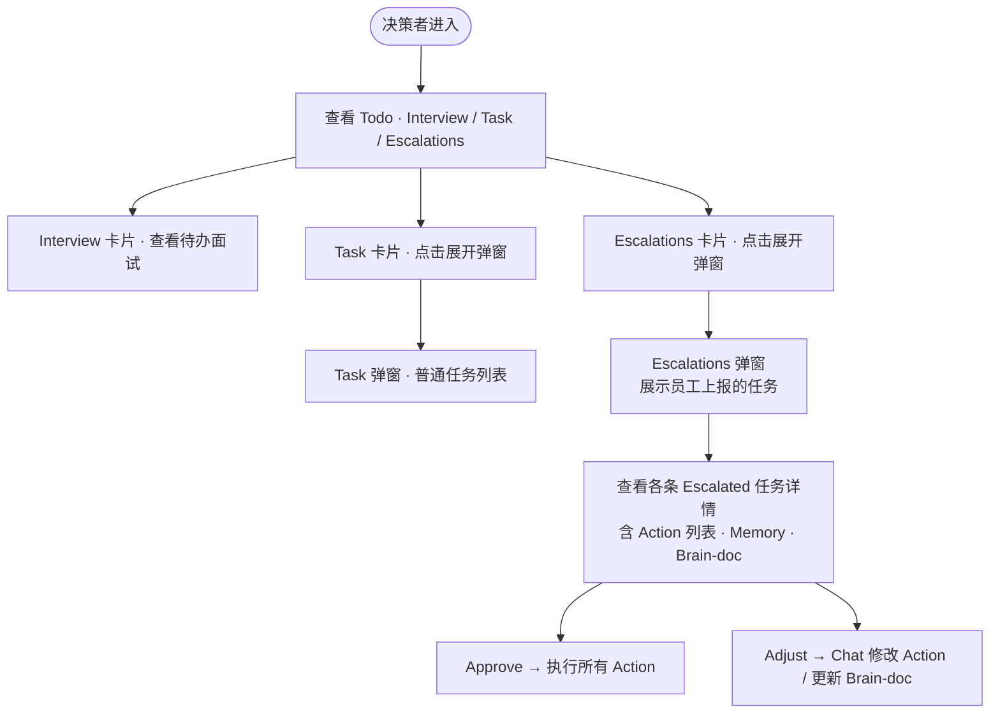
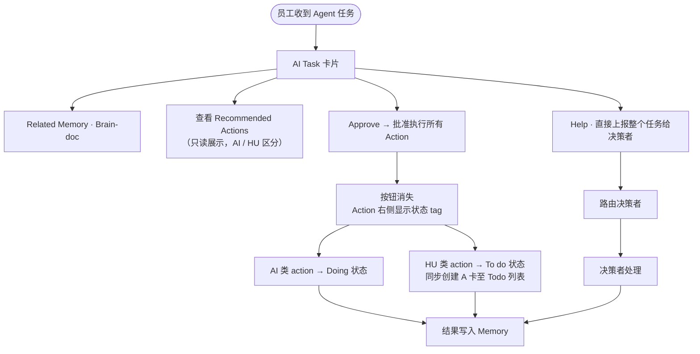
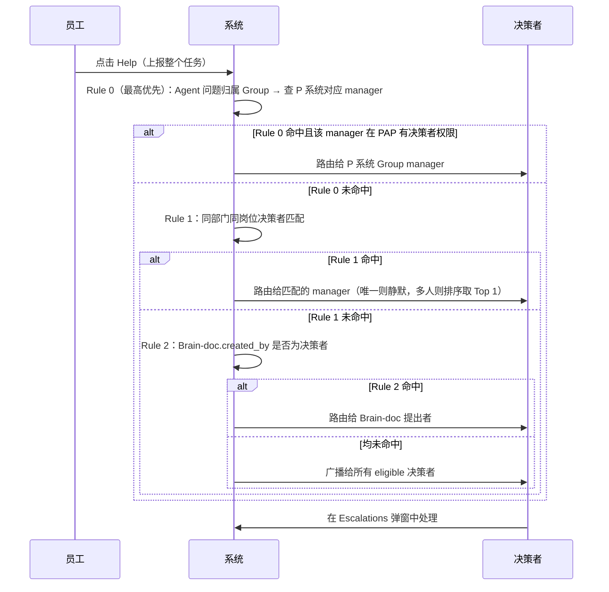
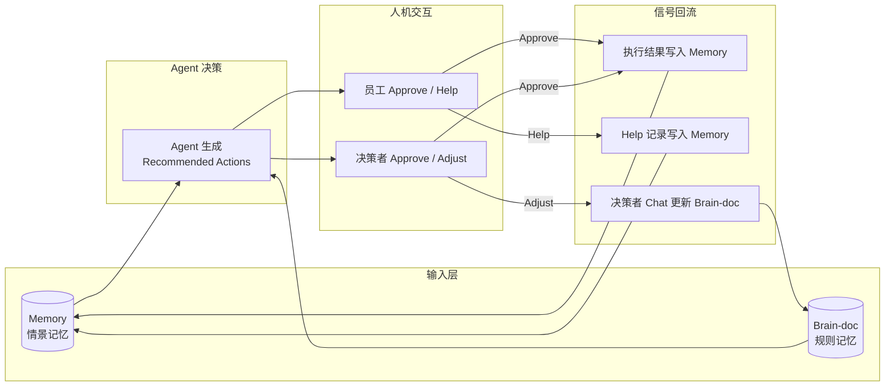

| 项目名称 | **PAP✖️Memory** |
|------|-------------|
| 文档版本 | v1.2        |
| 创建日期 | 2026-05-20  |
| 最后更新 | 2026-06-02  |
| 原型   | 员工（以通用PAP为实例）：<https://doraemon-prototype.vercel.app/D-PAP-AI-CENTER.html><br>决策者：<https://doraemon-prototype.vercel.app/D-PAP-MANAGER.html> |


---

# 背景

PAP（People · Agent · People）是 D 系统 3.0 的核心协作模式，目标是让 Agent 端到端地解决问题，人负责决策和例外处理。

整个协作链路涉及两类核心角色：

* **决策者（Manager）**：制定目标、管理资源、审核 Agent 产出、处理来自下级员工上报的 Escalated 任务。
* **普通员工（Normal Employee）**：接收 Agent 生成的任务建议，以 Approve / Help 的方式在 Task 维度参与决策。

本文档覆盖这两个角色中**新增功能**的需求，包含界面交互、业务规则、Escalation 路由逻辑及 Brain-doc / Memory 集成。


---

# 小秘 Agent 工作机制

小秘 Agent 是 PAP 协作链路的核心驱动节点，负责主动感知问题、生成解决方案并上报给相应的人进行决策。其工作分为两个阶段：发现问题与确定方案。

## 发现问题：数据来源

Agent 持续监听以下两类数据源，识别需要人工介入的异常或待决策事项：

**钉钉群消息**：Agent 接入业务相关的钉钉群（如 CS 反馈群、CP 沟通群等），实时解析群内消息。当消息中出现玩家投诉、活动异常、补偿诉求等关键信号时，Agent 自动触发问题识别流程，提取问题类型、受影响范围、紧迫程度等关键信息。

**系统监测点**：Agent 对接业务系统的监控指标（如 CS 工单量突增、活动道具异常消耗、支付成功率下降等），当指标超出预设阈值时，Agent 主动发起问题分析，判断是否需要生成 AI Task 通知相关员工或决策者。

## 确定方案：决策来源

Agent 在识别到问题后，结合以下两类知识来源生成 Recommended Actions：

**Memory（业务 Agent 情景记忆）**：Agent 检索历史上处理过的相似 case，参考过去的执行结果、决策路径和反馈记录。历史 Execute / Skip / Escalate / Already Done 操作均会写入 Memory，作为下次相似问题的推理依据，使 Agent 的方案随着积累越来越贴近实际业务判断。

**Brain-doc（决策规则文档）**：Agent 查询与当前问题匹配的 Brain-doc，获取该类问题的适用条件、执行规范、KPI 要求和标准 action 模板。Brain-doc 由决策者通过 Chat 显式维护，代表当前有效的业务规则。Agent 优先以 Brain-doc 中的规则为准，Memory 作为规则框架内的情景参考补充。


---

# 目标

* 普通员工以最低认知成本处理 Agent 上报的决策请求，通过 Help 向上传递超出能力或权限范围的任务。
* Escalated 任务在无组织架构系统的前提下，自动路由到最合适的决策者。
* Brain-doc 和 Memory 为 Agent 建议提供可溯源的决策依据，并可在 Chat 中实时更新。
* 每一次人机交互的结果转化为 Agent 的下次输入，形成持续自我优化的闭环。


---

# 需求

## 原型

* 决策者视图：`D-PAP-MANAGER.html`
* 普通员工视图：`D-PAP-AI-CENTER.html`


---

## 用户使用流程

### 决策者流程



### 普通员工流程



### Escalation 路由时序




---

## 角色定义

**决策者（Manager）**：`department = "executive"` 或在系统白名单中的用户，功能范围涵盖 Todo · Goal · Chat · Brain · Escalated 任务审核。

**普通员工（Normal Employee）**：其他员工，功能范围涵盖日常任务 · Agent 任务 · Execute / Already Done / Help。


---

## 一、普通员工视图（D-PAP-AI-CENTER）

### 1.1 Agent 任务卡片（AI Task）

当员工收到 Agent 主动识别并生成的决策请求时，在 Doing 区上方展示 **AI Task** 卡片，包含以下内容：

* **来源标签**：显示任务来源（如 `via 小秘 Agent`）
* **任务标题**：Agent 拟定的操作标题
* **任务简介**：一句话说明任务背景与当前状态
* **Related Memory**：历史决策参考，含日期、事件描述、来源标签
* **Related Brain-doc**：引用的决策文档，默认折叠展示"When to apply"预览，可展开查看完整章节
* **Recommended Actions**：只读展示，每条 action 标注执行方 `AI`（Agent 自动执行）或 `HU`（需人工跟进），员工不在此处做决策
* **操作按钮**：Approve / Help

**Related Brain-doc 展开/折叠规则：**

* 默认折叠，仅展示 `When to apply` 一行预览文字。
* 点击展开，显示 When to apply / Scope / KPI / Actions 完整内容。


---

### 1.2 Task 维度操作：Approve / Help

### Recommended Actions — AI / HU 区分规则

* `**AI**`：Agent 可直接自动执行，如批量发放道具、发布公告。
* `**HU**`：超出 Agent 权限，需人工确认或协调，如同步技术组排查、对外沟通。

Recommended Actions 为**只读**展示，员工无法在 action 维度进行操作，由此降低决策认知负担。

### Approve（批准执行）

点击后，系统立即：

1. **按钮消失**：Approve 和 Help 按钮从卡片上移除，防止重复操作。
2. **Action 状态标记**：每条 action 右侧出现状态 tag：
   * `AI` 类 → 绿色描边 **Doing** tag，表示 Agent 正在自动执行。
   * `HU` 类 → 灰色描边 **To do** tag，表示等待人工跟进。
3. **创建 A 卡**：`HU` 类 action 对应的人工任务以 A 卡形式出现在 Todo 列表顶部，包含任务标题、负责人确认要求及来源说明。
4. **卡片保留**：Agent 卡片保持可见，展示当前执行中状态，不自动消失。

AI 类 action 处理完毕后，结果记录至 Memory。

### Help（请求帮助）

适用场景：员工无法判断是否应该执行，或 Agent 给出的方案有疑问，或该任务超出员工的判断权限。

**Help 触发条件（举例）：**

* 补偿数量超过员工授权额度，需 manager 审批
* Agent 给出的方案与实际情况不符，需决策者修改后再执行
* 任务涉及跨部门影响，员工无把握独立判断
* 员工认为方案存在潜在风险，需要决策者定夺

点击后直接消费任务（员工侧卡片消失），整个任务连同上下文一起路由给决策者（见三、Escalation 路由规则），由决策者在 Escalations 弹窗中查看并决定执行或通过 Chat 调整。


---

## 二、决策者视图（D-PAP-MANAGER）

### 2.1 Todo 区

Todo 区并排展示三张卡片：**Interview / Task / Escalations**，以分隔线间隔。

### Task 卡片

* 始终展示第一条普通任务标题与 DDL（如「Q2 客服 AI 上线评审」）。
* 右上角计数显示当前普通任务总数。
* 点击展开 Task 弹窗，展示普通任务列表。

### Escalations 卡片

* 有待处理上报事项时，展示第一条 Escalated 任务标题 + 来源员工姓名与时间。
* 右上角计数显示当前 Escalated 任务总数。
* 无上报事项时展示空态文案「暂无上报事项」。
* 点击展开 Escalations 弹窗。


---

### 2.2 Task 弹窗

点击 Task 卡片弹出居中弹窗，展示普通任务列表（已有功能，本文档不展开）。


---

### 2.3 Escalations 弹窗

点击 Escalations 卡片弹出居中弹窗，展示所有来自下级员工上报的任务。

每条 Escalated 任务**默认展开**，完整显示以下详情：

* **任务标题**
* **来源行**（FROM 样式）：来源员工头像、姓名、角色、提交时间
* **执行摘要**：员工侧 Action 执行情况汇总，显示已执行条数与需决策者处理条数
* **员工备注**：员工说明升级原因的文字
* **Action 列表**：含执行方标注（AI / HU）和当前状态
* **CP 诉求**：相关方诉求条目列表
* **Agent 建议**：Agent 给出的建议操作及置信度
* **Related Memory**：历史相关 case 记录，含日期、描述、来源
* **Brain-doc**：可折叠，展示关联决策文档及 When to apply / Scope / KPI / Actions
* **操作按钮行**：Approve · Adjust

**Escalated 任务操作行为：**

* **Approve**：批准并执行所有待处理 action，结果同步写入 Memory。
* **Adjust**：关闭弹窗，将任务引用注入 Chat 输入框，开启与 AI 的对话以修改 action 或更新 Brain-doc。

Escalated 任务处理完毕后，从 Escalations 弹窗中移除，Escalations 卡片计数同步更新。若所有上报事项处理完毕，卡片显示空态。


---

### 2.4 Chat to Adjust（Action 修改与 Brain-doc 更新入口）

决策者通过 Chat 以自然语言修改 Agent action 或更新 Brain-doc 规则。

**触发场景：** 点击「Adjust」后，弹窗关闭，Chat 面板自动展开，并将对应 Escalated 任务的 @引用 预填到输入框。

**典型对话流程（以 Escalated 任务为例）：**

* 第 1 轮，决策者输入：`@[任务标题] 修改第一个 action，直接批量发放 140 张合成卡`，AI 回复：确认 action 已更新，回显更新后的 action 内容。
* 第 2 轮，决策者输入：`执行`，AI 回复：执行成功，回复执行结果。

> Memory 和 Brain-doc 的更新均在整个任务完成后触发，而非在单条对话消息发送时立即写入。Chat 是 Brain-doc 的唯一更新入口，员工侧不开放写入路径。

**触发 Brain-doc 更新的典型场景：**

* 表达新规则（如"以后这类任务不需要上级审批"）：任务完成后，调用 `manage_brain_doc` 将新规则写入对应文档。
* 修改适用条件：任务完成后，更新 Brain-doc 的 `when_to_apply` 字段。


---

## 三、Escalation 路由规则

### 资格门槛（Stage 0 · 必须通过）

```
eligible_dms = users WHERE department = "executive" OR in_whitelist = true
```

### Rule 0（最高优先级）：P 系统 Group manager

Agent 在生成 Recommended Actions 时会识别问题归属的 Group（如 CS、Tech、Marketing 等），系统据此查询 P 系统中该 Group 对应的 manager：

```
group    = agent.task_context.group
candidate = p_system.get_group_manager(group)
match     = eligible_dms WHERE id == candidate.id
```

* 命中（candidate 存在 且 在 `eligible_dms` 中）→ 直接路由给该 manager，静默发送。
* 未命中（group 无法识别 / manager 不存在 / manager 不在 `eligible_dms`）→ 进入 Rule 1。

> Rule 0 优先级最高，是「问题归属清晰时的精准路由」；Rule 1 及后续规则为兜底链路。

### Rule 1：同部门同岗位决策者

```
match = eligible_dms
  WHERE dm.department == escalator.department
  AND   dm.title == escalator.title
```

* 命中唯一决策者 → 静默路由。
* 命中多人 → 按 skill 语义相似度排序取 Top 1，静默路由。
* 未命中 → 进入 Rule 2。

### Rule 2：Brain-doc.created_by 是否为决策者

```
proposer = agent_suggestion.cited_brain_doc.created_by
match = eligible_dms WHERE id == proposer.id
```

* 命中（`created_by` 存在且该用户在 PAP 有决策者权限）→ 路由给 Brain-doc 提出者。
* 未命中 → 进入兜底。

### 兜底：广播所有决策者

```
broadcast → all eligible_dms
```

所有 eligible 决策者均收到通知，先认领先处理。

### Skill 语义评分（用于 Rule 1 多人时排序）

当 Rule 1 命中多人时，构建任务语义向量：

```
task_context = {
  title:           task.title,
  note:            escalator.note,
  agent_hint:      agent.suggestion,
  escalator_skill: escalator.skill_summary
}
```

与每位候选决策者的 `skill_summary` 做语义相似度排分，取 Top 1。

### 边界处理

* Rule 0：Group 无法从 Agent 上下文识别 → 跳过 Rule 0，进入 Rule 1
* Rule 0：P 系统中该 Group 无 manager 记录 → 跳过 Rule 0，进入 Rule 1
* Rule 0：Group manager 不在 eligible_dms 中 → 跳过 Rule 0，进入 Rule 1
* Rule 1 命中多人 → skill 评分取 Top 1，静默路由
* Rule 2：`created_by` 用户不在 eligible_dms 中 → 跳过，进入兜底
* Brain-doc 无 `created_by` 字段 → 跳过 Rule 2，直接兜底
* eligible_dms 为空 → 提示"当前无可用决策者，请联系管理员"
* 员工 department 字段为空 → 跳过 Rule 1，直接执行 Rule 2


---

## 四、数据结构

### 员工

```json
{
  "id": "u_001",
  "name": "王丽莎",
  "department": "CS",
  "title": "运营专员",
  "skill_summary": "善于处理玩家投诉与活动纠纷，熟悉道具补偿流程，处理过 200+ 批量补偿 case"
}
```

### 决策者

```json
{
  "id": "u_010",
  "name": "李怡菲",
  "department": "executive",
  "in_whitelist": true,
  "title": "CS Operations Manager",
  "skill_summary": "负责 CS 团队整体决策，专注用户体验与补偿政策制定，曾主导 3 次大规模活动危机处理"
}
```

### Escalated Task

```json
{
  "id": "esc_001",
  "title": "CP「逃离校园」紧急道具补偿",
  "escalator_id": "u_001",
  "escalate_reason": "70 张合成卡超过授权额度（> 50 张），需要 manager 批准",
  "cp_items": ["..."],
  "actions": [
    { "type": "ai", "text": "批准 CS 工具向 153 名玩家批量发放 70 张「合成卡」", "status": "escalated" },
    { "type": "hu", "text": "同步技术组排查卡池 bug 根本原因", "status": "done" },
    { "type": "ai", "text": "向受影响玩家发送补偿公告", "status": "done" }
  ],
  "agent_suggestion": ["批准发放 70 张「合成卡」(confidence 92%)", "引用: CS-PB-014"],
  "cited_brain_doc_id": "CS-PB-014",
  "memory_refs": [
    { "date": "5/12", "text": "...", "source": "memory · DingTalk" }
  ],
  "created_at": "2026-05-20T11:28:00Z"
}
```

**actions 字段说明：**

* `type`：`"ai"` 或 `"hu"`，执行方为 AI 自动执行或 HU 人工执行
* `text`：action 描述
* `status`：`"done"` 表示员工已执行，`"escalated"` 表示员工升级给决策者

### Brain-doc（新增字段）

```json
{
  "id": "CS-PB-014",
  "name": "CP 道具补偿决策模型",
  "created_by": "u_010",
  "when_to_apply": "CP 反映游戏内成就或道具类 bug，影响活动正常进程，需在活动截止前完成批量补偿时",
  "scope": "CS 运营类问题；批量用户道具补偿；受影响人数 ≥ 10",
  "kpi": "补偿完成率 ≥ 95% · 响应时效 ≤ 2h · 用户满意度 ≥ 4.2 / 5",
  "actions": ["CS 工具批量发放道具，优先级 P0", "同步技术组排查根本原因", "发布补偿公告"]
}
```

> `created_by` 为新增字段，用于支持 Escalation Rule 2 路由。


---

## 五、权限矩阵

**普通员工：**

* 查看日常任务 ✅
* 查看 Agent 任务（AI Task） ✅
* 查看 Recommended Actions（只读） ✅
* Approve（批准执行所有 Action） ✅
* Help（上报整个任务给决策者） ✅
* 查看 Related Memory ✅
* 查看 Related Brain-doc ✅

**决策者（Manager）：**

* 查看 Todo · Task 弹窗 / Escalations 弹窗 ✅
* 处理 Escalated 任务（Approve） ✅
* Adjust（通过 Chat 修改 Action / 更新 Brain-doc） ✅
* 接收 Escalation 广播（eligible_dms） ✅


---

## 六、非功能需求

* **Escalation 路由延迟**：员工提交 Escalate 后，系统完成路由匹配并发出通知 ≤ 3 秒
* **Brain-doc 更新延迟**：Chat 触发 `manage_brain_doc` 后，页面内容刷新 ≤ 2 秒
* **Skill 匹配延迟**：语义相似度计算须在路由链路 ≤ 1 秒内返回


---

## 七、Agent 能力提升闭环

PAP 的核心命题是：Agent 给出的 action 越准确，人的介入越少，系统效率越高。这要求系统把每一次人机交互的结果转化为 Agent 的下次输入，形成持续自我优化的闭环。

### 7.1 知识存储层

Agent 的决策依赖两类存储，分工明确：

**Memory（情景记忆）**：存储具体 case 的处理结果、时间、来源，每次交互后自动写入。

**Brain-doc（规则记忆）**：存储决策框架、适用条件、KPI、操作规范，由决策者通过 Chat 显式更新。

两者共同构成 Agent 下次生成 Recommended Actions 的上下文。

### 7.2 信号采集点

系统在以下 4 个交互节点采集反馈信号：

① **Approve（批准执行）**：普通员工批准全部 Action，正向信号（agent 方案被认可），写入 Memory（执行结果）。

② **Help（请求帮助）**：普通员工上报整个任务（超出权限 / 方案不合适 / 风险不确定等），中性/负向信号（需决策者介入），写入 Memory（help 记录）+ 路由信号。

③ **决策者 Approve**：决策者批准 Escalated 任务中的 action，正向信号，写入 Memory（决策结果）。

④ **决策者 Adjust（Chat to Adjust）**：决策者自然语言修改 action / 更新规则，主动规则修正，写入 Brain-doc（直接落库）。

### 7.3 闭环流程



### 7.4 各信号的具体回流规则

### ① Approve → Memory

```json
{
  "type": "execution_approved",
  "task_id": "esc_001",
  "actions_executed": ["AI: 批量发卡", "HU: 通知技术组"],
  "outcome": "in_progress",
  "timestamp": "2026-05-20T11:45:00Z"
}
```

Agent 下次遇到同类任务时，Memory 中的历史执行记录提升该 action 的置信度。

### ② Help → Memory + 决策者修正

员工点击 Help 后，系统统一记录 help 事件并触发 Escalation 路由，决策者收到后在 Task 弹窗中查看并处理：

```json
{
  "type": "task_help_requested",
  "task_id": "esc_001",
  "timestamp": "2026-05-20T11:46:00Z",
  "dm_correction": null
}
```

```json
{
  "type": "task_help_requested",
  "task_id": "esc_001",
  "dm_correction": "决策者通过 Chat to Adjust 将 action 改为：仅通知技术组排查，不发补偿"
}
```

* 所有 Help 记录都会写入 Memory，作为该 case 的决策依据和 Agent 下次推荐的参考。
* 若决策者通过 Adjust 修改了 action，修正内容作为高质量样本，可选地更新 Brain-doc 中的 Actions 字段。

### ③ 决策者 Approve → Memory

决策者在 Escalations 弹窗中对 Escalated 任务批准执行，结果同样写入 Memory，与员工侧信号结构相同，区分 `operator_role: "dm"`。

### ④ 决策者 Adjust → Brain-doc

决策者通过 Chat to Adjust 直接表达规则变更，是最高质量的信号来源。例如：

> "@\[CP逃离校园...\] 以后这种影响范围大且补偿范围 < 200 的经济补偿任务一律优先处理，不需要上级审批"

AI 调用 `manage_brain_doc(set_description)` 将新规则写入 CS-PB-014，下次 Agent 遇到同类任务时直接在 action 中体现该规则，无需员工再次 Escalate。

### 7.5 能力成熟度评估

通过持续监控以下指标判断 Agent action 准确率是否达到可信阈值：

* **Agent 方案接受率**：目标 ≥ 90%，计算方式为 Approve / (Approve + Help)
* **Help 率**：目标 < 10%，来源为员工点击 Help 的任务占总 AI Task 数量的比例；Help 率持续偏高说明 Agent 方案质量或员工授权设置需要优化
* **Brain-doc 主动更新频率**：目标趋于稳定，来源为 `manage_brain_doc` 调用次数 / 周


---

## 八、边界与已知限制


1. **P 系统 Group manager 映射（Rule 0）**：依赖 P 系统提供 `group → manager_id` 的查询接口；若 P 系统无该 Group 记录或接口不可用，自动降级至 Rule 1，需与 P 系统团队约定接口协议和兜底行为。
2. **无组织架构系统**：Rule 1 依赖 `department` 和 `title` 字段精确匹配，需确保 HR 系统部门与岗位字段命名规范统一。
3. `**created_by**` **字段**：Brain-doc Rule 2 路由依赖此字段，若历史文档缺失则自动跳至兜底广播，需在数据迁移时补全。
4. **白名单管理**：`in_whitelist` 当前为代码配置，建议迁移至后台可配置表，避免每次调整需发版。
5. **Chat 回复逻辑**：当前 AI 回复为前端 keyword 匹配的模拟逻辑，正式版需接入 LLM Orchestrator。
6. **Skill 语义评分**：当前原型无实际向量计算，Rule 1 多人命中时取列表第一条，正式版需接入 embedding 服务。


