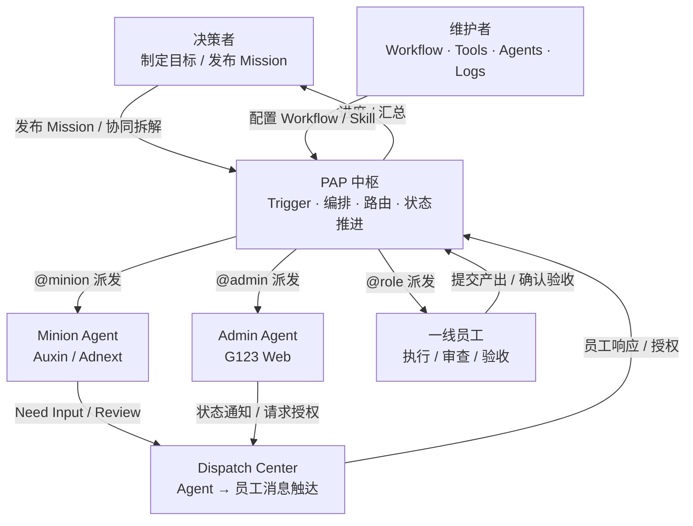
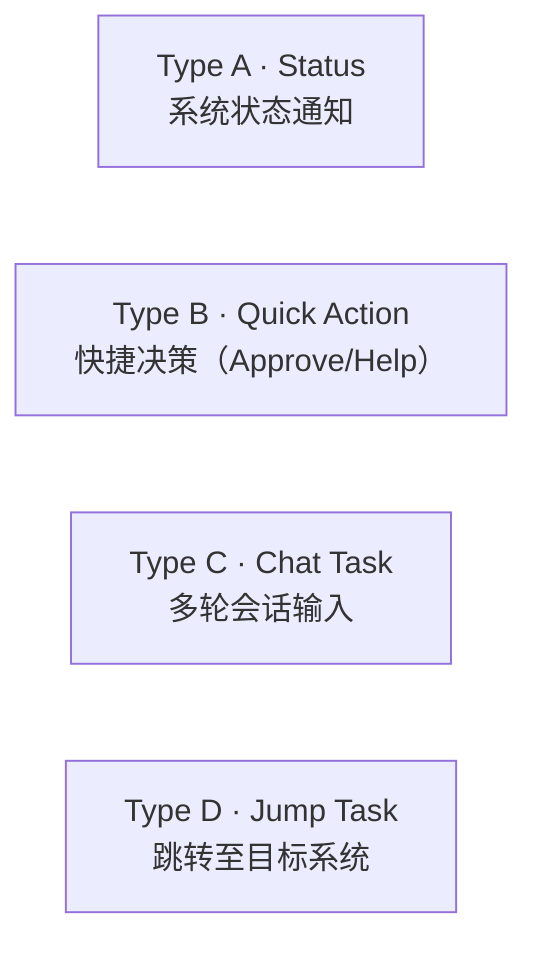
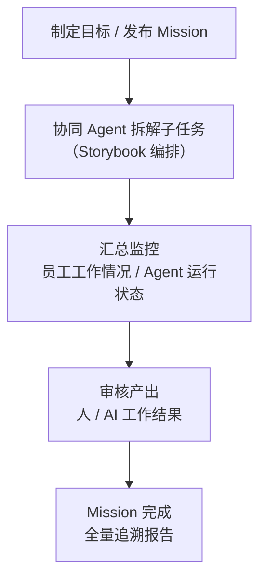
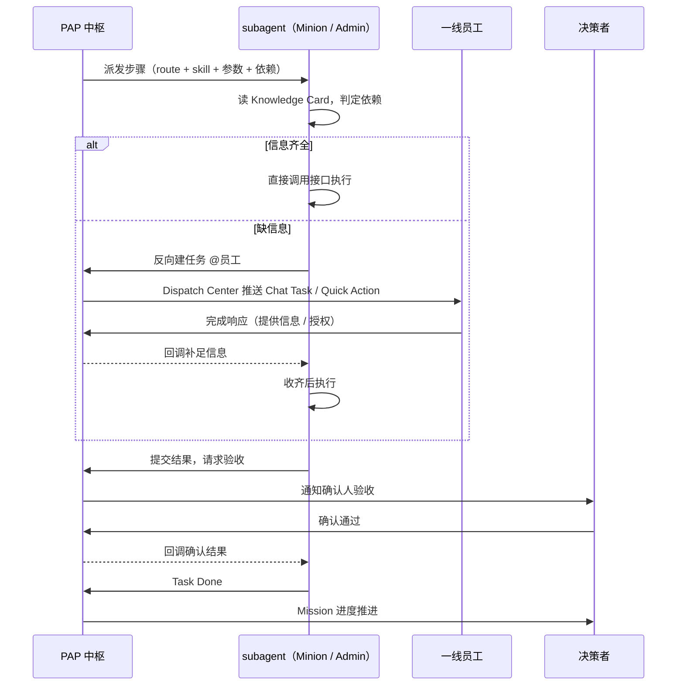

# PAP · People · Agent · People

* Status: draft
* Last updated: 2026-06-21
* Owner: D 系统产品团队

> 关联文档：[D 系统 3.0 大背景与目标](../D系统3.0背景与功能/D系统3.0大背景与目标.md) · [PAP 编排式 Agent 系统 PRD](../../其他系统需求/立项PRD.md) · [PAP 通用员工视图 PRD](PRD-PAP通用员工视图.md) · [Dispatch Center 设计规范](D员工任务管理-Dispatch%20Center.md) · [PAP×Minion 交互设计](PAP×Minion交互设计.md)

---

## 原型链接

| 视图 | 适用角色 | 原型链接 | 备注 |
|---|---|---|---|
| 通用员工视图 · Dispatch Center | 一线员工（客服 / 翻译官 / 运营等） | | |
| 通用员工视图 · Finance | 财务员工 | | |
| PAP Manager · 任务管理 | 决策者 | | |
| PAP Manager · AI Center | 决策者 | | |
| 翻译官视图 | 翻译官 | | |
| 维护者视图 | 系统维护者 | | |

---

## 整体方案

| 核心定位 | **PAP 是 D 系统 3.0 的人机协作总线**：连接决策者、一线员工与 AI Agent，承担任务拆解、分发、执行跟踪与结果验收的全链路职责 |
|---|---|
| 人机模型 | People · Agent · People——决策者制定目标 → PAP + Agent 拆解编排 → 一线员工执行/验收 → Agent 辅助 → 结果回流 |
| 与 D 系统 2.0 的区别 | D 2.0：员工自行制定任务，工具散落各子系统；D 3.0：AI 根据岗位职责主动分派任务，PAP 是唯一任务总线与协作界面 |
| 三类角色 | **一线员工**：接收任务、执行/审查、提交产出；**决策者**：制定目标、协同拆解、汇总监控；**维护者**：构建工作流、工具与 Agent |
| 执行层 | Minion Agent（Auxin/Adnext）/ Admin Agent（G123 Web）作为 subagent，PAP 负责编排与路由 |

一句话概括：**PAP 让 AI 知道该让谁做什么，让人知道自己该做什么、做完了没有。**

---

## Background

### 现状问题

D 系统 2.0 时代，工作协同依赖员工自行分配任务、靠 IM 和表格手工追踪进度。随着业务规模扩大和 AI Agent 能力落地，这套模式的局限日益明显：

* **任务来源分散，无统一入口**：一线员工面对 CS、CS Expert、Adnext、Auxin、i18n 系统等多个工具，需要主动在各系统查找自己的工作，容易遗漏，切换成本高。
* **AI 能力孤立，无法编排进流程**：已有 Minion Agent（Auxin/Adnext）、Admin Agent（G123 Web）等 AI 执行能力，但与人工步骤之间缺乏统一的协作接口，AI 做完的结果无法自然交接给下一个人或 Agent。
* **决策者缺乏全局视图**：团队目标是否推进、哪些任务卡住了、哪些员工工作量过高，没有可靠的实时数据，只能依赖人工汇报或主动追问。
* **工作质量因人而异**：大量重复性、标准化工作（入稿、登记、发布、Checklist 验证）靠员工记忆驱动，质量取决于个人经验，缺少系统性的引导与验收机制。
* **AI 产出无法触达员工**：Agent 执行任务过程中需要人工介入（提供信息、审查结果、确认发布）时，没有标准化渠道通知对应员工，信息传递依赖 IM，不可追溯。

### 新判断

D 系统 3.0 的核心判断是：**工作的驱动力从「人决定做什么」转变为「AI 根据岗位职责和业务目标主动分派任务」**。

这个转变要求一个新的基础设施：

1. **统一任务总线**：所有人工任务、AI 任务、人机协作任务都经过同一个系统流转，可追踪、可审计。
2. **双向协作通道**：PAP 不只是任务列表——它是 AI Agent 和人之间的实时协作界面。Agent 可以通过 PAP 向人请求补充信息；人可以通过 PAP 授权 Agent 执行操作。
3. **角色分层视图**：不同角色（一线员工 / 决策者 / 维护者）看到的是同一套数据，但视图聚焦各不相同，减少信息噪音。

PAP（People · Agent · People）正是这套基础设施的产品载体。

---

## Business Goal

| 指标 | 目标 | 衡量方式 | 衡量周期 |
|---|---|---|---|
| 员工任务感知响应时效 | 较现状缩短 ≥ 50% | 从任务产生到员工开始处理的中位时长 | 上线后 30 天 |
| 跨系统切换次数 | 下降 ≥ 60% | 员工完成单项工作需要访问的外部系统数量 | 上线后 30 天 |
| Agent 任务请求响应率 | ≥ 90% 在 SLA 内完成 | Agent 推送的 Quick Action / Chat Task 在规定时限内被消费的比例 | 上线后 30 天 |
| 决策者信息获取时效 | 从「主动追问」→「随时可查」 | 决策者获取特定员工 / 目标进展所需时间，目标 < 30 秒 | 上线后 60 天 |
| 工作流自动化率 | 首个 Mission（游戏上线）≥ 60% 步骤由 Agent 自动完成 | `@minion` + `@admin` 步骤数 / 总步骤数 | Phase 1 完成时 |
| 操作可追溯率 | 100% | 每个人工决策动作均有 PAP 记录，可按 Mission / 员工 / 时间查询 | 持续 |

---

## Requirement Description

### 1. 角色与视图矩阵

PAP 按角色提供差异化视图，底层共用同一套任务数据：

| 角色 | 核心诉求 | 主视图 | 典型操作 |
|---|---|---|---|
| **一线员工** | 知道今天该做什么，做完交差 | 通用员工视图 | 接收任务 · 执行/提交产出 · 响应 Agent 请求 |
| **决策者** | 知道整体进展，随时能介入 | PAP Manager | 制定目标 · 协同拆解任务 · 汇总监控 · 审核结果 |
| **维护者** | 构建和维护系统能力 | 维护者视图 | 编写 Workflow · 接入工具 · 管理 Agent · 查看日志 |

### 2. 整体架构

### 3. 一线员工视图

一线员工通过 PAP 接收和完成两类任务：

**操作型任务（人工执行）**：执行具体工作并提交产出物（文件、链接、表单等）。PAP 提供任务引导（完成所需的系统入口、质量衡量标准），并在完成后触发验收流程。

**审查型任务（AI 产出审查）**：审查 Agent 的工作结果（文案、配置、数据）。PAP 展示 Agent 产出内容，员工标记「通过/修改意见」，结果回流给 Agent。

**Dispatch Center（Agent → 员工触达）**：Agent 在执行过程中主动推送的消息与请求，包含四种类型：

详细规范见 [Dispatch Center 设计规范](D员工任务管理-Dispatch%20Center.md)。

**执行监控**：PAP 对可监控的工作类型（如客服是否在 CS / CS Expert 上有工作行为）进行过程跟踪，支持汇报每日工作量和工作结果。

### 4. 决策者视图（PAP Manager）

决策者通过 PAP Manager 完成从目标制定到结果汇总的全链路管理。

核心功能模块：

* **任务目标发布 Agent**：输入高层目标，Agent 辅助拆解成可执行步骤并填入 Storybook。
* **员工工作情况汇总**：按岗位/员工查看任务完成率、工作量、延误情况。
* **Agent 运行情况汇总**：查看各 subagent 的执行状态、成功率、耗时、异常。
* **协同型任务**：帮助 Agent 完成信息补充或子任务拆解中的判断节点。
* **审核型任务**：对 AI 或人的关键产出进行最终审核确认。

### 5. 维护者视图

维护者负责 PAP 系统能力的构建与维护，是 PAP 可运行的基础保障：

| 模块 | 职责 |
|---|---|
| **Works** | 构建并维护工作流（Workflow / Storybook），定义步骤、路由、依赖、验收规则 |
| **Tools** | 为 AI Agent 和员工构建工具（定制接口 & 定制前端页面交互） |
| **Agents** | 任务管理、任务分析等专用 Agent 的配置与迭代 |
| **Logs** | AI 运行状态监控、token 消耗统计、计费报表 |

### 6. 知识层：Mission Storybook + Skill Knowledge Card

PAP 编排的「做什么 + 路由给谁 + 怎么做」由两层知识模型支撑：

| 层级 | 名称 | 读取方 | 作用 |
|---|---|---|---|
| 第 1 层 | Mission Storybook | PAP 中枢 | 定义做什么、路由给谁、依赖顺序 |
| 第 2 层 | Skill Knowledge Card | subagent | 定义怎么做、需要什么输入、缺信息找谁 |

详细规范见 [PAP 编排式 Agent 系统 PRD](../../其他系统需求/立项PRD.md)。

### 7. Subagent 执行闭环

---

## Scope

### In scope（Phase 1）

* 通用员工视图：Dispatch Center 四种消息类型 · 消息队列 · 历史抽屉 · Chat Task / Jump Task 客户端标签页交互。
* 通用员工视图：To Do / Doing 区域（接收人工任务 · 提交产出 · 执行引导）。
* PAP Manager：Mission 任务树视图 · 步骤状态追踪（含 Minion Need Input / Review 交互态）。
* PAP 编排引擎：Trigger · 加载 Storybook · 按 `route` 派发 · 按 `depends_on` 推进。
* subagent 执行闭环：判定依赖 → 直调接口 / 反向摇人 → 回调收齐 → 执行 → 验收 → 终态通知。
* 首个端到端 Mission：游戏上线（复用并迁移 `game-launch-checklist.yaml`）。

### Out of scope（后续 / 非目标）

* 维护者视图（Works / Tools / Agents / Logs）——后续独立规划。
* 工作过程监控（如客服在 CS 系统的行为采集）——依赖各子系统接口，后续。
* 员工工作量汇报 Dashboard——后续。
* Workflow 自学习（从人工行为自动提炼 Storybook）——远期愿景。
* 移动端适配——后续。

---

## Feasibility And Principle Check

### 现状可行性

* **PAP 已存在**：全员任务系统，员工已接入统一任务总线，本 PRD 是在现有基础上增量扩展。
* **执行层已就绪**：Minion（Auxin/Adnext API）和 Admin Agent（G123 Web）已具备操作能力，无需重做 API 集成。
* **知识资产已有雏形**：`game-launch-checklist.yaml` 已结构化定义游戏上线全流程，可直接迁移为首个 Storybook。
* **原型已验证关键交互**：Dispatch Center、PAP Manager（含 Minion Need Input / Review）均已有 HTML 原型验证可行性。
* **主要新增工作**：服务端推送接口、callback 路由、消息持久化、编排引擎实现。

### 原则契合

* **AI 主动分派，人被动接收**：与 D 系统 3.0「AI 根据岗位职责分派任务」的核心目标完全一致。
* **Agent-First / 能做直接做，做不了发任务**：subagent 执行闭环与此原则一致。
* **每个决策可追溯**：所有步骤与回调落为 PAP 任务，天然具备完整审计链。
* **复用优先**：复用 PAP、Minion、Admin Agent 与现有 Workflow YAML，新增集中在编排层与视图层。

### 风险

* PAP 现有 API 能力可能不足以支撑程序化建任务 + callback + 确认的完整契约。
* subagent 反向摇人 → 回调收齐的状态机较复杂，超时/重试/取消语义需明确。
* 决策者视图的数据聚合依赖多个子系统接口，接入成本待评估。

---

## Decision

* 待评审：本 PRD 处于 `draft`，待各角色视图范围与 Phase 1 优先级对齐后推进至 `approved`。

---

## Acceptance Criteria

**通用员工视图**
- [ ] Dispatch Center：四种消息类型卡片正确渲染与消费，消息队列 + 徽标 + 历史抽屉完整可用。
- [ ] To Do / Doing：员工能接收 PAP 派发的人工任务，提交产出后触发验收流程。
- [ ] Chat Task 在客户端标签页打开 Agent 会话，会话完成后卡片归档。
- [ ] Quick Action callback 流程完整：用户点击 → PAP 回调创建方 → 返回 done/failed → 状态更新。

**PAP Manager**
- [ ] 决策者能创建 Mission，PAP 基于 Storybook 生成含依赖关系的执行计划。
- [ ] 任务树视图展示每个步骤的 route、状态（To do / Running / Need Input / Review / Done）。
- [ ] Minion Need Input / Review 状态在 PAP Manager 中有明确的视觉标识和跳转入口。

**编排层**
- [ ] PAP 能按 `route` 正确派发步骤给 `@minion` / `@admin` / `@role` 三类执行者。
- [ ] subagent 信息不足时反向在 PAP 建任务摇人，人提交后回调 subagent，subagent 收齐后执行。
- [ ] 游戏上线 Mission 可在 PAP 上完整端到端跑通。

---

## Progress Log

* 2026-06-21：PAP 立项 PRD 创建（`draft`）。整合 D 系统 3.0 背景目标、三角色模型、Dispatch Center 设计、PAP×Minion 交互设计，形成系统级产品立项文档。

---

## Risks And Open Questions

| 风险 | 等级 | 应对 |
|---|---|---|
| PAP API 不支持程序化建任务 / callback / 确认 | 高 | Phase 0 优先验证 PAP 接口能力，必要时推动 PAP 扩展 |
| subagent 反向摇人闭环状态机复杂 | 中 | 明确超时、重试、取消、并发依赖语义；先在游戏上线单 Mission 跑通 |
| 决策者视图数据聚合依赖多系统 | 中 | Phase 1 先做静态 / mock 展示，逐步替换为真实接口 |
| Knowledge Card 与真实接口漂移 | 中 | 建立 Card 与 Minion / Admin Skill 清单的定期对账机制 |
| 员工未及时在 PAP 响应导致 Mission 卡住 | 中 | 设置超时升级/催办，关键路径步骤标注 SLA |
| 维护者视图范围不清晰影响 Phase 1 边界 | 低 | 本 PRD 明确排除维护者视图，后续独立立项 |

Open questions：

* PAP 的「调度大脑」用规则引擎还是 LLM 规划？路由/依赖用结构化规则，意图理解/参数填充用 LLM——两者边界如何划定？
* `route: "@<role>"` 中角色到具体人的映射在哪维护（PAP 组织架构 or Storybook）？
* Quick Action callback 失败后，重试由 PAP 发起还是创建方自行重试？重试次数和间隔如何约定？
* 消息的 TTL（生存时间）由创建方声明还是 PAP 统一配置？超时未响应后消息如何处理？
* Storybook / Knowledge Card 的版本管理与灰度——改了剧本对进行中的 Mission 是否生效？
* PAP Manager 中决策者的「协同型任务」（帮助 Agent 拆解）的具体交互形式？

---

## Prototype

| 视图 | 文件 | 状态 |
|---|---|---|
| 通用员工视图 · Dispatch Center | `D-PAP-AI-message.html` | 完整原型，含四种卡片类型 · 消息队列 · 历史抽屉 |
| 通用员工视图 · Finance | `F-PAP-EXPENSE-REPORT.html` | 财务报销视图原型 |
| PAP Manager · 任务管理 | `D-PAP-MANAGER_副本.html` | 含 Minion Need Input / Review 交互态 |
| PAP Manager · AI Center | `D-PAP-AI-CENTER_副本.html` | AI 任务中心视图 |
| 翻译官视图 | `D-PAP-WORKER.html` | 翻译官执行视图 |
| 维护者视图 | — | 待规划 |
