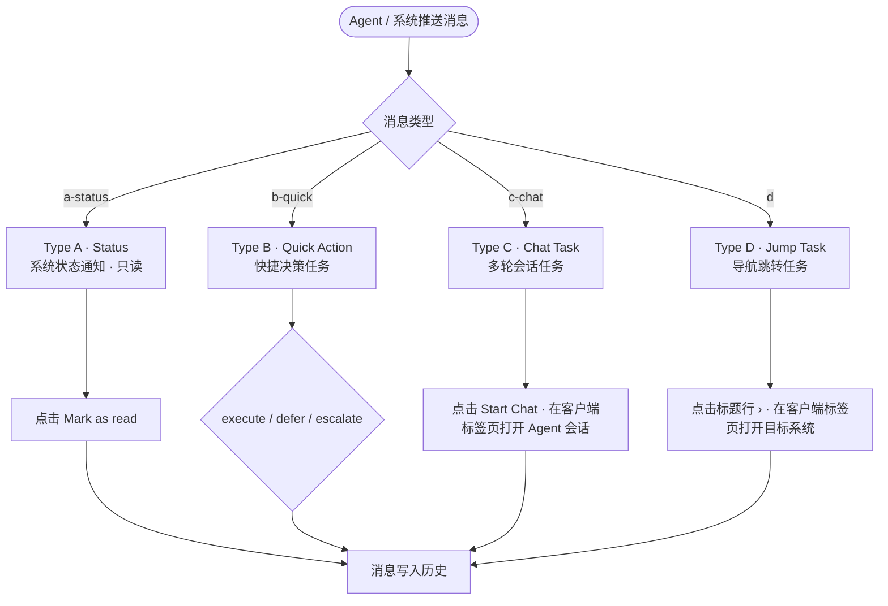
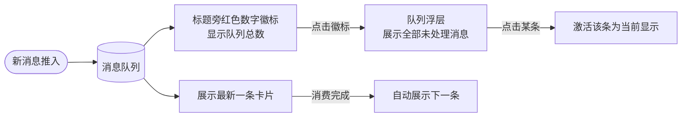
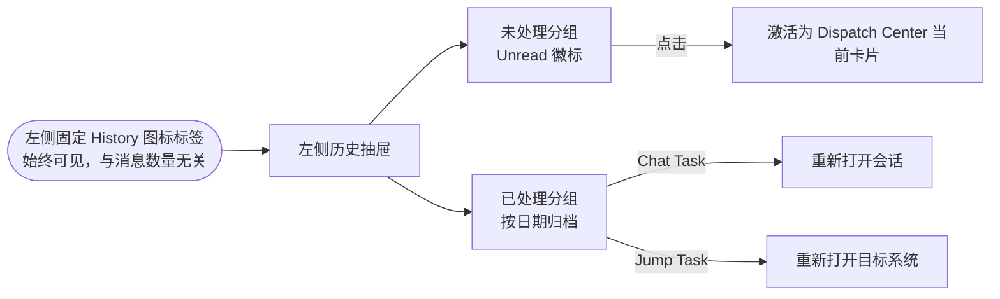
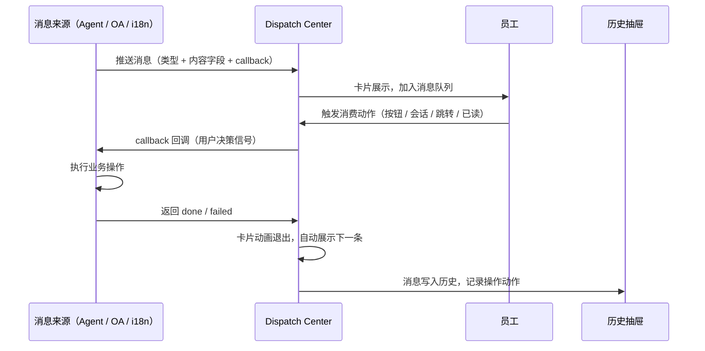

# PAP 通用员工视图 · Dispatch Center

* Status: draft
* Last updated: 2026-06-18
* Owner: D 系统产品团队
* Prototype: `D-PAP-AI-message.html`

> 关联文档：[PAP 编排式 Agent 系统 PRD](../../其他系统需求/立项PRD.md) · [Dispatch Center 设计规范](D员工任务管理-Dispatch%20Center.md) · [PAP×Minion 交互设计](PAP×Minion交互设计.md)

---

## 整体方案

| 定位 | **PAP 通用员工视图是 Agent → 人的末端触达层**：Agent 完成任务或需要人工介入时，通过 Dispatch Center 向员工推送结构化消息，员工在此处完成授权、会话协作或导航跳转。 |
|---|---|
| 与编排层的关系 | PAP 编排中枢（Brain）负责驱动 subagent 和派发人工步骤；通用员工视图是编排中枢在**普通员工侧的呈现端**，不参与调度决策 |
| 与 To Do / Doing 的关系 | Dispatch Center 接收**外部推入（Agent/系统 → 人）**的任务；To Do / Doing 是员工**自己持有**的工作队列——两者来源不同、生命周期不同，不合并展示 |
| 核心交互原则 | 消息按交互类型路由（Status / Quick Action / Chat Task / Jump Task），消费即归档，历史全量可查 |

一句话概括：**员工进入 PAP 看到的不是系统日志，而是「今天有哪些 Agent 在等你做决定」。**

---

## Background

### 现状问题

D 系统 2.0 有独立的消息中心，员工可在其中查看系统通知、任务提醒、审批结果。迁移至 D 系统 3.0（纯 PAP 架构）后，这一入口不复存在——PAP 专注于任务执行与 Agent 协作，**缺乏统一的消息触达通道**。

核心矛盾：

* **Agent 无法找到人**：Minion / Admin Agent 执行任务中遇到需要人工介入的节点，没有标准化渠道通知对应员工。员工只能靠 IM 或主动轮询子系统，容易遗漏或延迟。
* **决策无留存**：Quick Action 类操作（审批、发布授权）过去散落在 IM / OA，没有统一的操作链路记录。
* **系统通知无归口**：OA 审批结果、i18n 系统任务分配、发布流水线状态等来自不同系统，员工需要同时关注多个入口。
* **员工视角缺失**：现有 PAP 视图重在任务执行（Doing / To Do），缺少「有什么东西在等我处理」的主动感知入口。

### 新判断

PAP 是全员任务系统，员工的所有操作已天然在 PAP 上。因此，**在 PAP 通用员工视图中增加一个轻量的消息触达模块（Dispatch Center）** 是阻力最小、效果最直接的路径——Agent 和系统把消息推进来，员工在同一个界面完成感知与响应，无需跳转到其他入口。

---

## Business Goal

| 指标 | 目标 | 衡量方式 | 衡量周期 |
|---|---|---|---|
| Agent 请求响应时效 | 较现状缩短 ≥ 50% | 从 Agent 推送消息到员工完成消费的中位时长（对比现有 IM 渠道） | 上线后 30 天 |
| 消息遗漏率 | 降低 ≥ 70% | 超时未消费的消息占比（超时定义由业务场景设定 SLA） | 上线后 30 天 |
| 操作可追溯率 | 100% | 每条 Quick Action 的用户操作（Approved / Help sent）均有记录 | 持续 |
| 多系统通知整合 | Agent + OA + i18n 等 ≥ 3 个来源收口 | Dispatch Center 接入的来源系统数 | Phase 1 完成时 |
| 历史查阅满足率 | ≥ 90% | 员工通过历史抽屉能找到目标消息的比例（用户调研） | 上线后 60 天 |

---

## Requirement Description

### 1. Dispatch Center 的定位与边界

Dispatch Center 是 PAP 通用员工视图的消息触达模块，嵌入页面主内容区，**专门承接外部推入的消息和任务请求**。

与页面其他区域的关系：

| 区域 | 来源 | 生命周期 | 用户角色 |
|---|---|---|---|
| **Dispatch Center** | Agent / 系统 → 推给员工 | 出现 → 消费 → 归档（一次性） | 被请求者（Responder） |
| **To Do** | 员工自建 / 团队分配 | 持续存在直到完成 | 执行者（Doer） |
| **Doing** | 员工当前推进中的工作 | 持续存在，员工主动更新 | 执行者（Doer） |

**判断一条消息属于 Dispatch Center 的规则**：由 Agent 或系统主动推送，需要员工在有限时间内响应一次，响应后消息使命完成。

### 2. 消息类型体系

Dispatch Center 定义四种消息类型，类型决定交互方式，员工无需额外判断：



#### Type A · Status（状态通知）

只读的系统状态变更通知，不需要员工做任何操作决策，仅用于告知。来源为后端系统（OA 审批完成、付款到账、出行申请批准等），视觉权重低于操作类消息。

消费方式：点击 **Mark as read** → 卡片退出 → 进入历史，记录 `Read`。

#### Type B · Quick Action（快捷决策任务）

Agent 或系统已完成分析并给出结论，员工只需做一次授权决策的任务。适用于审批、发布确认、转人工介入等场景。

**适用判断**：创建方已得出结论，员工只需授权。若选项本身需要解释或背景说明，应使用 Chat Task。

Action 按钮规范（语义 Slot）：

| Semantic | 语义 | 视觉位置 |
|---|---|---|
| `execute` | 主操作，立即执行，通常不可逆 | 最左 |
| `defer` | 推迟处理，稍后执行 | 中间 |
| `escalate` | 上报，转交决策者介入 | 最右 |

**执行流程**：

```
用户点击按钮
  ↓
PAP → callback → 创建方（Agent 或系统 Webhook）
  { msg_id, semantic, label, actor, timestamp }
  ↓
创建方执行业务操作（调用目标系统接口）
  ↓
创建方 → PAP：done / failed
  ↓
PAP 更新卡片状态
```

PAP 不直接调用业务接口，只负责传递人的决策信号。`escalate` 路径通知 Decision Maker 介入，原卡片挂起。

创建方类型：

* **Agent 创建**：callback 由 Agent 运行时处理。
* **系统直接创建**：callback 为系统暴露的 Webhook 端点。
* **不可改造的系统**：由 Admin Agent 作适配层，系统侧无需改造。

#### Type C · Chat Task（会话任务）

Agent 已完成可自动执行的部分，存在 2–3 个需要员工判断的关键节点（如内容文案、时间设定），通过多轮会话逐步收集。

消费方式：点击 **💬 Start Chat** → 在客户端新标签页打开 Agent 会话，完成输入并点击「确认执行」→ 返回 Dispatch Center → 卡片退出，记录 `Chat done`。

#### Type D · Jump Task（跳转任务）

需要员工前往另一个系统完成的任务，Dispatch Center 仅作导航入口。**无操作按钮**，标题行右侧内联 `›` 箭头，点击标题行即触发：在客户端新标签页打开目标系统 → 卡片退出，记录 `Jumped`。

### 3. 消息队列与展示机制

Dispatch Center 同一时刻**只展示一条消息**（最新或当前激活），其余未处理消息以数字徽标的形式标注在「Dispatch Center」标题旁。



当 Dispatch Center 无待处理消息时，该区域不显示，标题不渲染。

### 4. 历史消息处理



历史抽屉分两段：
* **未处理（Unread）**：当前 case 下所有未消费消息，支持点击后切换为 Dispatch Center 当前显示卡片。
* **已处理（按日期归档）**：记录操作动作（Approved / Help sent / Chat done / Jumped / Read）。

抽屉支持**一键清空**（仅清除已处理历史，不影响未处理队列）。

### 5. 消息生命周期



### 6. 消息推送协议（创建方契约）

无论来源是 Agent 还是系统，推送 Quick Action 时均遵循统一协议：

```
{
  type: "b-quick",
  source: "Release Agent",
  title: "...",
  summary: "...",
  actions: [
    { semantic: "execute", label: "Publish Now", callback: "agent://release-agent/confirm" },
    { semantic: "defer",   label: "Schedule",    callback: "agent://release-agent/schedule" }
  ]
}
```

`callback` 字段由创建方自行填写，PAP 在用户点击时触发，不关心接收方是 Agent 还是 Webhook。

---

## Scope

### In scope（Phase 1）

* Dispatch Center 消息队列展示：单卡轮显 + 数字徽标 + 队列浮层。
* 四种消息类型（Status / Quick Action / Chat Task / Jump Task）的卡片渲染与消费交互。
* Quick Action 的 Semantic Slot 规范（execute / defer / escalate）与 callback 协议。
* Chat Task 在客户端标签页打开 Agent 会话、完成后归档。
* Jump Task 在客户端标签页打开目标系统、完成后归档。
* 历史抽屉：未处理 + 已处理两段，支持清空。
* 左侧固定 History 标签（与消息是否存在无关，始终可见）。
* 消息卡片样式：列表行风格，低视觉权重，摘要默认折叠（2 行），按需展开。
* Status 卡视觉降权（比操作类消息更矮、更灰、更轻）。

### Out of scope（后续 / 非目标）

* PAP 通用员工视图的 To Do / Doing 区域（独立文档）。
* Dispatch Center 的服务端推送实现（Phase 1 以前端 mock 为主，协议先行）。
* 消息中心归档页（超出历史抽屉容量后的持久化查询，后续规划）。
* 移动端适配（后续）。
* 通知铃铛 / 红点角标（Dispatch Center 本身是主视图模块，不依赖外部角标驱动）。

---

## Feasibility And Principle Check

### 现状可行性

* **PAP 已存在**：通用员工视图已有 To Do / Doing 区域，Dispatch Center 是增量模块，嵌入主内容区，不重构现有结构。
* **Agent 回调契约已设计**：PAP × Minion 交互设计已定义 Task Done / Need Input / Need Review 三种回调语义，Quick Action callback 与之一致。
* **原型已验证交互可行性**：`D-PAP-AI-message.html` 已完整实现四种卡片类型、消息队列、历史抽屉、Chat / Jump 标签页交互。
* **主要新增工作**：服务端推送接口、创建方 callback 路由、消息持久化存储。

### 原则契合

* **消费即归档**：保持主区域始终是「需要我处理的任务」，信息不堆积。
* **类型即操作**：员工看到卡片类型标签即知道如何操作，零学习成本。
* **Agent-First**：Dispatch Center 的首要场景是 Agent → 人的协作节点，而非系统通知堆砌。
* **可追溯**：每次操作（Approved / Help sent / Chat done 等）均写入历史，不依赖 IM 记录。

### 风险

* PAP 缺少服务端实时推送能力（WebSocket / SSE），需评估接入成本。
* Quick Action callback 的超时 / 失败 / 重试语义需明确，防止卡片状态不一致。
* Status 卡和 Quick Action 卡的视觉权重边界需持续验证（当前已降权 Status，但需用户测试确认）。

---

## Decision

* 待评审：本 PRD 处于 `draft`，待前后端接口方案确认（PAP 推送能力 + callback 路由）后推进至 `approved`。

---

## Acceptance Criteria

- [ ] Dispatch Center 区域在有未处理消息时出现，无消息时不渲染标题和卡片区。
- [ ] 多条未处理消息时，只展示一张卡片，标题旁红色徽标显示队列总数，点击徽标可在浮层中切换激活消息。
- [ ] 四种类型卡片（Status / Quick Action / Chat Task / Jump Task）的渲染与消费交互均符合类型规范。
- [ ] Quick Action 按钮点击后：PAP 发起 callback → 等待创建方返回 done / failed → 更新卡片状态；失败时卡片保留并显示错误态。
- [ ] Chat Task 点击 Start Chat 后：在客户端标签页打开对应 Agent 会话；会话完成后卡片归档，记录 `Chat done`。
- [ ] Jump Task 点击标题行后：在客户端标签页打开目标系统；卡片归档，记录 `Jumped`。
- [ ] 左侧固定 History 标签始终可见，点击打开历史抽屉，抽屉展示未处理（Unread）和已处理（按日期）两段。
- [ ] 历史抽屉支持一键清空已处理记录。
- [ ] 消费一条消息后，Dispatch Center 自动展示队列中下一条。
- [ ] 消息卡片摘要默认折叠 2 行，内容超出时显示展开控件；内容未超出时不显示控件。

---

## Progress Log

* 2026-06-07：Dispatch Center 初版设计，定义四种消息类型，明确消费即归档原则。
* 2026-06-15：历史入口改为左侧固定 History 标签；Chat Task / Jump Task 改为在客户端标签页打开对应系统；更新 Quick Action B1 案例。
* 2026-06-16：Chat Task 类型编号 B-Chat → C，Jump Task C → D；新增消息队列（单卡轮显 + 数字徽标）；Status 卡视觉降权；卡片改为列表行风格，摘要折叠。
* 2026-06-18：补写系统级 PRD，明确与编排 PRD 的层次关系，补充 Quick Action callback 协议、创建方契约、消息队列交互规范。

---

## Risks And Open Questions

| 风险 | 等级 | 应对 |
|---|---|---|
| PAP 缺少服务端实时推送（WebSocket / SSE） | 高 | Phase 0 验证推送能力，必要时推动 PAP 基础设施扩展 |
| Quick Action callback 超时 / 失败处理 | 中 | 明确 failed 态卡片行为（保留 + 错误提示 + 重试入口）；设定超时 SLA |
| 不可改造系统的 callback 适配 | 中 | Admin Agent 作适配层，系统无需改造，但增加 Admin Agent 维护成本 |
| 消息队列过长时用户感知负担 | 低 | 数字徽标 + 浮层已提供队列感知；后续可加 SLA 超时催办机制 |
| Status 卡 / Quick Action 卡视觉权重边界 | 低 | 原型已降权 Status，待用户测试验证区分度是否足够 |

Open questions：

* Quick Action callback 失败后，重试由 PAP 发起还是创建方自行重试？重试次数和间隔？
* 消息的 TTL（生存时间）由创建方声明还是 PAP 统一配置？超时后消息如何处理（自动归档 / 通知 escalate）？
* 历史抽屉的「已处理」记录何时持久化到服务端（目前为 session 级 mock）？持久化后清空按钮语义是否调整？
* Dispatch Center 和 To Do 是否存在消息转化路径（Quick Action 被 escalate 后，是否在 Decision Maker 的 To Do 中生成一条任务）？

---

## Prototype

* 原型文件：`D-PAP-AI-message.html`
* 已实现：四种消息类型卡片 · 消息队列 + 数字徽标 + 队列浮层 · Chat Task 客户端 iframe 标签页 · Jump Task 客户端 iframe 标签页 · 左侧 History 标签 · 历史抽屉（未处理 + 已处理 + 清空）· 摘要折叠展开 · Status 卡降权 · 列表行风格
* 待原型化：callback 执行中 / 失败态 · 消息超时催办 · 服务端推送模拟
