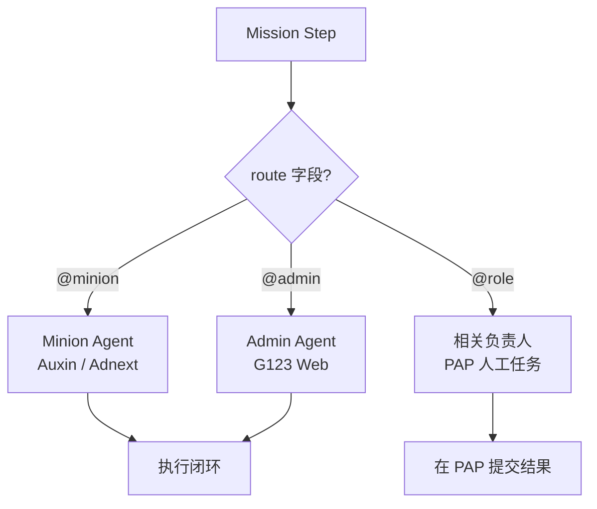
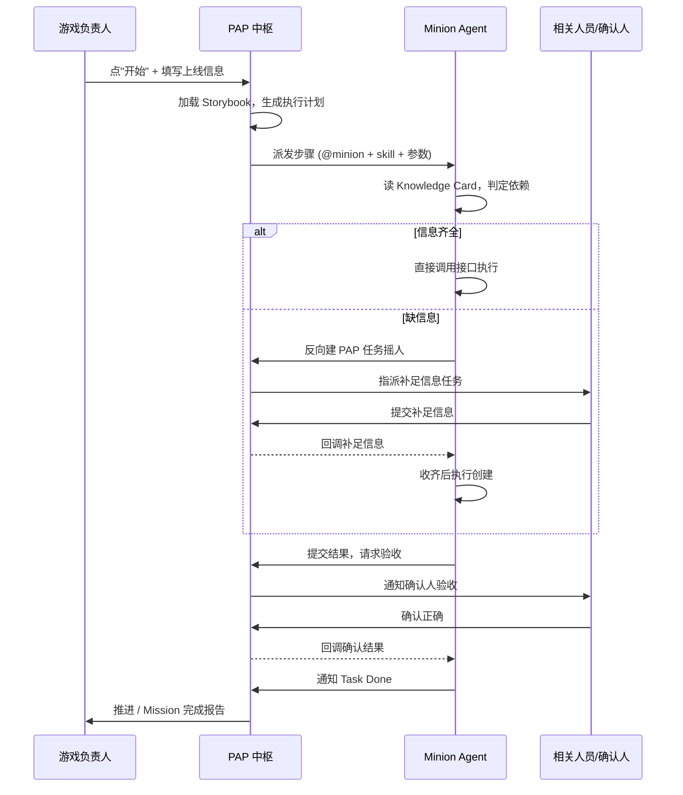
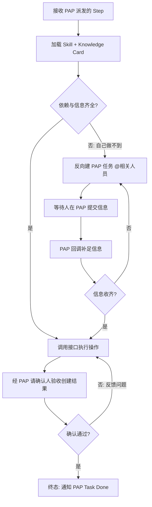

# PAP 编排式 Agent 系统

* Status: intake
* Last updated: 2026-06-04
* Repo: `/Users/shi-xuxin/ai-marketer`
* Owner: Marketing AI Agent 团队
* Prototype route: `prototype/`（平台级占位，详见 Prototype 章节）
* Prototype URL: <http://localhost:5173>

> 关联文档：[Marketing AI Agent 提案](../../Marketing_AI_Agent_Proposal.md) · [ROAS Agent MVP PRD](20260330-roas-agent-mvp.md) · [产品原则](../principles.md) · [游戏上线 Workflow](../../../workflows/game-launch-checklist.yaml)


---

## 整体方案

| 调度大脑 | **PAP 即大脑**：PAP 负责 Trigger、读 Storybook 编排、派发与状态推进 |
|------|-----------------------------------------------|
| 人工任务分发 | **统一进 PAP**：所有人工任务/Review 都是 PAP 任务           |
| 触发入口 | **PAP 是唯一 Trigger 源与人机任务总线**                  |
| 执行层  | `Minion`（Auxin/Adnext）/ `Admin Agent`（G123 Web）作为 subagent |
| 知识层  | 升级为 **Mission Storybook + Skill Knowledge Card** 两层（见下） |

一句话概括新模型：**PAP 指挥「人」和「sub Agent」干活；sub Agent 也可以反过来通过 PAP 指挥「人」补足信息，并把信息回流给自己**。「具体干什么」沉淀在 Storybook / Knowledge 知识层。


---

## Background

### 现状问题

游戏上线、Promotion、Performance 等运营工作高度依赖**跨团队人工协同**，核心痛点：

* **交接成本高**：一次游戏上线涉及 Adnext / Auxin / G123 Web / SNS / Newsletter / PressRelease 等多团队，步骤在人与人之间频繁交接，信息容易丢失或滞后。
* **缺乏统一调度**：没有一个中枢知道「整件事进展到哪了、下一步该谁做、卡在哪个依赖上」，负责人靠 IM/表格手工追踪。
* **重复且标准化**：大量步骤是固定流程（入稿、登记、发布、Checklist 验证），但每次都靠人记忆和经验驱动，质量因人而异。
* **Agent 能力未被编排**：已有 `Minion` 可调用 Adnext/Auxin API、`Admin Agent` 可操作 G123 Web，但缺少一个把它们和「人」统一编排进同一个任务流的中枢。

### 新判断

公司已上线 **PAP**——面向所有员工的任务系统，**员工的所有操作、Review 在 PAP 上都对应一个任务**。这意味着「人」已经天然接入了一个统一任务总线。

因此新的核心判断是：**把 PAP 从被动的任务记录系统，升格为主动的编排中枢（Brain）+ Trigger**。负责人在 PAP 上对一个 Mission 点「开始」，PAP 就按 Storybook「摇人或摇 subagent」把整件事推进到完成。执行层（Minion / Admin）已就绪，开发重心在编排模型、知识表示与人机回调契约。


---

## Business Goal

| 指标  | 目标  | 衡量方式 | 衡量周期 |
|-----|-----|------|------|
| Mission 端到端周期 | 缩短 ≥ 40% | 游戏上线从触发到全部步骤完成的总时长，接管前后同口径对比 | 上线后 30 天 |
| 人工交接次数 | 下降 ≥ 50% | 单次 Mission 中「人→人」交接动作计数 | 上线后 30 天 |
| 信息丢失 / 返工率 | 下降 ≥ 60% | 因信息缺失/错误导致的步骤重做次数 | 上线后 30 天 |
| 跨团队协同人时 | 节省 ≥ 40% | 单次游戏上线投入的总人工工时对比 | 上线后 30 天 |
| 首个 Mission（游戏上线）自动化率 | ≥ 60% 步骤由 subagent 自动完成 | `@minion` + `@admin` 步骤数 / 总步骤数 | Phase 1 完成时 |
| 调度可追溯 | 100% | 每个 Mission/步骤在 PAP 有完整状态与回调链路 | 持续   |

以一次游戏上线为例：当前需多团队约 2\~3 天的串行交接，目标是把负责人「点一下开始 → 收齐确认」的周期压缩到 1 天内，并把跨团队协同人时减少近半。


---

## Requirement Description

### 1. 角色与路由规则

PAP 作为中枢，把每个步骤按「归属系统」路由给三类执行者：

| 路由标记 | 执行者 | 负责范围 |
|------|-----|------|
| `@minion` | Minion Agent | 涉及 **Auxin / Adnext** 的任务（X 通知、IM/Popup Campaign、Sendgrid 等） |
| `@admin` | Admin Agent | 涉及 **G123 Web** 的任务（游戏登记、公开管理、Top Banner、排名位等） |
| `@<role>` | 相关负责人（人） | **没有任何 Agent 能做**的任务（原创设计、外部沟通、最终业务判断等） |

路由决策完全由 Storybook 中每个 Step 的 `route` 字段声明，PAP 不做隐式推断。



### 2. 编排架构

PAP 是唯一的 Trigger 源与人机任务总线，subagent 既被 PAP 指挥，也能反向通过 PAP 指挥人并把信息回流给自己。

 

### 3. Mission 生命周期（以游戏上线为例）


1. **建 Mission**：PAP 给游戏负责人建一个 Mission，负责人填写游戏名、上线日期/时间（JST）、目标市场等输入参数。
2. **选择剧本并编排**：PAP 根据 Mission 类型加载对应 **Storybook**，结合负责人填写的参数生成参数化的执行计划（分阶段、分步骤、含依赖关系）。
3. **分步路由派发**：PAP 按每个 Step 的 `route` 派发——`@minion` / `@admin` / `@<role>`，并按 `depends_on` 控制推进顺序与并发。
4. **执行与回调**：subagent 执行（见下「执行闭环」）；人工步骤在 PAP 上完成后回调，驱动后续步骤。
5. **验收与终态**：每个需确认的步骤执行后，经 PAP 找 `confirm_by` 指定的确认人验收；确认通过后该 Step 进入终态。
6. **Mission 完成**：所有步骤终态后，PAP 标记 Mission 完成（游戏上线 Storybook 末尾由 Brain 步骤做整体 Checklist 验证并产出状态报告）。



### 4. Subagent 执行闭环

这是新模型的核心机制——subagent 不是「一次性调接口」，而是一个**带人工回补的收敛闭环**：



要点：

* subagent 依据自身 **Skill** 和对应任务的**执行 Knowledge** 自行判定依赖。
* 能直接调接口的直接调；**做不到的再创建 PAP 任务找相关人员**提供信息。
* 人员在 PAP 提交补足信息后**回调**给 subagent；subagent **收齐所有信息后再执行**创建操作。
* 执行完再通过 PAP 找**最终确认人**验收创建是否正确；PAP 把确认结果**回馈**给 subagent。
* 负责人确认后 subagent **最终确认任务完成，通知 PAP 自己的 Task 做完了**。

### 5. 双向指挥模型

| 方向  | 含义  | 载体  |
|-----|-----|-----|
| PAP → subagent | 中枢派发结构化步骤指令（route + skill + 参数 + 依赖） | PAP 派发 / 回调接口 |
| PAP → 人 | 中枢指派人工任务（补足信息 / 原创 / 验收确认） | PAP 任务 |
| subagent → PAP → 人 | subagent 做不到时反向摇人，信息再回流给自己 | PAP 任务 + 回调 |
| 人 → PAP → subagent | 人提交结果/确认，驱动 subagent 继续 | PAP 回调 |

### 6. 知识层：Mission Storybook + Skill Knowledge Card

详见下方独立章节 [知识表示规范](#%E7%9F%A5%E8%AF%86%E8%A1%A8%E7%A4%BA%E8%A7%84%E8%8C%83)。这是 PAP「知道做什么」和 subagent「知道怎么做」的唯一真相来源，且由人手写、LLM 可解析。


---

## 知识表示规范

「具体干什么活」需要一个地方维护，本 PRD 采用**两层知识模型**。两层都使用 **Markdown + YAML frontmatter**，与仓库现有 [SKILL.md](../../skills/product-manager/SKILL.md) 和 [game-launch-checklist.yaml](../../../workflows/game-launch-checklist.yaml) 风格一致：结构化字段供 PAP 做路由/依赖解析，自然语言字段供 LLM 理解，且人可手写。

### 第 1 层：Mission Storybook（PAP 读取，定义「做什么 + 路由给谁」）

一个 Mission 类型一份剧本。frontmatter 描述触发与输入，正文按 Phase / Step 组织：

```markdown
---
mission: game-launch
name: "新游戏上线"
trigger: manual                 # 负责人在 PAP 点"开始"
owner_role: game_owner
inputs:
  - { name: game_name,        type: string, required: true }
  - { name: release_date,     type: date,   required: true }
  - { name: release_time_jst, type: time,   required: true }
  - { name: target_markets,   type: list,   required: true }
phases: [release, after_release]
---

## Phase: release

### Step: adnext_x_setup
- route: "@minion"                       # @minion | @admin | @<role>
- skill: adnext.x_notification.create_content
- depends_on: [adnext_x_review_text, adnext_x_obtain_banner]
- intent: |
    在 Adnext 上为官方 X 账号创建上线通知：写入审核通过的文案与 Banner，
    设置发送时间并用测试账号试发。判断 follower 数据、文案、Banner 是否齐全，
    缺哪项就向对应负责人摇人补足。
- needs_from_human:                      # agent 做不到时去 PAP 摇人
    - { who: marketer, provide: sns_banner_box_link }
    - { who: engineer, provide: follower_json_file }
- confirm_by: marketing_lead             # 执行后 PAP 找谁验收

### Step: g123web_register_and_publish
- route: "@admin"
- skill: g123.game_list.register
- depends_on: []
- intent: |
    在 G123 游戏一览中登记新游戏并配置公开管理时间。
- confirm_by: web_owner

### Step: sns_youtube_prepare
- route: "@video_owner"                  # 无 Agent，直接派人
- intent: |
    在 YouTube 频道准备上线视频，完成后在 PAP 提交链接。
- confirm_by: marketing_lead
```

字段说明：

| 字段  | 必填  | 作用  |
|-----|-----|-----|
| `route` | 是   | 路由目标：`@minion` / `@admin` / `@<role>`，PAP 据此派发 |
| `skill` | Agent 步骤必填 | 引用第 2 层 Knowledge Card 的 skill id |
| `depends_on` | 否   | 前置步骤 id 列表，控制推进顺序与并发 |
| `intent` | 是   | 自然语言意图，供 LLM/subagent 理解目标与依赖判断 |
| `needs_from_human` | 否   | 预声明可能要向人摇取的信息及对应角色 |
| `confirm_by` | 否   | 执行后由谁在 PAP 验收 |
| `scheduled_time` | 否   | 定时执行步骤（如上线日 12:00 JST） |

### 第 2 层：Skill Knowledge Card（subagent 读取，定义「怎么做 + 依赖 + 缺信息找谁 + 谁确认」）

一个 skill 一份卡片，按 `skill` id 被 Storybook 引用：

```markdown
# skill: adnext.x_notification.create_content

- 作用: 在 Adnext 创建官方 X 账号的上线通知内容并设置发送时间、试发。
- 必需输入:
    - follower_json_file   (来源: 工程团队同步)
    - approved_text        (来源: adnext_x_review_text 步骤产出)
    - sns_banner_box_link  (来源: marketer / CTWBox)
    - send_time            (来源: Mission 输入 release_time_jst)
- 前置依赖: 文案已审核通过、Banner 已就绪、Follower 数据已上传。
- 可直接调用的接口:
    - POST /adnext/x-notification/content   { text, banner_url }
    - PUT  /adnext/x-notification/schedule  { send_time }
    - POST /adnext/x-notification/test      { test_account }
- 缺信息时: 在 PAP 创建任务 @marketer 索取 sns_banner_box_link；
            创建任务 @engineer 索取 follower_json_file。
- 完成后: 提交 PAP 给 marketing_lead 验收创建结果是否正确。
```

### 与现有 `game-launch-checklist.yaml` 的迁移关系

现有 [workflows/game-launch-checklist.yaml](../../../workflows/game-launch-checklist.yaml) 已经定义了游戏上线的两阶段（`release` / `after_release`）全部步骤，字段（`executor` / `dispatch` / `depends_on` / `minion_skills` / `admin_agent_tasks` / `scheduled_time`）与本规范高度同构。迁移映射：

| 旧 YAML 字段 | 新 Storybook 字段 | 说明  |
|-----------|----------------|-----|
| `executor: minion` + `action`/`minion_skills` | `route: "@minion"` + `skill` | Auxin/Adnext 任务 |
| `executor: admin_agent` + `admin_agent_tasks` | `route: "@admin"` + `skill` | G123 Web 任务 |
| `executor: human` + `dispatch: system_a` | `route: "@<role>"` | 人工任务（`system_a` 派发统一收敛为 PAP 任务） |
| `executor: brain` | PAP 编排内置（如末尾 Checklist 验证） | Brain 能力归入 PAP 中枢 |
| `input_required` | `needs_from_human` | 缺信息时摇人字段 |

结论：现有 YAML 可作为游戏上线 Storybook 的**直接来源**，主要工作是补 `route` 标记、抽出 `intent` 自然语言、为每个 `skill` 建对应 Knowledge Card，并把 `dispatch: system_a` 统一改为 PAP 任务。

### 落位建议（本 PRD 仅定义规范，不创建这些文件）

* Mission Storybook：`playbooks/<mission>.md`（如 `playbooks/game-launch.md`）
* Skill Knowledge Card：`knowledge/<skill>.md`（如 `knowledge/adnext.x_notification.md`）


---

## Scope

### In scope（Phase 1）

* PAP 编排模型：Trigger、加载 Storybook、生成执行计划、按 `route` 派发、按 `depends_on` 推进。
* 知识表示规范：Mission Storybook + Skill Knowledge Card 两层格式（本 PRD 已定义）。
* 路由派发：`@minion` / `@admin` / `@<role>` 三类执行者。
* 含人工回补的 subagent 执行闭环：判定依赖 → 直调接口 / 反向摇人 → 回调收齐 → 执行 → 验收 → 终态通知。
* PAP ↔ subagent ↔ 人 的接口契约：任务创建、补足信息回调、验收确认回调、Task Done 通知。
* **游戏上线作为首个端到端 Mission**（复用并迁移现有 `game-launch-checklist.yaml`）。

### Out of scope（后续 / 非目标）

* PAP 系统本身的建设（PAP 已存在，本 PRD 只定义如何把它用作编排中枢）。
* LLM 生成内容的质量本身（文案/Banner 质量由审核环节保证）。
* 游戏上线以外的其它 Mission（Promotion / Performance 等，后续按同一模型扩展）。
* Workflow 自学习（从人工行为自动提炼 Storybook，远期愿景）。
* 原型实现（本 PRD 仅出文档；原型计划见 Prototype 章节）。
* Minion / Admin Agent 新 Skill 的具体补全（按 Storybook 引用清单逐步补）。


---

## Feasibility And Principle Check

### 现状可行性

* **PAP 已存在**：全员任务系统，所有操作/Review 已是 PAP 任务，人天然接入统一总线——把它升格为编排中枢是增量而非从零搭建。
* **执行层已就绪**：`Minion`（Auxin/Adnext API）与 `Admin Agent`（G123 Web）已具备操作能力，无需重做 API 集成。
* **知识资产已有雏形**：[game-launch-checklist.yaml](../../../workflows/game-launch-checklist.yaml) 已结构化定义游戏上线全流程，可直接迁移为首个 Storybook。
* **主要新增工作**集中在：PAP 编排引擎（读 Storybook + 路由 + 推进）、PAP↔subagent 回调契约、Knowledge Card 的整理。

### 原则契合（对齐 [principles.md](../principles.md)）

* **Agent-First / 能做直接做、做不了发任务**：与执行闭环的「直调接口 vs 反向摇人」完全一致。
* **复用优先**：复用 PAP、Minion、Admin Agent 与现有 Workflow YAML，新增集中在编排层。
* **每个决策可追溯**：所有步骤与回调都落为 PAP 任务，天然具备完整审计链。

### 风险

* PAP 现有 API 能力可能不足以支撑「程序化建任务 + 回调 + 确认」契约（关键依赖）。
* subagent「反向摇人 → 回调收齐」的状态机较复杂，需明确超时/重试/取消语义。
* Knowledge Card 与真实接口可能漂移，需建立维护与校验机制。


---

## Decision

* 待评审：本 PRD 处于 `intake`，待 stakeholder 确认架构定调（PAP 统一 Brain + A 系统）与知识表示规范后，推进至 `approved`。


---

## Acceptance Criteria

- [ ] PAP 能由负责人手动触发一个游戏上线 Mission，并基于 Storybook 生成含依赖关系的执行计划。
- [ ] PAP 能按 `route` 把步骤正确派发给 `@minion` / `@admin` / `@<role>` 三类执行者。
- [ ] subagent 能依据 Skill + Knowledge Card 判定依赖：信息齐全时直接调接口；缺信息时反向创建 PAP 任务摇人。
- [ ] 人在 PAP 提交补足信息后能回调给 subagent，subagent 收齐后执行创建。
- [ ] 执行后能经 PAP 找 `confirm_by` 验收，确认结果回调 subagent，确认通过后 subagent 通知 PAP Task Done。
- [ ] 整个游戏上线 Mission 可在 PAP 上完整追溯状态（含每步路由、依赖、回调、确认）。
- [ ] 现有 `game-launch-checklist.yaml` 已迁移为符合本规范的 Storybook + Knowledge Card 草稿。


---

## Progress Log

* 2026-06-04：PRD 创建（`intake`）。基于内部讨论的新方案，确立 PAP 为编排中枢 + Trigger，统一旧方案的 Brain 与 A 系统；定义 Mission Storybook + Skill Knowledge Card 两层知识表示；以游戏上线为首个示例 Mission。


---

## Risks And Open Questions

| 风险  | 等级  | 应对  |
|-----|-----|-----|
| PAP API 不支持程序化建任务/回调/确认 | 高   | Phase 0 优先验证 PAP 接口能力，必要时推动 PAP 扩展接口 |
| subagent 反向摇人闭环状态机复杂 | 中   | 明确超时、重试、取消、并发依赖语义；先在游戏上线单 Mission 跑通 |
| Knowledge Card 与真实接口漂移 | 中   | 建立 Card 与 Minion/Admin Skill 清单的对账机制 |
| 多步骤并发与 `depends_on` 调度复杂度 | 中   | 先支持 DAG 顺序+并发，复杂条件分支后置 |
| 人员不在 PAP 及时响应导致 Mission 卡住 | 中   | 设置超时升级/催办，关键路径步骤标注 SLA |

Open questions：

* PAP 的「调度大脑」用规则引擎还是 LLM 规划？两者边界如何切分（建议：路由/依赖用结构化规则，意图理解/参数填充用 LLM）。
* `route: "@<role>"` 中角色到具体人的映射在哪维护（PAP 组织架构 or Storybook）？
* 验收不通过时的回退策略：重做该步 vs 触发新的补救步骤？
* Storybook / Knowledge Card 的版本管理与灰度（改了剧本对进行中的 Mission 是否生效）？


---

## Prototype

* 平台级占位，本次不实现。
* 现有原型（[prototype/](../../../prototype)，Vite + React + Tailwind）已有 `Workflow Config` 与 `Workflow Monitor` 页面，后续可承载 **PAP Mission 视图**：Mission 列表、单 Mission 的步骤 DAG、每步 route/状态/回调链、待人工补足与待验收队列。
* 待架构定调与规范确认（推进至 `approved` / `prototyping`）后，再单独规划原型迭代。


