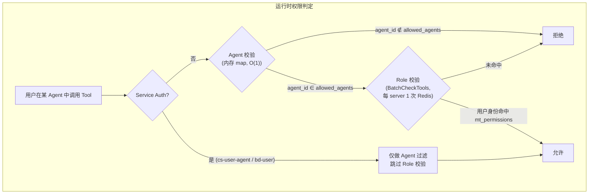
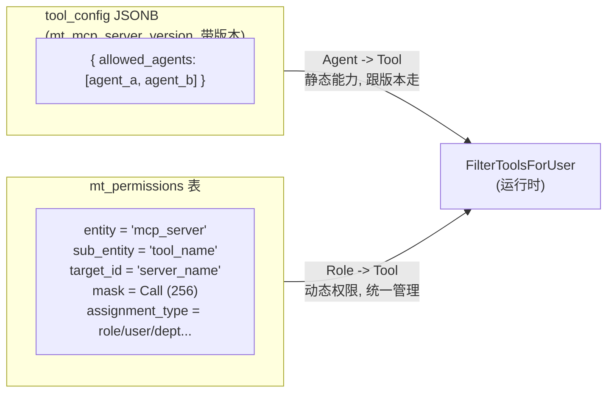
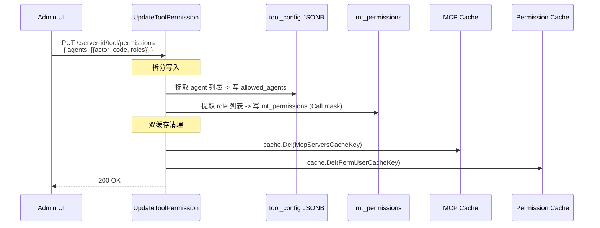
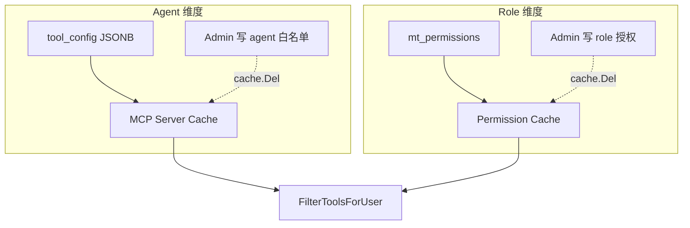
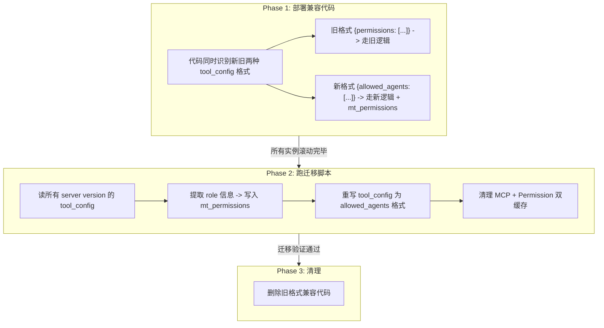

MCP权限管理重构
## 1. 当前现状

当前 MCP Tool 权限采用 **Agent 维度逐个配置 Role** 的模式：

* 每个 Agent 都需要单独维护一份“哪些 Role 可用”的配置。
* 权限关系在数据模型和管理流程上呈现 **Agent 维度与 Role 维度深度耦合**。

该模式的优缺点如下：

* **优点**
  * 支持每个 Agent 独立配置，灵活度高。**但实际使用中发现每个agent独立配置并不是必要的**
* **缺点**
  * 配置复杂度高，尤其在 Agent 数量多、Role 数量多时维护成本陡增。
  * 管理操作不友好，批量变更、审计、排查都较困难。
  * 难以接入统一的权限管理，当前只能自己独立维护，形成权限孤岛


### 每个agent独立配置role不是必要的

* 绝大多数tool只给单一agent使用，或者多个agent配置相同的role，不需要每个agent单独配置
* 只有极少数P的tool存在给多个agent使用，配置了不同role的情况，目前**只有2个**

  
  1. P user_select 对os agent支持hr, global_labors和members角色，但hr, global_labors为members子集，可以直接简化成members
  2. P user_detail ，cp, ip用户本身用不到其他agent，在其他agent有没有权限都无影响

     

## 2. 重构方案


**核心思路**：将 **Agent 维度** 与 **Role 维度** 从“绑定配置”改为“独立配置”，分别表达各自的授权边界，并且**接入统一权限管理体系**，最终在运行时做交集判断。

### 配置模型（按 Tool 组织）

针对每个 Tool，维护两组独立规则：

* `allowed_agents`：该 Tool 对哪些 Agent 开放。
* `allowed_roles`：该 Tool 对哪些 Role 开放。

两组配置互不嵌套、互不依赖，分别由对应管理流程维护。

### 权限判定逻辑（运行时）

当用户在某个 Agent 中调用 Tool 时，按以下逻辑判断：


1. 判断当前 `agent_id` 是否在 `allowed_agents` 中。
2. 判断用户 `role` 是否在 `allowed_roles` 中。
3. **仅当 1 和 2 同时满足时，才授予该 Tool 权限。**


### 接入统一权限管理

#### 1）数据映射（MCP -> mt_permissions）

针对每个 Tool，将权限记录映射为一条原子权限：

* `entity = {server_name}`
* `sub_entity = {tool_name}`
* `target_id = {server_id}`
* `mask = read`（表示“可执行该 Tool”）

在此基础上，分别落两类 assignment：

* **Role 维度配置**：`assignment_type = role`，`assignment_id = <role_name>`
* **Agent 维度配置**：`assignment_type = agent`，`assignment_id = <agent_name>`

说明：`role` 与 `agent` 两类 assignment 独立维护，不互相嵌套。

#### 2）运行时判定（交集）

当用户在某个 Agent 内调用 Tool 时，执行两次独立校验：


1. **Role 校验**：用户当前身份集合（用户/角色/部门/岗位/组）是否命中该 Tool 的 Role 授权。
2. **Agent 校验**：当前 `agent_id` 是否命中该 Tool 的 Agent 授权。
3. **最终结果**：仅当两者都通过时允许执行。


## 3. 一句话总结

将 MCP Tool 权限从原先的 Agent-Role 耦合配置改为在 mt_permissions 中按 Agent 与 Role 两个维度独立配置，并在运行时通过两者命中结果取交集（AND）决定是否允许调用 Tool。


# REVISED


## 1. 问题背景

当前 MCP Tool 权限采用 **Agent 维度逐个配置 Role** 的模式，数据存储在 `mt_mcp_server_version.tool_config` JSONB 字段中。每个 Agent 单独维护一份"哪些 Role 可用"的配置，导致：

* **配置爆炸**：Agent x Role 笛卡尔积，维护成本随 Agent/Role 数量陡增
* **管理困难**：批量变更、审计、排查都很痛苦
* **权限孤岛**：无法接入统一权限管理体系（`mt_permissions`），独立维护

但实际数据表明，绝大多数 tool 在不同 agent 之间配置的 role 完全相同。仅有 `user_select` 和 `user_detail` 两个 tool 存在 agent 维度的 role 差异，且均可简化。**Agent 维度和 Role 维度本质上是正交的，不需要耦合。**

## 2. 核心思路

**一句话**：Agent 是调用上下文，Role 是人的身份。两者正交，各归其位。

* **Agent -> Tool**（"这个 agent 能调哪些 tool"）= 静态能力声明，留在 `tool_config` JSONB，跟 server version 走
* **Role -> Tool**（"这个人能用哪些 tool"）= 动态访问控制，迁入 `mt_permissions`，接入统一权限管理

运行时两者取交集（AND）：agent 必须有能力调这个 tool，且用户必须有权限用这个 tool。



## 3. 数据模型变更

### 3.1 tool_config JSONB 简化

剥离 role 信息，只保留 agent 白名单。格式从深层嵌套变为扁平列表：

```json
// 改造前：agent 和 role 耦合
{
  "permissions": [
    {"actor_code": "workflow_agent", "roles": ["members", "cp"]},
    {"actor_code": "os_agent", "roles": ["members"]}
  ]
}

// 改造后：只留 agent 白名单
{
  "allowed_agents": ["workflow_agent", "os_agent"]
}
```

**为什么留在 tool_config**：agent 能力天然跟 server version 绑定——同一 MCP server 不同版本可能开放不同的 agent。`tool_config` 本身就是版本化的，不需要额外处理版本语义。

### 3.2 Role 权限迁入 mt_permissions

每个 tool 的 role 授权映射为 `mt_permissions` 中的标准记录：

| 字段  | 值   | 说明  |
|-----|-----|-----|
| `entity` | `'mcp_server'` | 权限类别，固定值 |
| `sub_entity` | `'{tool_name}'` | 具体 tool 名称 |
| `target_id` | `'{server_name}'` | 用 server_name 而非 ID，与运行时路径一致 |
| `mask` | `Call (256)` | 表示"可执行"。不用 `Read (1)`，语义更准确，且不占用读写位 |
| `assignment_type` | `role / user / dept / ...` | 复用现有身份维度，**不新增** `**agent**` **类型** |
| `assignment_id` | `'members'` / `'cp'` / ... | 具体角色/身份标识 |

**为什么不把 agent 也放进 mt_permissions**：`mt_permissions` 的查询引擎对所有 `assignment_type` 做 OR 聚合（任意一个身份命中即通过）。Agent 不是人的身份，是调用上下文，需要 AND 语义。硬塞进去需要改造查询引擎，成本远大于收益。



### 3.3 前置 Schema 变更

`mt_permissions.sub_entity` 当前是 `varchar(32)`，MCP tool name 是外部自由字符串可能超长，需扩容：

```sql
ALTER TABLE mt_permissions ALTER COLUMN sub_entity TYPE varchar(128);
```

## 4. 运行时实现

### 4.1 批量权限查询（解决 N+1 问题）

**不能**对每个 tool 单独调 `permService.Check`——那是 N 次 Redis 往返。需要新增批量接口：

```go
// 新增：一次查询获取某 server 下所有 tool 的权限结果
func (p *permService) BatchCheckTools(
    ctx context.Context,
    serverName string,        // target_id
    toolNames []string,       // sub_entity IN (...)
    assignmentIDs []string,   // 用户所有身份标识
) map[string]bool

// 底层 SQL:
// SELECT sub_entity, mask FROM mt_permissions
// WHERE entity = 'mcp_server'
//   AND target_id = {serverName}
//   AND sub_entity IN ({toolNames...})
//   AND assignment_id IN ({assignmentIDs...})
```

每个 server 1 次查询。实际场景 server 数量 < 10，总共不超过 10 次查询，可接受。

### 4.2 新的过滤函数

替换现有 `FilterByRolesAndAgent`，逻辑清晰、单一执行点：

```go
func (m *McpManager) FilterToolsForUser(ctx, agentID, userIdentity, servers) []*McpServer {
    // Service 调用走独立路径，保留现有 bypass 逻辑
    if roles.IsService(ctx) {
        return m.filterByAgentOnly(agentID, servers)
    }

    assignmentIDs := userIdentity.AllAssignmentIDs()
    result := make([]*McpServer, 0, len(servers))

    for _, server := range servers {
        // 第一关：Agent 校验（内存 map, O(1)）
        agentTools := filterToolsByAgent(server.Tools, agentID)
        if len(agentTools) == 0 { continue }

        // 第二关：Role 校验（批量, 1 query per server）
        permitted := m.permService.BatchCheckTools(
            ctx, server.Name, extractNames(agentTools), assignmentIDs,
        )

        var finalTools []Tool
        for _, t := range agentTools {
            if permitted[t.Name] { finalTools = append(finalTools, t) }
        }

        if len(finalTools) > 0 {
            s := *server          // 复制，不 mutate 缓存对象
            s.Tools = finalTools
            result = append(result, &s)
        }
    }
    return result
}
```

> **注意**：现有代码直接 `server.Information.Tools = tools` mutate 了缓存对象，是个并发隐患。重构时一并修复。

### 4.3 Service Auth 处理

`cs-user-agent` 和 `bd-user` 等 service 调用通过 `roles.IsService()` 识别，硬编码注入 agent 身份。这些调用没有真实用户 JWT，无法走 `mt_permissions` 校验。**保持现有 bypass 逻辑不变**，只做 agent 白名单过滤：

```go
func (m *McpManager) filterByAgentOnly(agentID string, servers []*McpServer) []*McpServer {
    // 只做 agent 白名单检查，跳过 role 校验
    // 保留 cs-user-agent → cs_expert, bd-user → bd_expert 的映射
}
```

## 5. Admin API 改造

现有 4 个端点直接操作 `tool_config` JSONB，需要拆分写入目标。**请求体结构保持不变**，调用方无感知：



| 现有端点 | 改造方式 |
|------|------|
| `PUT /:server-id/tool/permissions` | 拆分写入：agent -> tool_config, role -> mt_permissions |
| `GET /:server-id/versions/:version-id/tool-config` | 聚合读取：从 tool_config 读 agent，从 mt_permissions 读 role |
| `GET /tool-permissions` | 同上聚合 |
| `PUT /tool-permissions` (JSON 批量) | 同上拆分写入 |

## 6. 缓存策略

两个维度各自管理自己的缓存，互不干扰。Admin API 写入时同时清理两个缓存，保证一致性：

| 维度  | 数据源 | 缓存层 | 失效触发 |
|-----|-----|-----|------|
| Agent 白名单 | tool_config JSONB | MCP Server Cache (`McpServersCacheKey`) | Admin 改 tool_config 时 `cache.Del` |
| Role 权限 | mt_permissions | Permission Cache (`PermUserCacheKey`) | Admin 改 mt_permissions 时 `cache.Del` |



## 7. 部署计划（两阶段，任意时刻可回滚）

直接改 JSONB 格式 + 部署新代码是不行的——滚动部署期间旧实例反序列化新格式会得到 nil，导致所有 tool 不可访问。必须分阶段：



**Phase 1 -> 2 之间**：所有实例都能读新旧格式，数据还是旧的。回滚 = 直接回滚代码，无影响。

**Phase 2 -> 3 之间**：数据已迁移为新格式，新旧代码都能正常工作。回滚 = 用旧代码走旧逻辑分支读新数据？不行——所以需要迁移脚本同时支持**反向回滚**（把 allowed_agents 转回 permissions 格式）。

**Phase 3 之后**：清理完成，只剩新代码新数据。

## 8. 自查清单

| 关注点 | 状态  | 说明  |
|-----|-----|-----|
| 不改 mt_permissions 查询引擎 | OK  | 纯 OR 聚合，不引入 AND 语义 |
| 不新增 assignment_type | OK  | agent 不进 mt_permissions |
| 批量查询，非 N+1 | OK  | BatchCheckTools，每 server 1 次 |
| 两阶段部署，可回滚 | OK  | 兼容代码先行，迁移脚本支持反向 |
| Admin API 对外兼容 | OK  | 请求体结构不变，内部拆分写入 |
| Service auth bypass | OK  | IsService() 走独立 agent-only 路径 |
| sub_entity 字段长度 | OK  | varchar(32) -> varchar(128) |
| mask 语义正确 | OK  | 用 Call (256) 而非 Read (1) |
| 不 mutate 缓存对象 | OK  | 复制 server 后修改 Tools |
| Agent 白名单跟版本走 | OK  | 留在 tool_config JSONB，天然版本化 |


## 9. 交互变化


1. 旧版MCP Tool 权限采用 **Agent 维度逐个配置 Role** 的模式，新版改成MCP Tool分别配置Agent维度和role维度权限，每个tool只有一套role权限配置，不需要像之前每个agent一套role配置，可以直接前端处理
2. 旧版只支持按用户Role配置权限，新版接入权限管理后，可以支持按用户的 role/user/position/group/department 配置，是一个可选的升级项，如果需要升级的话，UI需要调整


